# Chapter 4: Enhanced Memory and Learning Agents

The cognitive workspace from Chapter 3 demonstrated basic context maintenance, but genuine intelligence demands more. A cognitive agent must organize knowledge effectively, recognize patterns over time, and learn from interaction.

We implement knowledge organization through the Zettelkasten method, where atomic notes capture discrete ideas while maintaining their relationships. This approach allows knowledge to evolve organically as new connections form between concepts, mirroring how human understanding develops.

Pattern recognition emerges through specialized agents that analyze interactions over time. By identifying similarities and relationships between experiences, these agents build categories and classifications that enhance Winston's ability to understand and respond appropriately.

A key aspect involves human-in-the-loop learning - the ability to learn effectively through feedback, correction, and demonstration. While autonomous learning is important, interactive learning proves essential for developing robust and reliable cognitive systems.

Rather than implementing a monolithic system, we distribute these cognitive functions across specialized agents. Each agent handles distinct aspects of memory and learning while maintaining simplicity and clarity. Their interactions create sophisticated behavior while preserving maintainability.

By the end of this chapter, you'll understand how sophisticated learning capabilities emerge naturally from collaboration between specialized agents. This foundation will prove essential in Chapter 5, where we'll build upon it to implement enhanced reasoning and planning capabilities.

In this chapter we're going to cover:

- Enhanced memory architecture through specialized agents
- Knowledge organization and consolidation systems
- Pattern recognition and category formation
- Human-in-the-loop learning mechanisms
- Meta-learning for strategy optimization
- Memory and learning foundations for advanced tasks

## 4.1 Enhanced memory architecture

---

Section Goals:

- Building on our cognitive workspace with specialized memory agents
- Memory Coordinator as the foundation
- How specialists work together through the coordinator
- Shared workspace as the integration point

---

The cognitive workspace we developed in Chapter 3 provides Winston with immediate context during conversations. While effective for maintaining short-term context, it lacks the ability to build and retain knowledge over time. Just as human intelligence requires both working memory and long-term memory, Winston needs mechanisms for organizing and preserving knowledge beyond individual interactions.

This enhanced memory architecture introduces autonomous specialized agents that collaborate to create persistent, organized knowledge. Each agent maintains its own cognitive processes - the Zettelkasten agent determines how to organize knowledge, the Pattern Recognition agent discovers meaningful relationships, and the Human Learning agent decides how to incorporate feedback. At the center, the Memory Coordinator facilitates their collaboration through the shared workspace while respecting each agent's decision-making autonomy.

Rather than replacing our cognitive workspace, we extend it. The workspace evolves from maintaining immediate context to serving as an integration point where specialists share insights and build collective understanding. This preserves the simplicity of our markdown-based approach while enabling sophisticated memory capabilities.

Let's examine how these components work together to give Winston genuine knowledge persistence and growth over time.

### 4.1.1 Memory coordinator foundation

---

Section Goals:

- Memory Coordinator's role bridging workspace and specialists
- Core responsibilities (evaluation, delegation, integration)
- Example showing coordinator managing a knowledge capture flow

---

The cognitive workspace from Chapter 3 provides immediate context for conversations, but lacks mechanisms for building and maintaining knowledge over time. The Memory Coordinator serves as the bridge between immediate context and persistent memory, orchestrating how knowledge flows between specialized memory agents.

Consider how the Memory Coordinator evaluates new information during a conversation. When Winston encounters a user preference, the coordinator first assesses its significance - is this a fleeting comment or an important insight worth preserving? Upon determining the information merits preservation, it communicates this to the Zettelkasten agent through a structured message. The Zettelkasten agent then evaluates how this new information relates to existing knowledge and decides the most appropriate way to preserve and integrate it.

This maintains true **agent autonomy** - the Memory Coordinator doesn't dictate specific actions but rather shares potentially significant information. The Zettelkasten agent applies its own cognitive processes to determine how best to organize and preserve this knowledge. This mirrors how different regions of the human brain maintain their specialized processing while collaborating through well-defined communication patterns.

This coordination extends beyond simple knowledge capture. When Winston discusses a topic that might benefit from historical context, the coordinator retrieves relevant knowledge through specialized agents and integrates it naturally into the conversation. Rather than overwhelming the workspace with all available information, the coordinator selectively incorporates the most pertinent details.


_Figure 4.1: Memory coordinator architecture_

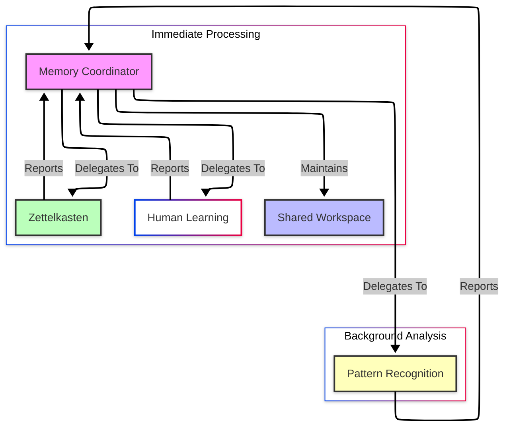

The Memory Coordinator maintains coherence across the memory system through the shared workspace. Each specialist agent - Zettelkasten for knowledge organization, Pattern Recognition for relationship discovery, Human Learning for feedback incorporation - interacts with others through this common ground. This architecture allows specialists to remain focused on their specific memory functions while the coordinator manages their collaboration.

For example, when Winston learns about a user's coffee preferences, the coordinator orchestrates several parallel operations: the Zettelkasten agent captures the specific preference details, the Pattern Recognition agent analyzes how this preference relates to other known preferences, and the Human Learning agent incorporates any corrections or clarifications from the user. The coordinator ensures these separate insights combine into a coherent understanding reflected in the workspace.

This foundation supports increasingly sophisticated memory capabilities while maintaining simplicity in each component. The coordinator's role grows naturally as we add new specialist agents, but its core responsibility remains unchanged: ensuring effective collaboration between memory specialists through the shared workspace.

### 4.1.2 Specialist Integration

---

Section Goals:

- How specialists extend workspace capabilities
- Zettelkasten Agent: knowledge organization
- Pattern Recognition Agent: relationship identification
- Human Learning Agent: feedback incorporation
- Example showing specialists working together

---

The Memory Coordinator provides the foundation, but the real power emerges from how specialist agents collectively create Winston's memory capabilities. These specialists operate in two distinct ways: immediate interaction handlers and background analytical processes.

The Zettelkasten agent and Human Learning agent independently process immediate interactions. The Zettelkasten agent evaluates and decides how to transform fleeting observations into lasting knowledge, building sophisticated webs of related concepts through its own cognitive processes. The Human Learning agent incorporates direct feedback and corrections, ensuring that when users clarify or correct Winston's understanding, this feedback propagates appropriately through the knowledge base.

Pattern Recognition operates as a background process, periodically analyzing the accumulated knowledge base to discover implicit relationships. It identifies recurring themes in user preferences, common elements across different conversations, and emerging categories of knowledge. This analytical layer complements the immediate interaction handlers by uncovering deeper patterns that only become apparent over time.

This combination of immediate and background processing mirrors human cognition, where we both react to immediate information and gradually form deeper understanding through reflection and analysis.

Consider how these specialists mirror human cognition when Winston discusses music preferences. While one part of the mind captures specific preferences, another recognizes patterns across different genres and artists. Simultaneously, a third aspect refines this understanding through direct feedback. These parallel processes combine naturally into coherent knowledge, just as human understanding emerges from multiple cognitive processes working in harmony.

This specialist architecture reflects how intelligence emerges from simpler cognitive functions working in concert. Just as human understanding arises from multiple brain systems operating together, Winston's knowledge emerges from the interplay of these specialized cognitive agents.

### 4.1.3 Shared workspace as integration hub

---

Section Goals:

- How workspace evolves from Chapter 3
- Maintaining coherence across specialists
- Knowledge flow between workspace and persistent memory
- Example showing workspace integration in action

---

The cognitive workspace from Chapter 3 serves as the foundation for memory integration. While our original workspace excelled at maintaining immediate context, memory specialists need a more sophisticated integration mechanism. The workspace evolves from a simple context holder to an active integration hub where specialists share insights and build collective understanding.

Consider how the workspace adapts when Winston discusses a user's travel preferences. The immediate conversation context lives in the workspace as before, but now memory specialists enrich this context dynamically. The Zettelkasten agent retrieves relevant past travel discussions, the Pattern Recognition agent identifies preference patterns, and the Human Learning agent adds recent corrections about destination recommendations.

The Memory Coordinator orchestrates this knowledge flow, ensuring each specialist both contributes to and learns from the shared context. When new knowledge about travel preferences emerges, it flows through the workspace where each specialist can analyze it from their unique perspective. When understanding needs correction, this too flows through the workspace, allowing all specialists to refine their knowledge accordingly.

This bi-directional flow maintains coherence across the memory system. Each specialist sees a consistent view of current understanding while contributing its unique insights. The workspace becomes more than just a temporary context holder - it becomes the living interface between immediate conversation and Winston's growing knowledge base.

With this architectural foundation established - the Memory Coordinator orchestrating specialists, each agent contributing distinct cognitive functions, and the workspace serving as integration hub - we can now examine the practical implementation. The Memory Coordinator's implementation deserves our initial focus, as it provides the essential infrastructure that other memory specialists will build upon.

## 4.2 Memory coordinator agent

---

Section Goals:

- Core coordinator responsibilities
- Routing and delegation patterns
- Workspace management
- Implementation details (key interfaces, protocols)
- Example showing coordination flow

---

The Memory Coordinator exemplifies Minsky's concept of **agencies** - collections of autonomous agents collaborating to perform complex cognitive functions. It's not just another specialist, but rather the agent that facilitates effective collaboration while preserving each specialist's cognitive autonomy. This creates a coherent system through coordination rather than control.

The Memory Coordinator solves three fundamental challenges in our cognitive architecture:

First, it determines what information warrants preservation. During conversation (or, more generally, observation), Winston encounters a stream of information - from casual remarks to significant insights about user preferences and behaviors. The coordinator must evaluate each piece of information to decide whether it represents knowledge worth capturing.

Second, it maintains coherence between immediate context and persistent memory. The coordinator bridges Winston's cognitive workspace, where current conversation unfolds, with the structured knowledge managed by specialist agents. This ensures that relevant historical knowledge informs current interactions while new insights properly update the knowledge base.

Third, it orchestrates the immediate processing agents - specifically the Zettelkasten agent for knowledge capture and the Human Learning agent for feedback incorporation. Rather than these specialists interacting directly with the workspace or each other, the coordinator manages their contributions to maintain consistency.

### 4.2.1 Evaluation and Routing

---

Section Goals:

- LLM-based evaluation approach
- Tool-based specialist interface
- System prompt design
- Example of evaluation flow

---

The Memory Coordinator evaluates incoming information and routes it to appropriate immediate processors - specifically the Zettelkasten agent for knowledge capture and the Human Learning agent for feedback incorporation. This evaluation happens through carefully crafted prompting and tool definitions, allowing sophisticated yet maintainable routing decisions.

The coordinator maintains coherence across the memory system by managing both specialist communication and workspace updates. When specialists like the Zettelkasten agent create new knowledge structures, these insights flow back through the coordinator to update the shared workspace. This centralized management ensures consistent knowledge representation while preventing conflicts between specialists.

The choice between rule-based routing and LLM-based routing represents a fundamental architectural decision. Traditional cognitive architectures often employ explicit rules, decision trees, or classifiers for routing. These approaches seem simpler at first - write clear rules for what constitutes "important knowledge" versus "feedback" versus "routine conversation."

However, consider these actual examples from human-agent interaction:

"I usually drink coffee in the morning, like my father used to."
This single statement contains:

- A personal preference
- A temporal habit
- A family relationship
- An implied emotional connection

A rule-based system would need complex pattern matching to:

1. Identify each component (preference, habit, relationship)
2. Assess their relative importance
3. Determine appropriate routing
4. Consider conversation context
5. Account for cultural nuances

The rules quickly become brittle and maintenance-intensive. Adding new patterns means updating multiple rule sets. Handling edge cases leads to exponential rule growth.

LLM-based routing through prompts and tools provides an elegant solution. The LLM's inherent natural language understanding handles nuanced content without explicit pattern matching. Its context-awareness means the coordinator naturally considers conversation history and cultural subtleties when making routing decisions. As Winston interacts with users, new patterns emerge organically through the LLM's understanding rather than requiring explicit programming. The tool interface maintains clear architectural boundaries while allowing this sophisticated routing, and we can refine the coordinator's behavior through prompt engineering rather than complex rule updates.

This approach mirrors how human experts make categorization decisions - through deep understanding rather than following explicit rules. Just as an experienced librarian naturally knows where to shelve a new book based on its content and context, our coordinator leverages LLM capabilities to make sophisticated yet maintainable routing decisions.

Throughout this process, the coordinator maintains workspace clarity by selectively incorporating the most relevant insights. Rather than overwhelming the workspace with every detail, it preserves the most pertinent information for ongoing interaction while ensuring longer-term knowledge remains accessible through specialist agents.

Consider this evaluation flow:


_Figure 4.2: Evaluation flow_

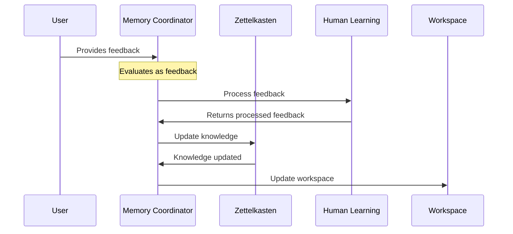

The coordinator's system prompt defines clear evaluation criteria:

```yaml
system_prompt: |
  You are a Memory Coordinator agent in a Society of Mind system. Your role is to evaluate information and coordinate with specialist agents to build and maintain the system's understanding.

  For each interaction, evaluate:
  1. Knowledge Significance - Is there important information that should be preserved? Consider:
     - New facts or insights about the user
     - Expressed preferences or interests
     - Important context for future interactions
     Use the capture_knowledge tool when you identify significant information.

  2. Learning Feedback - Has the user provided corrections or feedback? Consider:
     - Direct corrections to Winston's statements
     - Clarifications of misunderstandings
     - Teaching or guidance about preferences
     Use the incorporate_feedback tool when feedback is provided.

  Always explain your reasoning before using tools. Focus on building a coherent and useful memory system.
```

The coordinator's evaluation decisions translate into actions through a tool-based interface. First, we define the structure of requests to our immediate processors:

```python
class KnowledgeCaptureRequest(BaseModel):
  """Parameters for knowledge capture."""
  content: str = Field(description="Content to be captured")
  context: str = Field(description="Current context")
  importance: str = Field(description="Why this knowledge is significant")
```

These structured requests ensure consistent communication between the coordinator and immediate processors. The coordinator then makes these capabilities available through tool registration:

```python
"""Register core coordination tools."""
self.system.register_tool(
  Tool(
    name="capture_knowledge",
    description="Direct Zettelkasten agent to capture important knowledge",
    handler=self._handle_knowledge_capture,
    input_model=KnowledgeCaptureRequest,
    output_model=Response,
  )
)
```

With the tool interface defined and registered, the actual routing implementation becomes straightforward. The coordinator simply delegates to the appropriate specialist through the system's function invocation mechanism:

```python
# Example of coordinator routing logic
async def _handle_knowledge_capture(self, request: KnowledgeCaptureRequest) -> Response:
    """Route knowledge capture to Zettelkasten agent."""
    return await self.system.invoke_function(
        "zettelkasten",  # The Zettelkasten agent's ID
        "create_note",   # The specific tool to use
        {
            "content": request.content,
            "context": request.context,
            "importance": request.importance,
        },
    )
```

This separation between request definition and tool registration provides clear boundaries in our architecture. The request models define _what_ information passes between agents, while tool registration establishes _how_ that information flows. This pattern repeats for each immediate processor capability, creating a consistent interface for agent interaction.

---

> **Design Discussion: Agent Communication and Autonomy**
>
> A key architectural decision in our memory system involves how agents communicate and where autonomy resides. Consider the interaction between the Memory Coordinator and Zettelkasten agent:
>
> ```python
> # Memory Coordinator commands a specific operation
> response = await self.system.invoke_function(
>     "zettelkasten",
>     "capture_knowledge",
>     {
>         "content": request.content,
>         "context": request.context,
>         "importance": request.importance,
>     }
> )
> ```
>
> Rather than sending a general message and letting the Zettelkasten agent determine whether/how to preserve the information, the coordinator explicitly commands knowledge capture. This might seem to violate agent autonomy, but it actually creates a more efficient division of cognitive labor:
>
> 1. The Memory Coordinator's role is evaluating what deserves preservation and directing appropriate actions. Having made this determination, there's no value in the Zettelkasten agent re-evaluating the same question.
>
> 2. The Zettelkasten agent's autonomy lies in HOW it organizes and preserves knowledge - determining atomic boundaries, establishing relationships, managing tags, and maintaining the knowledge network. These complex cognitive decisions remain entirely under its control.
>
> This pattern mirrors human cognitive organization where high-level executive functions (the coordinator) direct specific brain systems (specialists) to perform their specialized tasks. The specialists maintain autonomy in how they perform their functions while responding to clear executive direction.
>
> The function invocation pattern provides clean architectural boundaries for this relationship, avoiding awkward hybrid approaches like encoding commands in message metadata. It makes the chain of command explicit while preserving essential cognitive autonomy where it matters most.

---

This evaluation and routing system forms the foundation of Winston's memory architecture. The clear separation between knowledge capture and feedback processing mirrors how humans process new information - some experiences become lasting memories while others refine our existing understanding. Through structured interfaces, the coordinator maintains consistent communication patterns with immediate processors, much like how different regions of the human brain exchange information through well-defined pathways.

The system's flexibility emerges naturally from its LLM-based evaluation, allowing us to refine the coordinator's behavior through prompt engineering rather than complex rule systems. As Winston's capabilities grow, new immediate processing functions integrate smoothly through additional tool registration, preserving the simplicity of the core architecture while expanding its cognitive abilities.

By maintaining this focused approach to immediate processing, the coordinator provides essential cognitive infrastructure without becoming entangled in background analysis tasks. This architectural clarity enables the sophisticated memory capabilities that emerge from specialist collaboration, which we'll explore in detail through the rest of this chapter.

### 4.2.2 Workspace management

---

Section Goals:

- Centralized workspace control
- Integration of specialist insights
- Maintaining workspace clarity
- Example of workspace evolution

---

The Memory Coordinator's workspace management responsibilities extend beyond simple updates. It must maintain coherence between immediate context and persistent knowledge while integrating insights from multiple specialists. This centralized control prevents conflicts and ensures consistent knowledge representation.

#### Centralized control pattern

First, let's examine the workspace update flow:

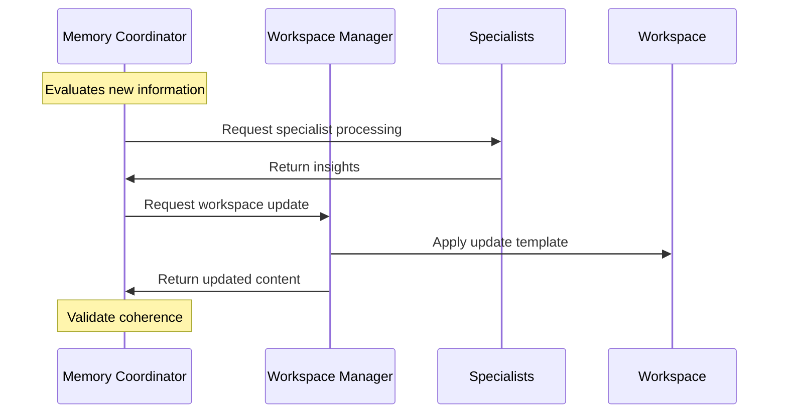

The coordinator uses a template-based approach for workspace updates. This ensures consistent structure while allowing flexible content integration:

```python
class WorkspaceManager:
    """Manages workspace updates across all agents."""

    def __init__(self):
        self._workspaces: dict[Path, str] = {}

    async def update_workspace(
        self,
        workspace_path: Path,
        message: Message,
        agent: Agent,
        update_template: str | None = None,
    ) -> str:
        """Update workspace with new insights."""
        workspace = self.load_workspace(workspace_path)

        # Use default or custom update template
        template = update_template or DEFAULT_UPDATE_TEMPLATE

        # Generate update prompt
        update_prompt = template.format(
            workspace=workspace,
            content=message.content,
            msg_type=message.metadata.get("type", "Update")
        )

        # Generate coherent update
        response = await agent.generate_response(
            Message(content=update_prompt)
        )

        # Save and return updated workspace
        self.save_workspace(workspace_path, response.content)
        return response.content
```

#### Integration patterns

The coordinator employs several patterns for integrating specialist insights:

1. **Progressive Updates**: Rather than batch updates, changes flow incrementally through the workspace
2. **Contextual Integration**: New information is woven into existing context rather than simply appended
3. **Structural Preservation**: Updates maintain workspace organization while incorporating new content

Here's how the coordinator implements these patterns:

```python
async def _integrate_specialist_insights(
    self,
    insights: list[Response],
    workspace_path: Path,
) -> None:
    """Progressively integrate specialist insights."""
    for insight in insights:
        # Create integration message
        message = Message(
            content=insight.content,
            metadata={
                "type": "Specialist Integration",
                "source": insight.metadata.get("source"),
            }
        )

        # Update workspace
        await self.system.update_workspace(
            workspace_path,
            message,
            self
        )
```

#### Maintaining clarity

The coordinator preserves workspace clarity through:

1. Selective incorporation of insights
2. Progressive summarization of content
3. Structural organization maintenance

This keeps the workspace focused and usable while allowing it to evolve with new understanding.

#### Example: Workspace evolution

Let's examine how a workspace evolves during a conversation about user preferences:

1. Initial workspace state:

```markdown
# Cognitive Workspace

## User Preferences

- Enjoys morning coffee
- Prefers quiet work environment

## Recent Interactions

- Discussed work habits
- Explored productivity tools

## Current Context

Exploring daily routines
```

2. After Zettelkasten insight:

```markdown
# Cognitive Workspace

## User Preferences

- Enjoys morning coffee
  - Family tradition, emotional connection
  - Specific preference for dark roast
- Prefers quiet work environment

## Recent Interactions

- Discussed work habits
- Explored productivity tools
- Shared family coffee traditions

## Current Context

Exploring daily routines and personal traditions
```

3. After Pattern Recognition insight:

```markdown
# Cognitive Workspace

## User Preferences

- Enjoys morning coffee
  - Family tradition, emotional connection
  - Specific preference for dark roast
  - Part of broader morning ritual pattern
- Prefers quiet work environment

## Recent Interactions

- Discussed work habits
- Explored productivity tools
- Shared family coffee traditions

## Current Context

Exploring daily routines and personal traditions
Focus on ritual and tradition importance

## Observed Patterns

- Strong connection between routines and family traditions
- Preference for structured morning activities
```

This evolution shows how the coordinator maintains clarity while integrating multiple specialist insights into a coherent understanding.

## 4.3 Knowledge organization

---

Section Goals:

- Understanding the Zettelkasten agent's essential role in knowledge management for other cognitive specialists
- Implementing core knowledge interfaces needed by coordinator and specialists
- Building a flexible organization system that supports pattern discovery and learning
- Demonstrating how knowledge flows between specialists through the Zettelkasten

---

The Memory Coordinator needs a reliable way to preserve and retrieve knowledge. The Pattern Recognition agent requires structured data to analyze relationships. The Human Learning agent must incorporate feedback and corrections into existing knowledge. These requirements demand sophisticated knowledge management capabilities.

The Zettelkasten agent fulfills these needs by providing essential cognitive infrastructure. Rather than just storing information, it maintains an evolving network of knowledge that other specialists can query, analyze, and refine. When the Memory Coordinator identifies important information during conversation, the Zettelkasten agent creates structured representations that preserve both content and context. When the Pattern Recognition agent discovers relationships, the Zettelkasten agent captures these insights in ways that inform future interactions. When the Human Learning agent receives corrections, the Zettelkasten agent updates existing knowledge while maintaining its connections.

This infrastructure role makes the Zettelkasten agent fundamentally different from a simple note-taking system. It must provide interfaces that other specialists can use to query and manipulate knowledge. It needs organizational flexibility to accommodate both explicit relationships identified during conversations and implicit patterns discovered through analysis. It requires versioning capabilities to track how knowledge evolves through learning and refinement.

Consider how these requirements play out during a typical interaction:

Consider how these requirements play out when Winston learns about a user's coffee preferences:

1. The Memory Coordinator identifies important information: "I usually drink coffee in the morning, like my father used to." It needs this preference captured along with its emotional and temporal context.

2. The Pattern Recognition agent analyzes this in relation to other morning routine preferences. It needs to record these relationships so they inform future interactions about daily habits.

3. Later, the Human Learning agent receives a correction: "Actually, I've switched to tea recently." This update must preserve the family connection while reflecting the current preference.

The Zettelkasten agent handles these requirements through structured knowledge management:

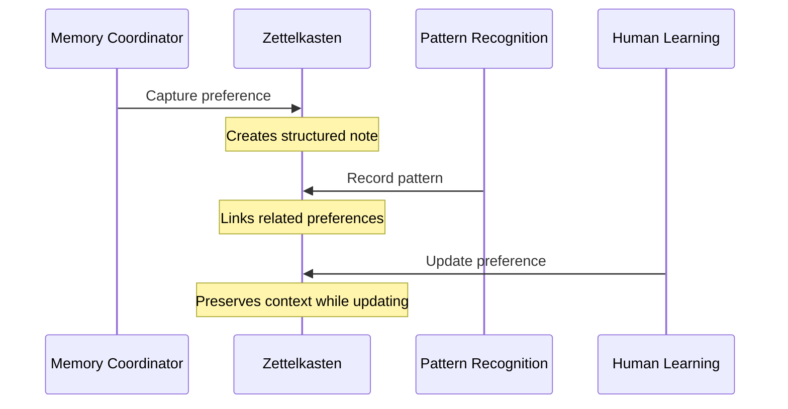

This interaction demonstrates why simple note storage isn't sufficient. The Zettelkasten agent must:

- Maintain knowledge structure that supports multiple specialist perspectives
- Preserve contextual relationships while allowing content updates
- Enable pattern discovery through flexible organization
- Track knowledge evolution through learning and refinement

### 4.3.1 The Zettelkasten method

---

Section Goals:

- Explain the core principles of Zettelkasten knowledge organization
- Show why this method aligns with cognitive architectures
- Establish the foundational components for our implementation
- Demonstrate how these principles enable sophisticated knowledge management

---

Knowledge organization presents a fundamental challenge: how can we structure information in a way that supports genuine understanding rather than mere storage? The Zettelkasten method provides an elegant solution by mirroring how human minds form and connect ideas. This approach offers several key benefits that make it ideal for cognitive architectures:

1. Atomic notes enable precise knowledge management and incremental knowledge building
2. Flexible linking creates an organic network that evolves naturally
3. Progressive summarization maintains clarity as knowledge grows
4. Natural integration with cognitive processes through markdown formatting

These benefits align perfectly with our cognitive architecture needs, where knowledge must grow and adapt while maintaining coherence and usability.

Consider how humans develop expertise in a domain. We don't memorize entire textbooks or lectures as monolithic blocks. Instead, we accumulate discrete pieces of knowledge and gradually discover relationships between them. A chef doesn't learn cooking through a single massive download of information, but by understanding individual techniques, ingredients, and flavor combinations. Over time, these atomic pieces of knowledge connect in increasingly sophisticated ways, enabling creative combinations and deep understanding.

Four key principles define the Zettelkasten approach:

**Atomicity**: Each note captures exactly one idea. This granularity enables precise knowledge management and makes it easier to form new connections between concepts. When Winston learns about a user's coffee preferences, distinct aspects like preparation method, timing, and associated emotions can be captured separately while maintaining their relationships.

**Connectivity**: Notes link explicitly to related concepts, creating a network that reflects how ideas relate and combine. These connections aren't just simple references - they carry semantic meaning about how concepts interact. A note about morning coffee might connect to daily routines through temporal context, to family traditions through emotional context, and to beverage preferences through categorization.

**Emergence**: Complex understanding develops organically as the network of atomic notes grows and connects. Rather than trying to impose a rigid structure upfront, the Zettelkasten method allows patterns and relationships to emerge naturally through use. This mirrors how human understanding often develops - we don't start with perfect categorization but discover organization through experience.

**Progressive Summarization**: As knowledge accumulates, higher-level patterns and insights emerge through successive layers of synthesis. Individual notes combine into concept clusters, clusters reveal broader patterns, and patterns suggest general principles. This layered approach manages cognitive load while preserving access to detailed information when needed.

These principles make Zettelkasten ideal for cognitive architectures. Just as human understanding emerges from networks of simpler neural patterns, Winston's knowledge develops through networks of atomic notes. The explicit connections between notes mirror neural pathways, while progressive summarization parallels how human minds consolidate and abstract knowledge over time.

Consider how these principles work together when Winston processes new information. When a user shares "I usually drink coffee in the morning, like my father used to," Winston must:

1. Identify atomic concepts (morning coffee preference, family tradition, temporal pattern)
2. Establish meaningful connections between these concepts
3. Allow patterns to emerge by connecting to existing knowledge
4. Build layers of understanding through progressive summarization

This cognitive process requires a knowledge structure that supports both atomic storage and rich interconnection:

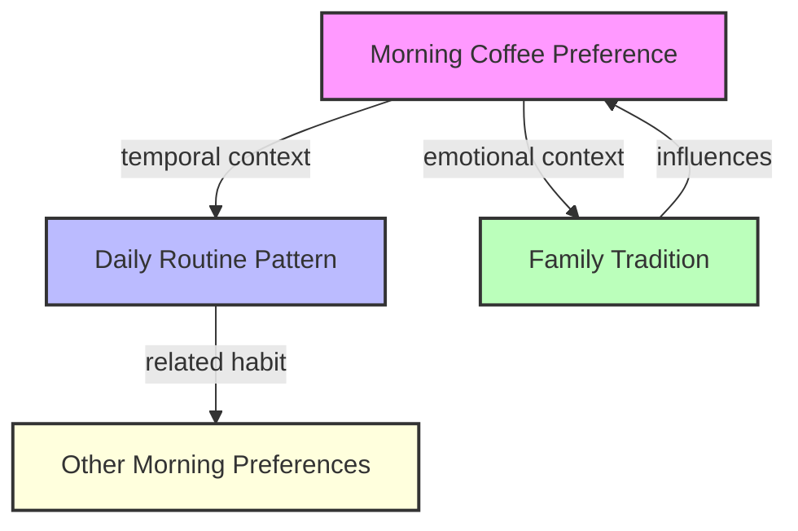

The structure and relationships shown here demonstrate how atomic notes combine to create sophisticated understanding. Each node represents a distinct concept, while edges capture the semantic relationships between them. This network grows organically as Winston learns more about the user's preferences and habits.

This foundation supports increasingly sophisticated knowledge operations, which we'll explore in subsequent sections. The principles established here - atomicity, connectivity, emergence, and progressive summarization - guide how we structure knowledge (4.3.2) and implement knowledge operations (4.3.3).

### 4.3.2 Knowledge structure

---

Section Goals:

- Define the conceptual organization of knowledge through links, tags, and semantics
- Establish the physical implementation using files and database
- Show how these layers work together to enable cognitive operations
- Demonstrate practical knowledge management approaches

---

Individual notes serve as the fundamental units of Winston's knowledge, but their value comes from how they are organized into coherent structures that enable deeper understanding. This organization operates on two levels: the conceptual level, which defines the relationships and interactions between pieces of knowledge, and the physical level, which handles the efficient implementation of these relationships. To support both levels effectively, a hybrid storage approach is essential, as it combines different storage methods to meet the diverse functional requirements of the system.

The hybrid storage approach is not a superficial design choice; it addresses key functional requirements of cognitive systems. Each storage method serves a distinct purpose. Files are human-readable, which simplifies debugging and development, and they integrate directly with existing tools. They also allow straightforward backup and version control while supporting Markdown formatting, which aligns well with large language model (LLM) processing.

Databases, by contrast, are optimized for efficient traversal of relationships, transactional consistency, advanced querying, and structured management of metadata.

Semantic storage complements these by providing capabilities such as meaning-based similarity detection, discovery of conceptual relationships, context-aware retrieval, and natural language understanding.

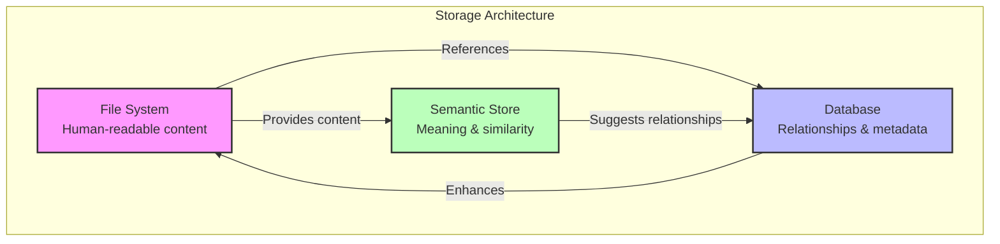

This layered approach mirrors aspects of human cognition: immediate perception, structured memory, and semantic reasoning. Combining these elements is critical for ensuring that systems like Winston can meet the demands of complex cognitive tasks.

#### Conceptual organization

Three mechanisms work together to create Winston's knowledge structure: a semantic link network, a consistent tag taxonomy, and vector-based indexing.

##### Link network

The link network transforms isolated notes into meaningful knowledge structures. Rather than implementing simple references, links carry semantic weight that reflects different types of cognitive relationships:

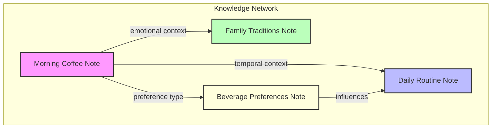

Each link type represents a distinct cognitive relationship. Temporal links connect events and patterns over time. Contextual links preserve situational understanding. Causal links capture relationships between actions and outcomes. This semantic richness enables specialists to traverse the knowledge network in ways that match their cognitive needs.

##### Tag taxonomy

While links capture specific relationships between notes, tags provide another dimension of organization through consistent categorization. Tags enable broader pattern recognition and knowledge retrieval:

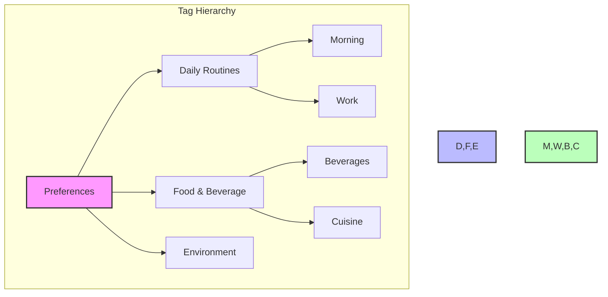

This hierarchical structure balances flexibility and consistency. Tags can evolve as Winston discovers new patterns, while maintaining relationships that support reliable knowledge retrieval. When the Pattern Recognition agent identifies a new category of preferences, it integrates naturally into the existing taxonomy.

##### Semantic layer

Vector embeddings add crucial cognitive capabilities by enabling Winston to identify conceptual similarities even when explicit links don't exist. This mirrors how human minds recognize related concepts through semantic similarity rather than just explicit connections:

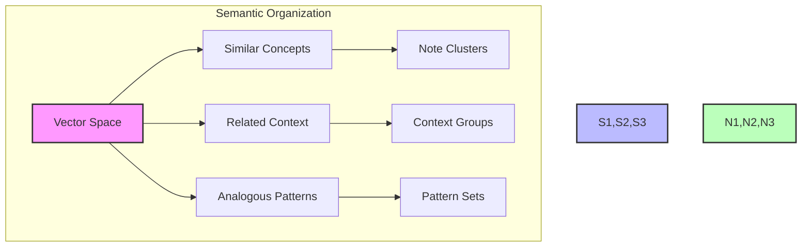

#### Physical implementation

Just as human cognition requires both immediate access to current thoughts and efficient storage of long-term memories, our physical implementation must balance accessibility with organization. We achieve this through a hybrid approach that combines human-readable file-based note storage with computationally efficient database-managed relationships.

##### File-based notes

Individual notes live as markdown files, offering human readability and direct editability, compatibility with version control systems, integration into existing tool ecosystems, and simple backup and migration options. Each note follows a consistent naming pattern:

```
YYYYMMDDHHMM-descriptive-slug.md
```

For example:

```markdown
# 202311290900-coffee-preferences.md

---

title: Morning Coffee Preferences
created: 2023-11-29-09-00
tags: [preferences, routines, beverages]

---

User expresses strong preference for dark roast coffee...
```

This timestamp-based identification strategy provides several benefits. It guarantees uniqueness, supports natural chronological ordering, preserves creation context, and allows for efficient filesystem organization.

##### Database-managed relationships

While notes live as files, we use SQLAlchemy with SQLite to manage relationships efficiently. This split architecture balances human accessibility with computational efficiency:

```python
from sqlalchemy.orm import declarative_base
from sqlalchemy import Column, String, DateTime, ForeignKey

Base = declarative_base()

class NoteRecord(Base):
    """Database record for note metadata."""
    __tablename__ = 'notes'

    id = Column(String, primary_key=True)  # YYYYMMDDHHMM-slug
    title = Column(String, nullable=False)
    created_at = Column(DateTime, nullable=False)
    updated_at = Column(DateTime, nullable=False)

class LinkRecord(Base):
    """Database record for note relationships."""
    __tablename__ = 'links'

    source_id = Column(String, ForeignKey('notes.id'), primary_key=True)
    target_id = Column(String, ForeignKey('notes.id'), primary_key=True)
    link_type = Column(String, primary_key=True)
    context = Column(String)
    created_at = Column(DateTime, nullable=False)
```

This hybrid approach provides numerous benefits. Firstly, notes are human-accessible as they remain directly readable and editable, are compatible with existing markdown tools, and are easy to backup and integrate into version control systems. Secondly, the computational efficiency of this approach allows for fast graph traversal through database indexes, efficient relationship querying, and ensures transactional safety during updates. Lastly, the system can evolve over time since notes can adapt independently of the relationship structure, and the database schema can adapt without altering note content, while new relationship types can be added effortlessly.

The database enables sophisticated queries impractical with simple file linking, such as path finding between concepts, relationship pattern analysis, knowledge cluster identification, and tracking temporal evolution.

This physical implementation bridges the gap between human-readable knowledge and machine-efficient processing. The file-based notes maintain accessibility for both humans and LLMs through markdown formatting, while the database provides the high-performance querying and relationship management needed for cognitive operations. This hybrid approach mirrors how human minds combine immediate understanding (like reading notes) with sophisticated relationship processing (like recognizing patterns across concepts).

For example, when Winston discovers a connection between morning routines and family traditions, the relationship persists through database transactions while keeping the notes themselves as clean, human-readable markdown files. SQLAlchemy's abstraction layer means we can start with SQLite for simplicity and migrate to more powerful databases as needs evolve.

This combination of conceptual organization and physical implementation creates a knowledge structure that's both sophisticated and maintainable. The next section explores how we operate on this structure to capture, update, and retrieve knowledge effectively.

##### Semantic storage

The semantic layer completes our knowledge structure by capturing meaning beyond explicit links and tags. While traditional databases excel at storing relationships and ChromaDB manages our vector representations, the semantic layer bridges these systems to create a complete understanding of knowledge relationships. This mirrors how human minds grasp both explicit connections and implicit similarities.

Just as our file system stores individual notes and our database manages their relationships, ChromaDB provides the foundation for semantic understanding through carefully organized collections. Each collection serves a specific cognitive purpose - our primary notes collection captures the semantic essence of knowledge content, while separate collections maintain the semantic aspects of our tag taxonomy and relationship types.

This structural organization ensures that semantic understanding permeates every level of our knowledge base. When Winston processes new information, the semantic layer preserves not just the content's vector representation, but its relationship to existing knowledge structures. This foundation enables the sophisticated semantic processing we'll explore in section 4.3.4.

ChromaDB manages our semantic layer through collections that mirror our knowledge organization:

```python
class SemanticStore:
    """Manages semantic embeddings and similarity search."""

    def __init__(self, client: chromadb.Client):
        self.client = client
        # Main collection for note content
        self.notes = client.create_collection(
            name="notes",
            metadata={"description": "Primary note embeddings"}
        )
        # Collection for tag embeddings
        self.tags = client.create_collection(
            name="tags",
            metadata={"description": "Tag taxonomy embeddings"}
        )

    async def add_note(
        self,
        note_id: str,
        content: str,
        metadata: dict
    ) -> None:
        """Add note content to semantic store."""
        await self.notes.add(
            ids=[note_id],
            documents=[content],
            metadatas=[{
                "created_at": metadata["created_at"],
                "tags": metadata["tags"],
                "type": "note"
            }]
        )
```

The semantic store maintains parallel collections for different aspects of our knowledge base. The primary notes collection handles content embeddings, while separate collections manage tags and other semantic structures. This organization allows efficient similarity operations across different knowledge dimensions.

Each note's embedding connects to both its markdown file and database records through consistent IDs:

```python
class NoteMetadata(BaseModel):
    """Metadata for semantic note storage."""
    note_id: str
    file_path: Path
    created_at: datetime
    tags: list[str]
    relationships: list[str]

async def store_note(
    self,
    content: str,
    metadata: NoteMetadata
) -> None:
    """Store note with connected metadata."""
    # Add to ChromaDB with relationship metadata
    await self.semantic_store.add_note(
        note_id=metadata.note_id,
        content=content,
        metadata={
            "created_at": metadata.created_at.isoformat(),
            "tags": metadata.tags,
            "relationships": metadata.relationships
        }
    )
```

ChromaDB's metadata filtering capabilities enhance our knowledge operations. We can combine semantic similarity with structured filters:

```python
async def find_similar_notes(
    self,
    content: str,
    tags: list[str] | None = None,
    min_similarity: float = 0.7,
    limit: int = 10
) -> list[NoteMatch]:
    """Find semantically similar notes with optional tag filtering."""
    where = {}
    if tags:
        where["tags"] = {"$contains": tags}

    results = await self.notes.query(
        query_texts=[content],
        where=where,
        n_results=limit
    )

    return [
        NoteMatch(
            note_id=id,
            similarity=distance,
            metadata=metadata
        )
        for id, distance, metadata in zip(
            results["ids"][0],
            results["distances"][0],
            results["metadatas"][0]
        )
        if distance >= min_similarity
    ]
```

The semantic layer completes our knowledge structure by providing the essential capability to understand meaning beyond literal text matching. Just as human minds grasp concepts rather than just words, Winston's semantic understanding enables it to:

1. Recognize related ideas even when expressed differently
2. Group conceptually similar knowledge
3. Discover implicit relationships between experiences
4. Adapt to evolving language and context

With this storage foundation established, we can now explore how Winston performs essential cognitive operations. Knowledge capture is achieved through the integrated use of all three storage components: it involves the creation of markdown files, the recording of relationships within the database, and the updating of semantic embeddings. For relationship management, the system utilizes the database structures while also employing semantic similarity techniques to propose new connections. When it comes to search and retrieval, Winston combines database querying with semantic similarity to identify and present relevant knowledge. Finally, knowledge evolution ensures that consistency is preserved across all three storage layers as the system's understanding grows and adapts.

The following section will demonstrate how these operations interconnect to create sophisticated cognitive capabilities, all while maintaining an architecturally simple and efficient design.

### 4.3.3 Knowledge operations

---

Section Goals:

- Capturing new knowledge (with duplicate detection)
- Updating existing knowledge
- Link discovery and creation
- Tag management and standardization
- Search and retrieval patterns
- Example showing complete operation flow

---

The Zettelkasten agent implements knowledge operations through a tool-based interface, allowing the LLM to make sophisticated decisions about knowledge management through natural language understanding. This mirrors our established pattern where LLMs handle reasoning and decision-making while tools perform specific actions.

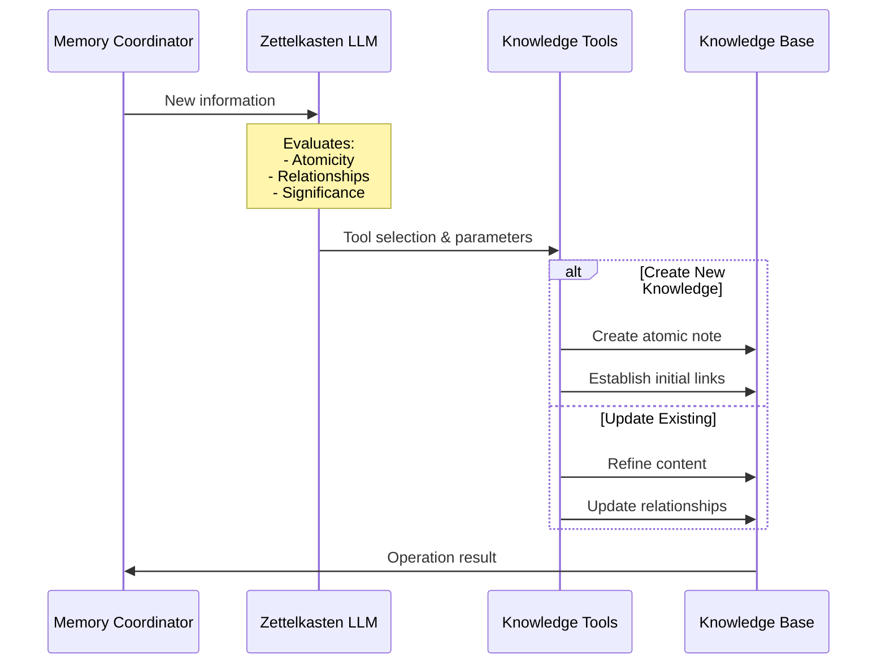

#### Core knowledge tools

The agent provides four categories of knowledge operations, each addressing distinct cognitive needs:

**Knowledge capture tools** handle the creation of new atomic notes while preventing duplication. When new information enters the system, these tools first check for similar existing knowledge through semantic comparison. If the information is novel, they create properly structured atomic notes with appropriate metadata and initial relationships.

**Knowledge update tools** manage the evolution of existing notes. Rather than simply overwriting content, these tools preserve important relationships while updating information. They maintain version history and ensure updates propagate appropriately through the knowledge network.

**Relationship management tools** handle both explicit and implicit connections between notes. They create typed links that capture specific kinds of relationships (temporal, causal, contextual) and discover potential connections through semantic analysis. This maintains the growing web of relationships that gives the knowledge base its cognitive value.

**Search and retrieval tools** make the knowledge base actionable by finding relevant information based on current context. They operate across multiple modalities - searching note content, following relationship paths, and leveraging semantic similarity to find conceptually related knowledge.

Let's examine two key operations in detail - knowledge capture and relationship management:

#### LLM-driven knowledge management

The system prompt guides the LLM in making sophisticated decisions about knowledge management:

```yaml
system_prompt: |
  You are a Zettelkasten agent responsible for creating and organizing atomic notes.
  Your role is to:
  1. Create clear, atomic notes that capture single ideas
  2. Establish meaningful connections between related notes
  3. Use progressive summarization to maintain clarity
  4. Ensure knowledge is properly organized and retrievable

  When creating notes:
  - Focus on capturing single, clear ideas
  - Use precise, unambiguous language
  - Include relevant context and connections
  - Add appropriate tags for organization
  - Consider how this note fits into existing knowledge
```

This prompt enables the LLM to reason about:

- When to create new notes versus update existing ones
- How to detect and handle duplicates
- When to create explicit versus discover implicit links
- How to maintain knowledge coherence

#### Knowledge capture flow

Let's examine how these components work together when Winston learns about a user's coffee preferences:

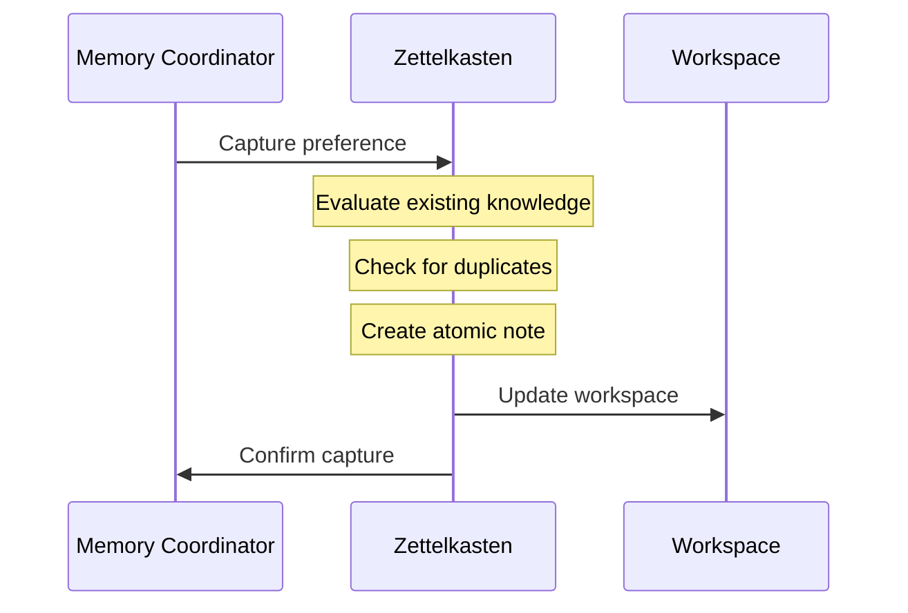

The flow includes:

- Duplicate detection through semantic similarity
- Atomic note creation with context preservation
- Initial link discovery and validation
- Tag assignment based on content analysis
- Integration with existing knowledge structures

The knowledge capture flow illustrates how tools enable sophisticated cognitive operations through simple interfaces. Consider how Winston processes new information about a user's coffee preferences:

```python
class CreateNoteRequest(BaseModel):
    """Parameters for atomic note creation."""
    content: str = Field(description="Content to capture")
    context: str = Field(description="Current context")
    importance: str = Field(description="Significance of this knowledge")
```

This simple interface belies the sophisticated processing it enables. When the Memory Coordinator identifies important information during conversation, it provides both the content and current context. The Zettelkasten agent's LLM then:

1. Evaluates how this information relates to existing knowledge
2. Determines appropriate atomic boundaries
3. Identifies potential relationships to other notes
4. Assesses the significance for future retrieval

Rather than exposing this complexity through the interface, we maintain a clean tool boundary that allows the LLM to focus on cognitive decisions while the tool handles implementation details.

Consider how duplicate detection works when Winston learns about a user's coffee preferences. Before creating a new note, the system checks for semantic similarity with existing notes:

```python
async def check_duplicates(
    self,
    content: str,
    threshold: float = 0.85
) -> list[Note]:
    """Find potential duplicate notes."""
    embedding = await self.get_embedding(content)
    return await self.find_similar_notes(embedding, threshold)
```

This simple interface belies sophisticated processing - the LLM evaluates whether similar notes represent true duplicates or just related concepts that deserve linking rather than merging.

#### Knowledge evolution

---

[Demonstrate how knowledge updates maintain coherence]

- Content refinement with relationship preservation
- Link maintenance and validation
- Tag consistency enforcement
- Version tracking for knowledge evolution
- Context preservation across updates

[Diagram showing update flow]

---

Knowledge in a cognitive system must adapt while maintaining coherence. When Winston receives new information that updates existing knowledge, the system must carefully manage both content changes and relationship preservation.

Consider how this evolution occurs when a user updates their coffee preferences:

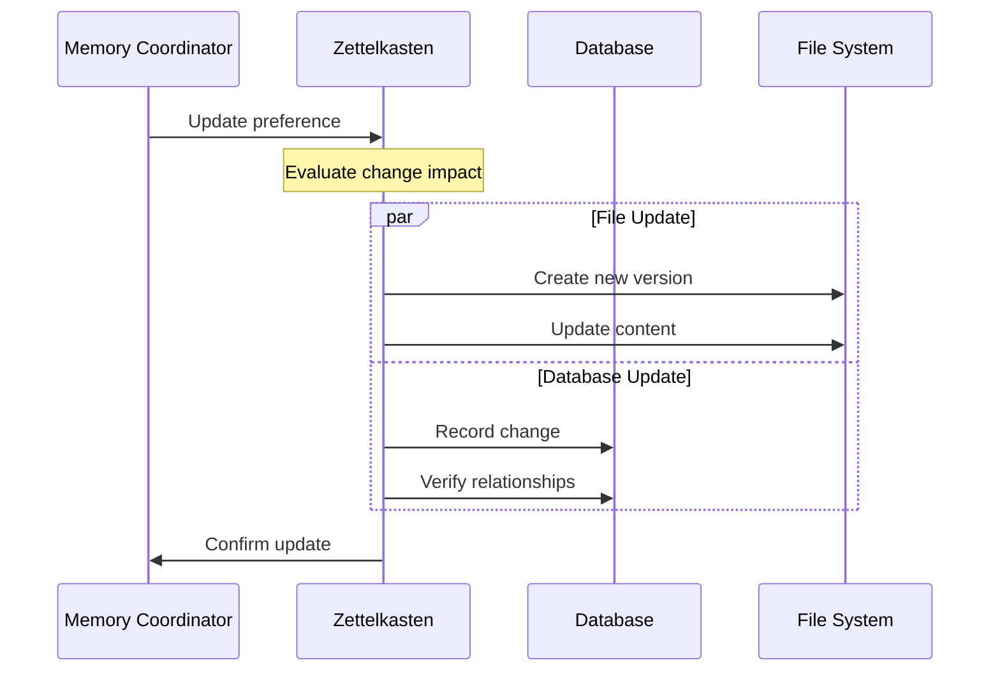

The update process handles several critical concerns:

1. **Version Management**
   Each note maintains its history through timestamped versions. Rather than overwriting existing content, updates create new versions while preserving the original:

```python
async def update_note(
    self,
    note_id: NoteId,
    content: str,
    context: str | None = None
) -> Note:
    """Update note while preserving history."""
    async with self.db.session() as session:
        # Create new version
        version = NoteVersion(
            note_id=note_id,
            content=content,
            created_at=datetime.now(),
            context=context
        )
        session.add(version)

        # Update note metadata
        note = await session.get(NoteRecord, note_id)
        note.updated_at = datetime.now()

        await session.commit()

        # Update file content
        await self._write_note_file(note_id, content)

        return note
```

This versioning approach ensures we can track how knowledge evolves while maintaining a clean current state. The file system always reflects the latest version, while the database preserves the full history.

2. **Relationship Preservation**
   Updates must maintain the semantic network that gives our knowledge base its cognitive value. When a note changes, its relationships require careful evaluation:

```python
async def evaluate_relationships(
    self,
    note_id: NoteId,
    old_content: str,
    new_content: str
) -> list[RelationshipChange]:
    """Evaluate how relationships should adapt to content changes."""
    # Get existing relationships
    existing = await self.db.get_note_relationships(note_id)

    # Have LLM evaluate relationship validity
    evaluation = await self.llm.evaluate_relationship_changes(
        old_content=old_content,
        new_content=new_content,
        relationships=existing
    )

    return evaluation.changes
```

The LLM plays a crucial role here, evaluating how content changes affect existing relationships. Some relationships might strengthen, others might weaken or become invalid. For example, if a user switches from coffee to tea, relationships about coffee preparation might become historical rather than active preferences.

3. **Consistency Management**
   Our hybrid storage approach demands careful synchronization between files and database. A transaction manager ensures updates maintain consistency:

```python
class UpdateTransaction:
    """Manages atomic updates across file and database."""

    def __init__(self, db: ZettelkastenDB, fs: NoteFileSystem):
        self.db = db
        self.fs = fs

    async def __aenter__(self):
        self.db_transaction = await self.db.begin()
        return self

    async def __aexit__(self, exc_type, exc, tb):
        if exc_type is None:
            await self.db_transaction.commit()
        else:
            await self.db_transaction.rollback()
            await self.fs.revert_changes()
```

This transaction management ensures that file system and database changes succeed or fail together, maintaining system integrity even during failures.

4. **Semantic Coherence**
   Beyond mechanical consistency, updates must maintain semantic coherence. The LLM evaluates whether changes preserve essential meaning:

```python
async def validate_update(
    self,
    note: Note,
    new_content: str,
    context: str | None = None
) -> UpdateValidation:
    """Validate that update maintains semantic coherence."""
    prompt = f"""
    Evaluate if this update maintains essential meaning while reflecting new information.

    Original note:
    {note.content}

    Proposed update:
    {new_content}

    Context:
    {context or 'No additional context'}

    Consider:
    1. Does update preserve core concepts?
    2. Are relationship changes justified?
    3. Is historical context maintained appropriately?
    """

    response = await self.llm.generate_response(prompt)
    return UpdateValidation.parse_obj(response.content)
```

This semantic validation ensures updates enhance rather than degrade our knowledge base's cognitive value.

A complete update flow brings these elements together:

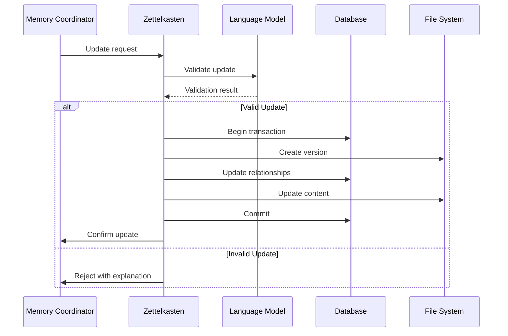

This careful orchestration of version management, relationship preservation, consistency control, and semantic validation enables Winston's knowledge to evolve naturally while maintaining its cognitive utility.

#### Relationship management

---

[Show how the LLM manages knowledge relationships]

- Explicit link creation through direct observation
- Implicit relationship discovery through analysis
- Link validation and coherence maintenance
- Network structure optimization

---

While knowledge evolution handles how individual notes change, relationship management focuses on the connections that form Winston's cognitive network. These relationships aren't simple links - they represent meaningful cognitive associations that inform understanding and decision-making.

The relationship management system handles three key responsibilities:

1. **Explicit Relationship Creation**
   When the Memory Coordinator identifies direct relationships during conversation, the system creates typed links with semantic context:

```python
class RelationshipType(str, Enum):
    """Core relationship types in knowledge network."""
    EXTENDS = "extends"          # Builds upon or elaborates
    CONTRADICTS = "contradicts"  # Conflicts with or updates
    RELATES = "relates"          # General association
    CAUSES = "causes"            # Causal relationship
    PART_OF = "part_of"         # Hierarchical belonging
    TEMPORAL = "temporal"        # Time-based relationship

class Relationship(BaseModel):
    """Semantic relationship between notes."""
    source_id: NoteId
    target_id: NoteId
    type: RelationshipType
    context: str | None
    confidence: float = Field(ge=0.0, le=1.0)
    created_at: datetime = Field(default_factory=datetime.now)
```

The LLM evaluates conversation context to determine appropriate relationship types:

```python
async def evaluate_relationship(
    self,
    source_content: str,
    target_content: str,
    context: str | None = None
) -> Relationship:
    """Determine relationship type and context from content."""
    prompt = f"""
    Evaluate the relationship between these pieces of knowledge:

    Source:
    {source_content}

    Target:
    {target_content}

    Context:
    {context or 'No additional context'}

    Determine:
    1. Relationship type
    2. Contextual explanation
    3. Confidence level
    """

    response = await self.llm.generate_response(prompt)
    return Relationship.parse_obj(response.content)
```

2. **Implicit Relationship Discovery**
   Beyond explicit connections, the system discovers implicit relationships through semantic analysis:

```python
async def discover_relationships(
    self,
    note_id: NoteId,
    min_confidence: float = 0.7
) -> list[Relationship]:
    """Find potential relationships through semantic similarity."""
    # Get note content and embedding
    note = await self.get_note(note_id)
    embedding = await self.get_note_embedding(note)

    # Find semantically similar notes
    similar_notes = await self.find_similar_notes(
        embedding,
        threshold=min_confidence
    )

    # Evaluate relationships
    relationships = []
    for similar in similar_notes:
        relationship = await self.evaluate_relationship(
            note.content,
            similar.content
        )
        if relationship.confidence >= min_confidence:
            relationships.append(relationship)

    return relationships
```

3. **Network Maintenance**
   The system actively maintains the health and utility of the relationship network:

```python
async def optimize_network(self) -> NetworkOptimization:
    """Analyze and optimize relationship network."""
    async with self.db.session() as session:
        # Identify potential issues
        orphaned = await self._find_orphaned_notes(session)
        circular = await self._find_circular_references(session)
        redundant = await self._find_redundant_links(session)

        # Generate optimization plan
        plan = await self.llm.generate_optimization_plan(
            orphaned=orphaned,
            circular=circular,
            redundant=redundant
        )

        # Apply approved optimizations
        results = await self._apply_optimizations(plan)

        return results
```

This maintenance includes:

- Removing invalid relationships
- Consolidating redundant connections
- Ensuring bidirectional consistency
- Optimizing network structure

The relationship network evolves through active use:

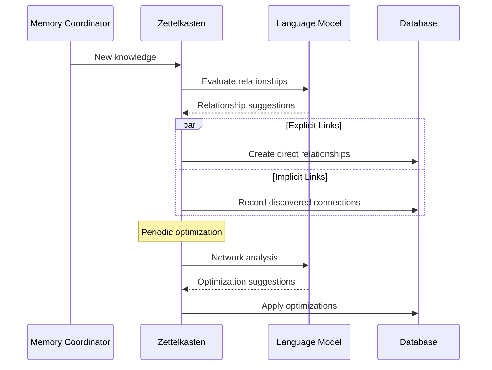

This continuous cycle of creation, discovery, and optimization ensures the relationship network remains both accurate and useful for cognitive operations.

#### Search and integration

---

[Demonstrate how knowledge becomes actionable]

- Multi-modal search across content, tags, and links
- Context-aware retrieval for relevance
- Ranking and filtering results
- Workspace integration for immediate use

[Conclude with complete example showing:

1. Initial knowledge capture
2. Relationship discovery
3. Knowledge refinement
4. Retrieval and use]

---

The true value of Winston's knowledge emerges through effective retrieval and integration into ongoing cognitive processes. The search system operates across multiple dimensions - content, relationships, and semantic similarity - to find relevant knowledge when needed.

The search interface provides a unified entry point while supporting different search strategies:

```python
class SearchRequest(BaseModel):
    """Parameters for knowledge search."""
    query: str
    context: str | None = None
    search_types: list[SearchType] = Field(
        default_factory=lambda: [
            SearchType.CONTENT,
            SearchType.RELATIONSHIP,
            SearchType.SEMANTIC
        ]
    )
    max_results: int = 10
    min_confidence: float = 0.7

class SearchType(str, Enum):
    """Different ways to search knowledge."""
    CONTENT = "content"          # Direct text matching
    RELATIONSHIP = "relationship"  # Graph traversal
    SEMANTIC = "semantic"        # Embedding similarity
```

The search process combines multiple strategies:

```python
async def search_knowledge(
    self,
    request: SearchRequest
) -> SearchResults:
    """Find relevant knowledge using multiple strategies."""
    results = []

    # Parallel search across different dimensions
    searches = []
    if SearchType.CONTENT in request.search_types:
        searches.append(self._content_search(request))
    if SearchType.RELATIONSHIP in request.search_types:
        searches.append(self._relationship_search(request))
    if SearchType.SEMANTIC in request.search_types:
        searches.append(self._semantic_search(request))

    # Gather results
    all_results = await asyncio.gather(*searches)

    # Merge and rank results
    merged = await self._merge_results(
        all_results,
        min_confidence=request.min_confidence
    )

    # Return top results
    return SearchResults(
        items=merged[:request.max_results],
        total=len(merged)
    )
```

Each search strategy serves a different cognitive need:

1. **Content Search**
   Direct text matching finds explicit mentions and key terms:

```python
async def _content_search(
    self,
    request: SearchRequest
) -> list[SearchResult]:
    """Search note content directly."""
    async with self.db.session() as session:
        # Use database full-text search if available
        if self.db.supports_fts:
            results = await session.execute(
                select(NoteRecord).where(
                    NoteRecord.content.match(request.query)
                )
            )
        else:
            # Fallback to simple pattern matching
            results = await session.execute(
                select(NoteRecord).where(
                    NoteRecord.content.contains(request.query)
                )
            )

        return [
            SearchResult(
                note_id=record.id,
                confidence=1.0 if request.query in record.content else 0.8,
                match_type=SearchType.CONTENT
            )
            for record in results.scalars()
        ]
```

2. **Relationship Search**
   Graph traversal finds connected knowledge:

```python
async def _relationship_search(
    self,
    request: SearchRequest
) -> list[SearchResult]:
    """Find knowledge through relationship network."""
    # First find entry points
    seeds = await self._content_search(request)

    results = []
    for seed in seeds:
        # Follow relationships up to 2 steps
        related = await self.db.find_connected_notes(
            seed.note_id,
            max_depth=2
        )

        # Score based on relationship distance
        for note_id, depth in related:
            results.append(
                SearchResult(
                    note_id=note_id,
                    confidence=1.0 / (depth + 1),
                    match_type=SearchType.RELATIONSHIP
                )
            )

    return results
```

3. **Semantic Search**
   Vector similarity finds conceptually related knowledge:

```python
async def _semantic_search(
    self,
    request: SearchRequest
) -> list[SearchResult]:
    """Find knowledge through semantic similarity."""
    # Get query embedding
    query_embedding = await self.get_embedding(request.query)

    # Find similar notes
    similar = await self.db.find_similar_embeddings(
        query_embedding,
        min_similarity=request.min_confidence
    )

    return [
        SearchResult(
            note_id=note_id,
            confidence=similarity,
            match_type=SearchType.SEMANTIC
        )
        for note_id, similarity in similar
    ]
```

The search results integrate into Winston's cognitive workspace through careful summarization and context matching:

```python
async def integrate_knowledge(
    self,
    search_results: SearchResults,
    current_context: str
) -> WorkspaceUpdate:
    """Prepare knowledge for workspace integration."""
    # Get full note content
    notes = await self.db.get_notes([r.note_id for r in search_results.items])

    # Have LLM generate contextual summary
    summary = await self.llm.generate_integration_summary(
        notes=notes,
        context=current_context
    )

    # Create workspace update
    return WorkspaceUpdate(
        content=summary,
        source_notes=notes,
        confidence=max(r.confidence for r in search_results.items)
    )
```

This integration process ensures that retrieved knowledge enhances rather than disrupts ongoing cognitive processes. The LLM carefully considers current context when deciding how to present relevant information.

Let's see this complete system in action through a concrete example:

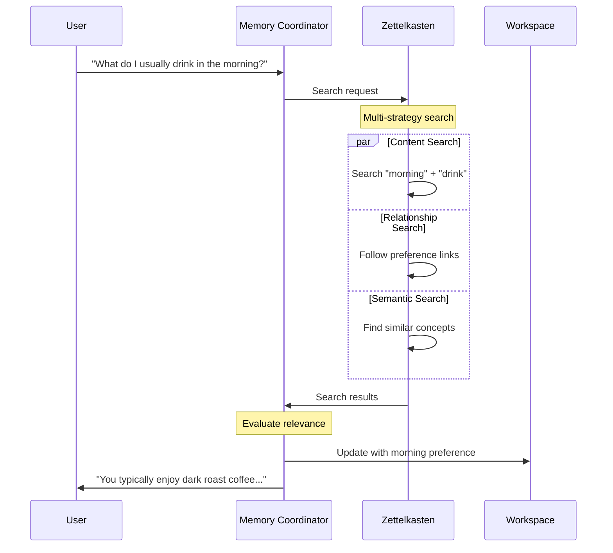

This example shows how:

1. Different search strategies combine to find relevant knowledge
2. Results merge based on confidence and relevance
3. Context influences result integration
4. Knowledge flows naturally into conversation

The search and integration system makes Winston's knowledge base more than just a storage system - it becomes an active participant in cognitive processes.

### 4.3.4 Semantic integration

---

Section Goals:

- Vector embedding strategy
- Similarity search implementation
- Using embeddings for link suggestions
- Tag similarity and standardization
- Integration with specialist agents
- Example showing semantic-driven operations

---

While explicit links and tags provide clear organization, human-like understanding requires grasping the meaning behind the words. Semantic integration enables Winston to recognize conceptual relationships even when they're not explicitly connected.

Consider how humans recognize related concepts. When someone mentions "morning coffee ritual", we naturally connect this to concepts like "breakfast habits", "daily routines", and "productivity patterns" - even if these connections were never explicitly taught. Winston needs similar capabilities to develop genuine understanding.

Vector embeddings transform text into mathematical representations that capture semantic meaning. Rather than relying solely on exact matches or explicit links, Winston can identify conceptually related knowledge through similarity in this semantic space.

#### Vector embedding strategy

The embedding strategy addresses three key requirements:

1. **Consistent Representation**: Notes with similar meaning should have similar vector representations, regardless of specific wording
2. **Context Preservation**: Embeddings must capture both content and relevant context
3. **Efficient Processing**: Vector operations must support real-time cognitive operations

We implement this through a layered approach:

```python
class SemanticProcessor:
    """Manages semantic understanding of knowledge."""

    def __init__(self, model: EmbeddingModel):
        self.model = model
        self.cache = EmbeddingCache()

    async def get_embedding(
        self,
        content: str,
        context: str | None = None
    ) -> np.ndarray:
        """Generate semantic embedding with context."""
        # Check cache first
        cache_key = self._make_cache_key(content, context)
        if cached := await self.cache.get(cache_key):
            return cached

        # Combine content and context
        text = content
        if context:
            text = f"{content}\nContext: {context}"

        # Generate and cache embedding
        embedding = await self.model.embed(text)
        await self.cache.set(cache_key, embedding)
        return embedding
```

This foundation enables sophisticated semantic operations. When Winston processes new information about a user's coffee preferences, the semantic processor:

1. Generates embeddings that capture both the specific preference and its context
2. Compares these embeddings to existing knowledge to find related concepts
3. Suggests potential relationships based on semantic similarity

The embedding strategy deliberately separates semantic processing from storage concerns:

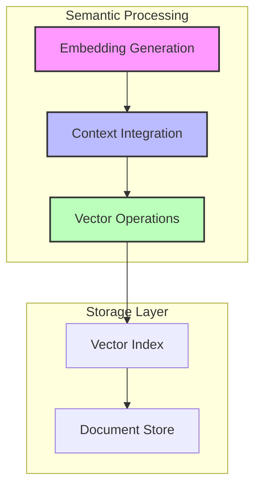

This separation ensures the semantic layer can evolve independently as embedding technology improves, while maintaining stable interfaces for cognitive operations.

#### Similarity search implementation

With embeddings providing semantic representation, Winston needs efficient ways to find conceptually related knowledge. The similarity search system combines multiple techniques to balance accuracy and performance.

The core similarity interface defines clear boundaries for semantic operations:

```python
class SimilarityMatch(BaseModel):
    """Semantic similarity result."""
    note_id: str
    similarity: float
    context: str | None
    confidence: float

class SimilaritySearch:
    """Manages semantic similarity operations."""

    def __init__(
        self,
        vector_store: VectorStore,
        semantic_processor: SemanticProcessor
    ):
        self.store = vector_store
        self.processor = semantic_processor

    async def find_similar(
        self,
        content: str,
        context: str | None = None,
        min_similarity: float = 0.7,
        limit: int = 10
    ) -> list[SimilarityMatch]:
        """Find semantically similar knowledge."""
        # Generate query embedding
        query_embedding = await self.processor.get_embedding(
            content, context
        )

        # Search vector store
        matches = await self.store.search(
            query_embedding,
            min_similarity=min_similarity,
            limit=limit
        )

        # Enhance results with context
        return [
            SimilarityMatch(
                note_id=match.id,
                similarity=match.score,
                context=await self._get_match_context(
                    match.id, content
                ),
                confidence=self._calculate_confidence(
                    match.score, context is not None
                )
            )
            for match in matches
        ]
```

This implementation addresses several key cognitive needs:

1. **Context-Aware Matching**: Similarity considers both content and context when finding related knowledge
2. **Confidence Scoring**: Results include confidence levels based on match quality and context
3. **Relevance Enhancement**: Additional context helps explain why matches are meaningful

Consider how this operates when Winston processes user preferences:

```mermaid
sequenceDagram
    participant W as Winston
    participant S as Similarity Search
    participant V as Vector Store
    participant K as Knowledge Base

    W->>S: Search similar preferences
    S->>S: Generate embedding
    S->>V: Find similar vectors
    V->>K: Get note content
    K->>S: Return matches
    S->>S: Enhance with context
    S->>W: Return similar preferences
```

The similarity system integrates naturally with Winston's cognitive workspace:

```python
async def integrate_similar_knowledge(
    self,
    workspace: Workspace,
    content: str,
    min_confidence: float = 0.7
) -> None:
    """Enhance workspace with similar knowledge."""
    # Find similar knowledge
    matches = await self.similarity.find_similar(
        content,
        context=workspace.current_context,
        min_confidence=min_confidence
    )

    # Have LLM evaluate relevance
    relevant = await self.llm.evaluate_similarity_relevance(
        matches,
        workspace.current_context
    )

    # Integrate relevant matches
    for match in relevant:
        await workspace.integrate_knowledge(
            match.note_id,
            match.context
        )
```

This integration ensures that semantically related knowledge naturally informs ongoing cognitive processes. When Winston discusses morning routines, similar patterns from other daily habits automatically enrich the conversation context.

The similarity system deliberately avoids complex optimization strategies in favor of clear cognitive utility. While techniques like approximate nearest neighbors could improve raw performance, the current implementation prioritizes:

1. Clear semantic relationships
2. Reliable context integration
3. Explainable matching
4. Natural workspace integration

This foundation supports the more sophisticated semantic operations we'll explore next - using similarity for link suggestions and tag standardization.

#### Using embeddings for link suggestions

While explicit links capture known relationships, semantic similarity helps Winston discover connections that might otherwise be missed. The link suggestion system uses embeddings to identify potential relationships while maintaining the knowledge network's cognitive value.

The core suggestion interface balances automation with cognitive control:

```python
class LinkSuggestion(BaseModel):
    """Suggested relationship between notes."""
    source_id: str
    target_id: str
    similarity: float
    relationship_type: str | None
    explanation: str
    confidence: float

class LinkSuggester:
    """Suggests potential knowledge relationships."""

    def __init__(
        self,
        similarity: SimilaritySearch,
        llm: LanguageModel
    ):
        self.similarity = similarity
        self.llm = llm

    async def suggest_links(
        self,
        note_id: str,
        min_confidence: float = 0.7
    ) -> list[LinkSuggestion]:
        """Find and evaluate potential relationships."""
        # Get note content
        note = await self.get_note(note_id)

        # Find similar notes
        matches = await self.similarity.find_similar(
            note.content,
            context=note.context
        )

        # Have LLM evaluate relationships
        suggestions = []
        for match in matches:
            if match.similarity >= min_confidence:
                relationship = await self.evaluate_relationship(
                    note.content,
                    match.note_id
                )
                suggestions.append(relationship)

        return suggestions
```

The system uses LLM evaluation to turn raw similarity into meaningful relationships:

```python
async def evaluate_relationship(
    self,
    source_content: str,
    target_id: str
) -> LinkSuggestion:
    """Evaluate potential relationship between notes."""
    target = await self.get_note(target_id)

    # Have LLM analyze relationship
    evaluation = await self.llm.evaluate_note_relationship(
        source=source_content,
        target=target.content,
        context=target.context
    )

    return LinkSuggestion(
        source_id=source_id,
        target_id=target_id,
        similarity=evaluation.similarity,
        relationship_type=evaluation.relationship,
        explanation=evaluation.reasoning,
        confidence=evaluation.confidence
    )
```

This process mirrors how humans discover connections:

1. Notice similarity between concepts
2. Analyze potential relationship
3. Determine relationship type
4. Explain the connection

Consider how this works when Winston learns about morning routines:

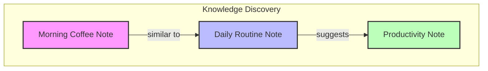

The LLM might recognize that:

- Morning coffee is part of a daily routine
- Daily routines relate to productivity patterns
- Therefore, morning coffee habits may influence productivity

These discovered relationships enhance Winston's understanding:

```python
async def enhance_understanding(
    self,
    note_id: str,
    min_confidence: float = 0.7
) -> None:
    """Enhance knowledge through relationship discovery."""
    # Get relationship suggestions
    suggestions = await self.suggest_links(
        note_id,
        min_confidence=min_confidence
    )

    # Filter and verify suggestions
    verified = await self.verify_suggestions(suggestions)

    # Create validated relationships
    for suggestion in verified:
        await self.create_relationship(
            source_id=suggestion.source_id,
            target_id=suggestion.target_id,
            type=suggestion.relationship_type,
            context=suggestion.explanation
        )
```

This enhancement process runs both:

- Immediately when new knowledge is added
- Periodically to discover relationships in existing knowledge

The system maintains cognitive value by:

1. Requiring LLM verification of relationships
2. Preserving explanation context
3. Integrating with existing knowledge structures
4. Supporting ongoing discovery

This foundation of semantic relationship discovery enables the tag standardization capabilities we'll explore next.

#### Tag similarity and standardization

While free-form tagging provides flexibility, cognitive systems benefit from consistent categorization. Tag standardization uses semantic similarity to maintain a coherent taxonomy while allowing natural evolution of categories.

The standardization system combines embedding-based similarity with LLM evaluation:

```python
class TagStandardizer:
    """Maintains consistent knowledge categorization."""

    def __init__(
        self,
        semantic_processor: SemanticProcessor,
        llm: LanguageModel
    ):
        self.processor = semantic_processor
        self.llm = llm
        self.tag_embeddings = {}

    async def standardize_tags(
        self,
        proposed_tags: list[str],
        context: str | None = None
    ) -> list[str]:
        """Align proposed tags with existing taxonomy."""
        standardized = []

        for tag in proposed_tags:
            # Find similar existing tags
            similar = await self.find_similar_tags(tag)

            if similar:
                # Evaluate whether to use existing or new tag
                standardized_tag = await self.evaluate_tag_choice(
                    proposed=tag,
                    existing=similar,
                    context=context
                )
                standardized.append(standardized_tag)
            else:
                # No similar tags exist, verify new tag
                if await self.verify_new_tag(tag, context):
                    standardized.append(tag)

        return standardized
```

Tag similarity considers both semantic meaning and usage patterns:

```python
async def find_similar_tags(
    self,
    tag: str,
    min_similarity: float = 0.7
) -> list[TagMatch]:
    """Find semantically similar existing tags."""
    # Get tag embedding
    tag_embedding = await self.processor.get_embedding(tag)

    # Compare with existing tags
    matches = []
    for existing_tag, existing_embedding in self.tag_embeddings.items():
        similarity = cosine_similarity(
            tag_embedding,
            existing_embedding
        )
        if similarity >= min_similarity:
            matches.append(
                TagMatch(
                    tag=existing_tag,
                    similarity=similarity,
                    usage_count=await self.get_tag_usage(existing_tag)
                )
            )

    return sorted(
        matches,
        key=lambda m: (m.similarity, m.usage_count),
        reverse=True
    )
```

The LLM evaluates potential tag choices based on cognitive utility:

```python
async def evaluate_tag_choice(
    self,
    proposed: str,
    existing: list[TagMatch],
    context: str | None = None
) -> str:
    """Determine best tag choice for cognitive value."""
    prompt = f"""
    Evaluate tag choices for knowledge organization.

    Proposed new tag: {proposed}

    Similar existing tags:
    {self._format_tag_matches(existing)}

    Context: {context or 'No additional context'}

    Consider:
    1. Semantic clarity
    2. Consistency with existing taxonomy
    3. Cognitive utility for retrieval
    4. Balance between precision and generalization

    Should we:
    A) Use an existing tag (specify which)
    B) Add the new tag
    C) Suggest an alternative

    Explain your reasoning.
    """

    response = await self.llm.generate_response(prompt)
    return self._parse_tag_decision(response.content)
```

This process maintains taxonomy health through several mechanisms:

1. **Similarity Clustering**: Related tags naturally group together
2. **Usage Analysis**: Popular tags tend to persist
3. **Context Consideration**: Tag choices reflect cognitive context
4. **Guided Evolution**: New tags emerge when cognitively valuable

Consider how this works with preference categorization:

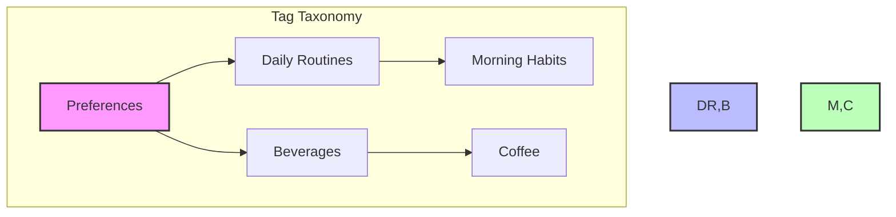

When processing a note about "morning coffee ritual", the system might:

1. Recognize similarity to existing tags
2. Consider multiple categorization options
3. Choose tags that support cognitive retrieval
4. Maintain consistent classification

The standardization system integrates with knowledge capture:

```python
async def process_new_knowledge(
    self,
    content: str,
    proposed_tags: list[str],
    context: str | None = None
) -> Note:
    """Process new knowledge with standardized tags."""
    # Standardize tags
    standardized_tags = await self.standardize_tags(
        proposed_tags,
        context
    )

    # Create note with standardized tags
    note = await self.create_note(
        content=content,
        tags=standardized_tags,
        context=context
    )

    # Update tag embeddings if new tags added
    await self.update_tag_embeddings(standardized_tags)

    return note
```

This standardization enables reliable knowledge organization while allowing natural taxonomy evolution. The next section will show how these semantic capabilities enhance specialist agent interactions.

Tag standardization happens through LLM evaluation of semantic similarity. When assigning tags to a new note, the system compares potential tags against existing ones:

```python
async def standardize_tags(
    self,
    proposed_tags: list[str]
) -> list[str]:
    """Align new tags with existing taxonomy."""
    existing = await self.get_tag_taxonomy()
    return await self.llm.standardize_tags(
        proposed=proposed_tags,
        existing=existing
    )
```

This maintains taxonomy consistency while allowing natural evolution of the tag system.

#### Integration with specialist agents

Semantic understanding becomes truly powerful when it enhances specialist agent capabilities. Each cognitive specialist leverages semantic processing in unique ways while contributing to collective understanding.

The semantic integration system provides specialized interfaces for different cognitive needs:

```python
class SemanticIntegration:
    """Manages semantic capabilities for specialists."""

    def __init__(
        self,
        processor: SemanticProcessor,
        similarity: SimilaritySearch,
        standardizer: TagStandardizer
    ):
        self.processor = processor
        self.similarity = similarity
        self.standardizer = standardizer

    async def get_specialist_interface(
        self,
        specialist_type: SpecialistType
    ) -> SpecialistInterface:
        """Get semantic interface for specialist type."""
        match specialist_type:
            case SpecialistType.PATTERN:
                return PatternInterface(self)
            case SpecialistType.LEARNING:
                return LearningInterface(self)
            case SpecialistType.PLANNING:
                return PlanningInterface(self)
```

Let's examine how three key specialists leverage semantic capabilities:

##### Pattern Recognition Specialist

The Pattern Recognition agent uses semantic similarity to discover recurring themes and relationships:

```python
class PatternInterface:
    """Semantic interface for pattern recognition."""

    async def find_patterns(
        self,
        notes: list[Note],
        min_confidence: float = 0.7
    ) -> list[Pattern]:
        """Identify patterns across notes."""
        # Generate embeddings for analysis
        embeddings = await self.get_note_embeddings(notes)

        # Cluster similar concepts
        clusters = await self.cluster_embeddings(embeddings)

        # Have LLM analyze clusters
        patterns = []
        for cluster in clusters:
            pattern = await self.analyze_cluster(
                cluster.notes,
                cluster.centroid
            )
            if pattern.confidence >= min_confidence:
                patterns.append(pattern)

        return patterns
```

##### Learning Specialist

The Human Learning agent uses semantic understanding to better incorporate feedback:

```python
class LearningInterface:
    """Semantic interface for learning processes."""

    async def process_feedback(
        self,
        feedback: str,
        context: Note,
        related_notes: list[Note]
    ) -> LearningUpdate:
        """Process feedback semantically."""
        # Find knowledge affected by feedback
        affected = await self.find_affected_knowledge(
            feedback,
            context,
            related_notes
        )

        # Generate learning update
        update = await self.generate_update(
            feedback,
            affected
        )

        # Propagate changes through knowledge
        await self.propagate_learning(update)

        return update
```

##### Planning Specialist

The Planning agent leverages semantic relationships for better decision-making:

```python
class PlanningInterface:
    """Semantic interface for planning processes."""

    async def analyze_options(
        self,
        goal: str,
        options: list[str],
        context: str
    ) -> list[Option]:
        """Analyze options using semantic knowledge."""
        # Find relevant knowledge
        knowledge = await self.find_relevant_knowledge(
            goal, options, context
        )

        # Evaluate options semantically
        evaluations = []
        for option in options:
            evaluation = await self.evaluate_option(
                option,
                goal,
                knowledge
            )
            evaluations.append(evaluation)

        return evaluations
```

These specialist integrations create a virtuous cycle:

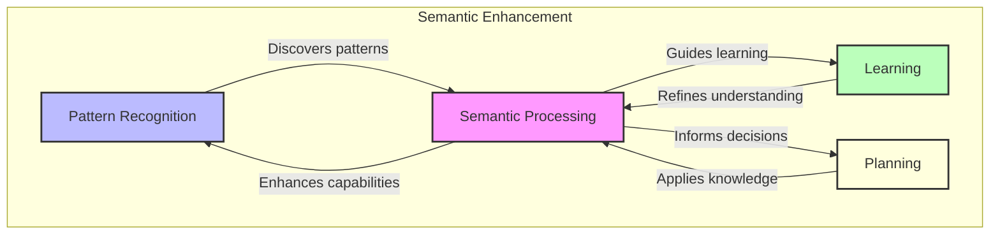

Each specialist both uses and enhances semantic understanding:

1. **Pattern Recognition**

   - Uses similarity to find patterns
   - Enhances semantic relationships
   - Discovers new categories

2. **Learning**

   - Leverages similarity for feedback
   - Refines semantic understanding
   - Improves categorization

3. **Planning**
   - Applies semantic knowledge
   - Validates relationships
   - Strengthens useful patterns

This integration creates increasingly sophisticated cognitive capabilities:

```python
async def enhance_cognitive_processes(
    self,
    workspace: Workspace
) -> None:
    """Enhance cognitive processes with semantic understanding."""
    # Get current context
    context = workspace.current_context

    # Enhance with patterns
    patterns = await self.pattern_interface.find_patterns(
        workspace.recent_notes
    )
    await workspace.integrate_patterns(patterns)

    # Apply learning updates
    updates = await self.learning_interface.get_relevant_updates(
        context
    )
    await workspace.apply_updates(updates)

    # Inform planning
    options = await self.planning_interface.analyze_options(
        workspace.current_goal,
        workspace.available_options,
        context
    )
    await workspace.update_options(options)
```

This semantic foundation enables Winston to:

1. Recognize meaningful patterns
2. Learn effectively from feedback
3. Make informed decisions
4. Build increasingly sophisticated understanding

The final section will demonstrate these capabilities through a complete example of semantic-driven operations.

#### Example: Semantic-driven operations in action

Let's examine how these semantic capabilities work together through a concrete example of Winston learning about a user's morning routine preferences. This example demonstrates the full cycle of semantic processing, specialist integration, and knowledge enhancement.

Consider this interaction sequence:

```python
# Initial learning about morning routine
user_input = """
I usually start my day early with coffee and reading.
Like my father, I find it helps me focus for the day ahead.
"""

# Later feedback
feedback = """
Actually, I've switched to tea recently, but still keep
the morning reading habit.
"""

# Pattern discovery
related_input = """
In the evenings I also set aside quiet time for reading,
it helps me wind down.
"""
```

Let's trace how semantic understanding drives cognitive operations:

##### 1. Initial Knowledge Processing

First, Winston processes the morning routine information:

```python
async def process_new_understanding(
    self,
    content: str,
    context: Workspace
) -> None:
    """Process new information with semantic understanding."""
    # Generate embedding
    embedding = await self.semantic.get_embedding(
        content,
        context=context.current_context
    )

    # Find related knowledge
    similar = await self.semantic.find_similar(embedding)

    # Have LLM analyze understanding
    analysis = await self.llm.analyze_new_knowledge(
        content=content,
        similar=similar,
        context=context
    )

    # Create structured knowledge
    note = await self.create_knowledge(
        content=content,
        analysis=analysis,
        embedding=embedding
    )

    # Integrate with workspace
    await context.integrate_knowledge(note)
```

This creates several semantic connections:

```mermaid
graph TD
    M[Morning Routine]
    C[Coffee Preference]
    F[Family Influence]
    P[Productivity]

    M -->|"includes"| C
    M -->|"influenced by"| F
    M -->|"supports"| P

    style M fill:#f9f,stroke:#333,stroke-width:2px
    style C,F fill:#bbf,stroke:#333,stroke-width:2px
    style P fill:#bfb,stroke:#333,stroke-width:2px
```

##### 2. Feedback Integration

When Winston receives feedback about the switch to tea:

```python
async def integrate_feedback(
    self,
    feedback: str,
    original: Note,
    context: Workspace
) -> None:
    """Integrate feedback with semantic understanding."""
    # Analyze feedback semantically
    analysis = await self.learning_interface.process_feedback(
        feedback=feedback,
        original=original,
        context=context
    )

    # Update knowledge while preserving relationships
    updated = await self.update_knowledge(
        note=original,
        changes=analysis.changes,
        preserve=analysis.preserve
    )

    # Adjust semantic connections
    await self.adjust_relationships(
        note=updated,
        analysis=analysis
    )
```

The semantic understanding preserves important relationships while updating specifics:

```mermaid
graph TD
    M[Morning Routine]
    T[Tea Preference]
    C[Previous Coffee]
    R[Reading Habit]

    M -->|"currently includes"| T
    M -->|"previously included"| C
    M -->|"maintains"| R

    style M fill:#f9f,stroke:#333,stroke-width:2px
    style T,C fill:#bbf,stroke:#333,stroke-width:2px
    style R fill:#bfb,stroke:#333,stroke-width:2px
```

##### 3. Pattern Recognition

When learning about evening reading, semantic understanding enables pattern discovery:

```python
async def discover_patterns(
    self,
    new_content: str,
    context: Workspace
) -> None:
    """Discover patterns through semantic analysis."""
    # Find semantically related notes
    related = await self.semantic.find_similar(new_content)

    # Analyze for patterns
    patterns = await self.pattern_interface.analyze_patterns(
        new_content=new_content,
        related=related,
        context=context
    )

    # Create pattern knowledge
    for pattern in patterns:
        await self.create_pattern_note(
            pattern=pattern,
            evidence=[new_content, *related]
        )
```

This reveals broader patterns:

```mermaid
graph TD
    subgraph "Reading Patterns"
        MR[Morning Reading]
        ER[Evening Reading]
        RP[Reading Pattern]

        MR -->|"instance of"| RP
        ER -->|"instance of"| RP

        style RP fill:#f9f,stroke:#333,stroke-width:2px
        style MR,ER fill:#bbf,stroke:#333,stroke-width:2px
    end

    subgraph "Routine Patterns"
        DR[Daily Routines]
        F[Focus Time]
        R[Relaxation]

        DR -->|"supports"| F
        DR -->|"enables"| R

        style DR fill:#bfb,stroke:#333,stroke-width:2px
        style F,R fill:#ffd,stroke:#333,stroke-width:2px
    end
```

##### 4. Enhanced Understanding

These semantic operations create sophisticated understanding:

```python
class EnhancedUnderstanding:
    """Cognitive patterns discovered through semantic analysis."""

    patterns = {
        "reading_ritual": {
            "instances": ["morning_reading", "evening_reading"],
            "functions": ["focus", "relaxation"],
            "context": "daily_routine"
        },
        "routine_evolution": {
            "changes": ["coffee_to_tea"],
            "preserved": ["reading_habit"],
            "adaptability": "high"
        }
    }
```

This understanding enables Winston to:

1. Recognize the significance of reading rituals
2. Understand how routines evolve while preserving core elements
3. Connect specific habits to broader patterns
4. Apply this knowledge in future interactions

The semantic foundation makes this understanding possible by:

- Finding meaningful relationships between experiences
- Preserving important connections during changes
- Discovering patterns across interactions
- Supporting increasingly sophisticated cognitive operations

This example demonstrates how semantic capabilities enhance Winston's:

- Knowledge organization
- Learning processes
- Pattern recognition
- Adaptive understanding

These capabilities form the foundation for the knowledge evolution we'll explore in the next section.

---

### 4.3.5 Knowledge evolution

---

Section Goals:

- Note revision and versioning
- Link graph maintenance
- Tag taxonomy evolution
- Semantic index updates
- Example showing knowledge refinement

---

A static knowledge base, no matter how well organized, cannot support genuine intelligence. Winston's knowledge must grow and adapt while maintaining coherence - just as human understanding evolves through experience.

#### Versioning Architecture

[Show how knowledge changes while preserving history]

- Note revision tracking
- Link evolution
- Tag refinement
- Semantic drift handling
- Confidence management

#### Network Adaptation

[Demonstrate how the knowledge graph matures]

- Link density management
- Cluster formation
- Path optimization
- Dead link pruning
- Relationship strength evolution

#### Taxonomy Growth

[Explain how organization evolves]

- Tag hierarchy expansion
- Category emergence
- Standardization maintenance
- Obsolescence handling
- Merge/split operations

#### Semantic Maintenance

[Show how meaning evolves]

- Embedding refresh strategies
- Similarity drift detection
- Context evolution
- Relevance decay
- Retraining triggers

[Conclude with example showing complete evolution cycle]

---

This section differs from 4.3.3 and 4.3.4 by:

1. Focusing on system-wide evolution rather than individual operations
2. Emphasizing long-term coherence maintenance
3. Addressing challenges of growing knowledge complexity

Looking at all three sections (4.3.3-4.3.5), we have a natural progression:

- 4.3.3: Basic operations (create, update, link, retrieve)
- 4.3.4: Adding meaning through semantics
- 4.3.5: Long-term growth and adaptation

---

---

## 4.4 Interactive learning

---

Section Goals:

- Learning from human feedback and correction
- Adapting behavior based on teaching
- Verifying and refining understanding
- Example showing feedback incorporation

---

- Processes feedback and corrections
- Implements teaching patterns
- Manages knowledge verification

### 4.4.1 Human-in-the-loop learning

- Feedback incorporation
- Teaching patterns
- Knowledge verification
- Example: Refining understanding

## 4.5 Pattern recognition

---

Section Goals:

- Identifying relationships and similarities over time
- Building categories from experience
- Integration with knowledge organization
- Example showing pattern detection and use

---

- Identifies relationships between concepts
- Forms categories and classifications
- Suggests potential connections

### 4.5.1 Pattern recognition agent

- Similarity detection
- Category formation
- Knowledge integration
- Example: Recognizing preference patterns

## 4.6 Meta-learning systems

---

Section Goals:

- How agents optimize their strategies
- Adapting memory organization over time
- Improving retrieval and integration methods
- Example showing system adaptation

---

### 4.6.1 Memory system adaptation

- Organization optimization
- Retrieval enhancement
- Integration improvement
- Example: Memory efficiency

## 4.7 Exercises and implementation

- Memory system implementation
- Learning agent development
- Integration exercises
- Testing and validation

## Conclusion

- Capability summary
- Integration achievements
- Foundation for Chapter 5
- Future directions
