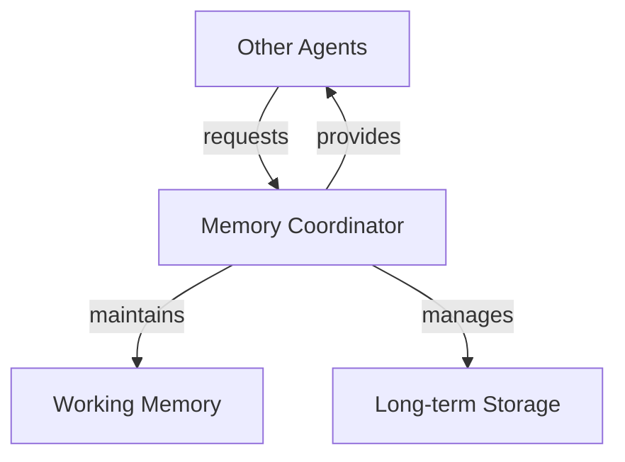

# Chapter 4: Enhanced Memory and Learning

The cognitive workspace from Chapter 3 demonstrated basic context maintenance, but genuine intelligence demands more. A cognitive agent must organize knowledge effectively and learn from interaction.

Knowledge must be broken into pieces that can be connected. When Winston learns "I usually drink coffee in the morning, like my father used to," this single statement contains multiple connected ideas. These connections matter when the knowledge changes - if the person switches to tea, the family connection remains important.

These connected pieces of knowledge serve many purposes. When researching a technical problem, Winston needs to connect error messages with potential solutions and past attempts. During project planning, requirements link to constraints and available resources. Even simple scheduling connects people's preferences with time slots and locations. Just as the coffee preference connects to family history, all of Winston's knowledge forms a web of related information that must be maintained as facts change and understanding grows.

This connected knowledge structure is especially crucial because Winston is built on current-generation language models with frozen training weights. These models cannot update their core training to remember conversations or learn from experience. Without an external memory system to store and connect knowledge, every conversation would start fresh, every lesson would be forgotten, and every problem would need to be solved anew. When the user switches from coffee to tea, this change must be explicitly stored and connected to existing knowledge since the underlying language model cannot "learn" this update.

Winston must also learn from human feedback. When told "Actually, I've switched to tea," he needs to update stored knowledge. When corrected "That solution didn't work because..." he must revise his understanding of problem-solving approaches. When shown "Here's a better way to analyze this data..." he needs to adapt his research methods. While Winston can learn from his own observations, human feedback provides crucial corrections and improvements that he can't discover alone. The language model can engage with feedback in the moment, but without persistent memory, these lessons would be lost after each interaction.

These memory and learning requirements - storing knowledge and learning from feedback - must work within our Society of Mind architecture. Each cognitive function needs independent access to stored knowledge. When Winston updates his understanding of morning beverages, both conversation and planning agents need access to this change. The language model provides shared understanding through the workspace, but each agent needs to read and write to persistent memory while maintaining its independence.

While these requirements might suggest complex solutions, we'll see how straightforward implementations of core memory functions can support sophisticated cognitive capabilities. By focusing on essential operations - storing knowledge, finding relevant information, and incorporating feedback - we can build a memory system that serves Winston's cognitive needs while maintaining simplicity and clarity.

By the end of this chapter, you'll understand how Winston stores and updates knowledge over time, like changing beverage preferences and research findings. You'll see how he finds relevant knowledge when needed and learns from human feedback. These capabilities form the foundation for Chapter 5, where Winston will use this accumulated knowledge to reason about problems and plan solutions. Without reliable memory and learning, no meaningful reasoning or planning would be possible since each task would start from scratch.

## 4.1 Enhanced Memory Architecture

- Working memory vs long-term memory in cognitive systems
- Memory Coordinator as central agent
- Design decisions around separation of concerns
- Initial implementation of workspace management
- Example: Tracking coffee preferences in workspace

## 4.2 Knowledge Storage and Retrieval

- Simple but effective storage design (files + embeddings)
- Why vector embeddings are crucial
- Implementation of basic storage operations
- Semantic retrieval patterns
- Example: Storing and retrieving coffee preferences

## 4.3 Learning Through Feedback

- Design patterns for human feedback
- Updating knowledge and understanding
- Workspace integration of new learning
- Example: Updating coffee preferences based on feedback

## 4.4 Memory System Integration

- Memory Coordinator interface for other agents
- Balancing simplicity and capability
- Implementation patterns for agent interaction
- Complete coffee preference example showing full system operation

## Exercises

[TODO]

## Conclusion
