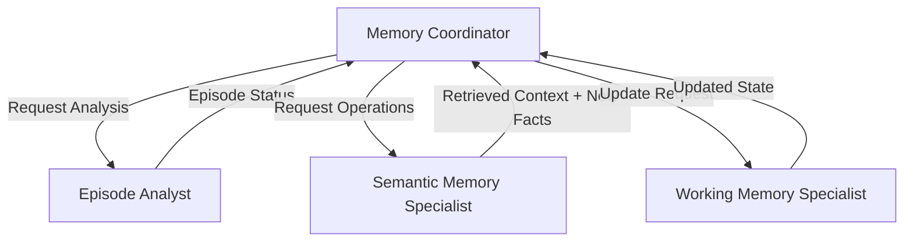
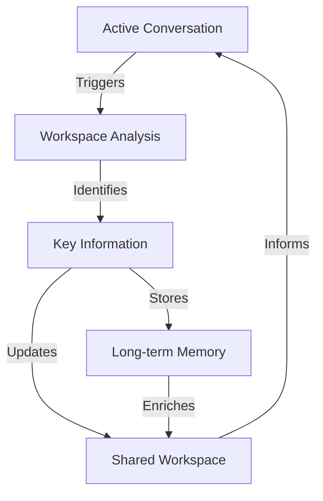
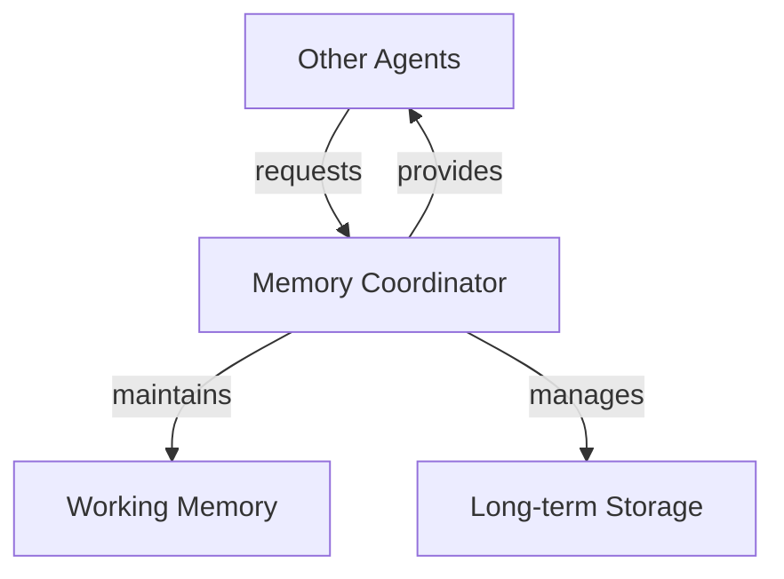

# Chapter 4: Enhanced Memory and Learning

Chapter 3 introduced basic workspace management - a simple utility for agents to maintain context. But genuine cognitive memory requires more. In this chapter, we evolve this foundation into a true memory system, with a dedicated memory agency coordinating both working and long-term memory operations.

A cognitive memory system must manage knowledge as connected pieces. Consider when Winston learns "I usually drink coffee in the morning, like my father used to." The memory coordinator must extract multiple connected ideas - the morning routine, the beverage preference, and the family connection. When knowledge changes (switching to tea), these connections help maintain context while updating facts.

These connected pieces of knowledge serve many purposes. When researching a technical problem, Winston needs to connect error messages with potential solutions and past attempts. During project planning, requirements link to constraints and available resources. Even simple scheduling connects people's preferences with time slots and locations. Just as the coffee preference connects to family history, all of Winston's knowledge forms a web of related information that must be maintained as facts change and understanding grows.

This connected knowledge structure is especially important because Winston is built on current-generation language models with frozen training weights. These models cannot update their core training to remember conversations or learn from experience. Without an external memory system to store and connect knowledge, every conversation would start fresh, every lesson would be forgotten, and every problem would need to be solved anew. When the user switches from coffee to tea, this change must be explicitly stored and connected to existing knowledge since the underlying language model cannot "learn" this update.

Winston must also learn from human feedback. When told "Actually, I've switched to tea," he needs to update stored knowledge. When corrected "That solution didn't work because..." he must revise his understanding of problem-solving approaches. When shown "Here's a better way to analyze this data..." he needs to adapt his research methods. While Winston can learn from his own observations, human feedback provides crucial corrections and improvements that he can't discover alone. The language model can engage with feedback in the moment, but without persistent memory, these lessons would be lost after each interaction.

These memory and learning requirements - storing knowledge and learning from feedback - must work within our Society of Mind architecture. Each cognitive function needs independent access to stored knowledge. When Winston updates his understanding of morning beverages, both conversation and planning agents need access to this change. The language model provides shared understanding through the workspace, but each agent needs to read and write to persistent memory while maintaining its independence.

While these requirements might suggest complex solutions, we'll see how straightforward implementations of core memory functions can support sophisticated cognitive capabilities. By focusing on essential operations - storing knowledge, finding relevant information, and incorporating feedback - we can build a memory system that serves Winston's cognitive needs while maintaining simplicity and clarity.

By the end of this chapter, you'll understand how Winston stores and updates knowledge over time, like changing beverage preferences and research findings. You'll see how he finds relevant knowledge when needed and learns from human feedback. These capabilities form the foundation for Chapter 5, where Winston will use this accumulated knowledge to reason about problems and plan solutions. Without reliable memory and learning, no meaningful reasoning or planning would be possible since each task would start from scratch.

## 4.1 Memory in cognitive architectures

In Chapter 3, agents directly managed their workspaces through the WorkspaceManager, treating working memory as a simple persistence mechanism for maintaining context. Chapter 4 introduces a fundamental architectural shift by establishing a true memory "agency" through the MemoryCoordinator. This coordinator becomes responsible for all memory operations - from immediate working memory (workspace maintenance) to long-term semantic storage. Rather than having agents directly manipulate workspaces, they now interact with a unified memory system that manages the interplay between working and long-term memory.

This architectural evolution better reflects the Society of Mind model, where memory isn't just a collection of storage mechanisms but rather a coordinated agency that handles the full spectrum of memory operations. The MemoryCoordinator maintains working memory context, retrieves relevant long-term knowledge, evaluates new information for storage, and manages the relationships between different types of memory (semantic, episodic, procedural). This centralization of memory operations under a single agency enables more sophisticated cognitive capabilities while maintaining clear architectural boundaries - other agents interact with memory through the coordinator rather than managing memory operations themselves.

- Introduction to cognitive memory systems

### Memory Taxonomy

#### Working Memory (Short-term)

- Implemented through cognitive workspaces (Ch 3)
- Temporary storage for active processing
- Current context and attention focus
- Limited capacity by design

---

Let's walk through the lifecycle of workspace maintenance:

1. **Initialization**

- Each agent gets a private workspace (already implemented)
- Shared workspaces can be created when needed
- Both use a template system (already implemented)

2. **During Interaction**

- Agent receives message with optional shared_workspace path
- Loads both private and shared workspaces
- Uses both contexts for processing
- Updates one or both based on interaction

3. **Persistence**

- Workspaces are markdown files
- Changes are saved immediately
- Content persists between interactions

Conversational memory (message history) is maintained slightly differently:

1. **During Runtime**

- Full conversation history maintained in Chainlit session
- Used for complete context in LLM interactions
- Lost when session ends

2. **Persistent Storage (Workspace)**

- Contains extracted/processed insights from interactions
- Organized into sections (preferences, context, etc.)
- Survives between sessions
- More semantic/compressed than raw history

This is actually quite cognitively plausible:

- Like human working memory holding current conversation
- While simultaneously updating longer-term understanding
- Raw conversation details fade, but processed insights persist

---

#### Long-term Memory

- **Semantic Memory** (focus of Ch 4)

  - Facts, knowledge, and relationships
  - Implemented through knowledge storage and embeddings
  - Includes compressed experiences and lessons learned

- **Procedural Memory** (future: Expert chapters)
  - Skills and learned behaviors
  - Tool usage patterns and strategies
  - How to accomplish tasks

### Experience Processing

- Not a separate memory system
- Process for converting experiences into long-term knowledge
- Involves:
  - Episode detection (topic/context shifts)
  - Information compression
  - Extraction of key facts and lessons
  - Storage in semantic memory

### Implementation Focus for Chapter 4

1. Enhanced working memory (workspace management)
2. Semantic knowledge storage
3. Basic embedding-based retrieval
4. Simple experience compression (facts → semantic storage)

## 4.2 Specialist agent guidelines

The core requirements for any specialist agent in Winston's architecture are deliberately minimal. This simplicity is not a limitation but a design choice - it enables rapid development while maintaining system coherence.

---

## 1. Core Design Philosophy

The fundamental principle of specialist agent design is that **cognitive logic lives in the prompt**. The language model, guided by a carefully crafted system prompt, performs all analysis and decision-making. Tools simply represent the concrete actions available based on that reasoning.

## 2. Core Requirements

```python
class SpecialistAgent(BaseAgent):
    """Each specialist agent must:
    1. Inherit from BaseAgent
    2. Have a clear, focused cognitive role
    3. Provide configuration YAML
    4. Maintain clean separation of concerns
    """
```

## 3. Configuration (YAML)

```yaml
# required: config/agents/{agent_id}.yaml
id: agent_id # Unique identifier
model: gpt-4 # Model to use
system_prompt: | # Core intelligence
  You are a {SPECIALIST} agent in a Society of Mind system.

  Your ONLY role is to {SPECIFIC_COGNITIVE_FUNCTION}.

  Given input, analyze:
  1. {KEY_ANALYSIS_POINTS}
  2. {DECISION_CRITERIA}

  Based on your analysis, select the appropriate action:
  - Use tool_a when {CONDITION_A}
  - Use tool_b when {CONDITION_B}

  Always explain your reasoning before taking action.

temperature: 0.7 # Optional parameters
stream: true
```

## 4. Tool Implementation

```python
from pydantic import BaseModel, Field
from winston.core.tools import Tool

# A. Define Request/Response Models
class ActionRequest(BaseModel):
    """Each tool needs input validation."""
    content: str = Field(
        description="Content to analyze"
    )
    context: dict[str, Any] = Field(
        default_factory=dict,
        description="Additional context"
    )

class ActionResponse(BaseModel):
    """And structured output."""
    result: str = Field(
        description="Action results"
    )
    metadata: dict = Field(
        description="Additional metadata"
    )

# B. Implement Tool Handler(s)
async def handle_action(
    request: ActionRequest
) -> ActionResponse:
    """Implement concrete action logic only."""
    # ... tool implementation
    return ActionResponse(
        result="Action completed",
        metadata={"status": "success"}
    )

# C. Optional: Format Results
def format_result(
    result: ActionResponse
) -> str:
    """Format tool results for user display."""
    return f"Result: {result.result}"

# D. Create Tool Instance
action_tool = Tool(
    name="perform_action",
    description="Execute specific action based on LLM analysis",
    handler=handle_action,
    input_model=ActionRequest,
    output_model=ActionResponse,
    format_response=format_result  # Optional
)
```

## 5. Agent Implementation

```python
class SpecialistAgent(BaseAgent):
    """Each specialist performs a specific cognitive function."""

    def __init__(
        self,
        system: System,
        config: AgentConfig,
        paths: AgentPaths,
    ) -> None:
        super().__init__(system, config, paths)

        # Tools represent possible actions based on LLM reasoning
        self.system.register_tool(Tool(
            name="action_a",
            description="Take action A when analysis indicates X",
            handler=self._handle_action_a,
            input_model=ActionARequest,
            output_model=ActionAResponse
        ))

        self.system.register_tool(Tool(
            name="action_b",
            description="Take action B when analysis indicates Y",
            handler=self._handle_action_b,
            input_model=ActionBRequest,
            output_model=ActionBResponse
        ))

        # Grant self access to own tools
        self.system.grant_tool_access(
            self.id,
            ["action_a", "action_b"]
        )
```

## 6. Separation of Concerns

1. **System Prompt**

   - Defines the cognitive role and decision process
   - Specifies analysis criteria and decision logic
   - Establishes conditions for tool usage
   - Contains all reasoning patterns

2. **Language Model**

   - Performs all analysis and reasoning
   - Makes decisions based on prompt guidance
   - Explains reasoning before taking action
   - Selects appropriate tools based on analysis

3. **Tools**

   - Execute concrete actions only
   - Implement no decision logic
   - Process structured inputs
   - Return structured outputs
   - Format results for display (optional)

4. **Agent Class**
   - Inherits from BaseAgent
   - Registers available tools
   - Grants tool access
   - Provides no additional logic

The BaseAgent handles all core functionality:

- Message processing
- LLM interaction
- Tool execution
- Response streaming

This clean separation ensures that cognitive logic remains in the prompt/LLM layer while tools serve purely as action executors based on that reasoning.

## Anti-Pattern: "RPC-like" Control Flow

❌ **NEVER** use metadata or message fields to direct agent behavior like this:

```python
# WRONG: Using metadata as RPC-like control flow
message = Message(
    content="Some content",
    metadata={
        "type": "do_analysis",  # NO! This is not how we direct behavior
        "operation": "store",   # NO! This is not how we select actions
        "mode": "quick"        # NO! This is not how we control processing
    }
)
```

This approach:

- Bypasses the LLM's cognitive capabilities
- Creates brittle, procedural control flow
- Violates the core architectural principle that cognitive logic belongs in the prompt

## Key Principles

✅ **CRITICAL**: Cognitive Logic Lives in the Prompt

1. **Cognitive Logic in Prompt**

   - The system prompt defines the agent's cognitive role
   - LLM reasoning determines appropriate actions
   - Tools represent conclusions/decisions, not control flow

2. **Tools as Decision Points**

   - Each tool represents a possible conclusion from analysis
   - Tool parameters capture the details of the decision
   - Multiple tools represent distinct cognitive branches

3. **Clean Separation**
   - Prompt: Contains ALL cognitive logic and decision criteria
   - LLM: Performs analysis and selects appropriate action
   - Tools: Execute concrete actions based on LLM decisions
   - Metadata: Carries context, NOT control flow

## Remember

- If you find yourself using metadata or messages to control agent behavior, STOP
- If you're creating complex control flows between agents, STOP
- Return to the core principle: Cognitive logic lives in the prompt
- Let the LLM's reasoning, guided by the prompt, drive tool selection and action

This architectural principle ensures our agents remain truly cognitive rather than degrading into procedural RPC endpoints.

---

This clean separation ensures that cognitive logic remains in the prompt/LLM layer while tools serve purely as action executors based on that reasoning.

This two-step process - registration followed by access granting - enforces the principle of least privilege. Tools exist in the system but are only available to agents explicitly granted access. The pattern ensures clear tool ownership and responsibility while enabling controlled access to system capabilities. By maintaining explicit access grants, we can easily audit agent permissions and safely share tools between specialists. The registration pattern remains consistent regardless of tool complexity, maintaining architectural clarity even as capabilities grow.

The BaseAgent handles all the mechanical aspects of system integration: processing messages, interacting with the LLM, executing tools, and streaming responses. This minimalist approach to specialist implementation lets us focus on cognitive capabilities rather than infrastructure. Each specialist can concentrate on its core role - whether that's memory management, reasoning, or planning - while relying on the BaseAgent's robust foundation for system interaction.

---

# Memory Agency Design

## Core Agents

### Memory Coordinator

**Role**: Orchestrates all memory operations, ensuring coherent interaction between working and long-term memory

**Responsibilities**:

- Validates shared workspace requirements
- Coordinates specialist agents in proper sequence
- Maintains overall memory system coherence

**Flow**:

```python
async def process(self, message: Message) -> AsyncIterator[Response]:
    """Orchestrate memory operations."""
    # 1. Validate shared workspace exists
    if "shared_workspace" not in message.metadata:
        raise ValueError("Shared workspace required")

    # 2. Check for episode boundary
    # - Could trigger workspace cleanup
    # - Affects relevance query generation

    # 3. Semantic memory operations
    # - Generate relevance queries
    # - Retrieve relevant context
    # - Extract new facts for storage

    # 4. Working memory update
    # - Clear if new episode
    # - Incorporate new content
    # - Integrate retrieved context
```

### Episode Analyst

**Role**: Detects cognitive context shifts requiring memory reorganization

**Responsibilities**:

- Analyzes message content against current context
- Determines if topic/context has significantly shifted
- Signals when working memory needs cleanup
- NO direct workspace manipulation

### Semantic Memory Specialist

**Role**: Manages all long-term knowledge operations

**Responsibilities**:

- Generates relevance queries from current context
- Performs knowledge retrieval
- Extracts facts from observations
- Maintains long-term knowledge store
- Handles both storage and retrieval operations

### Working Memory Specialist

**Role**: Maintains coherent working memory state

**Responsibilities**:

- Updates workspace content
- Incorporates retrieved context
- Maintains contextual relationships
- Ensures workspace coherence
- Handles cleanup when directed

## Information Flow



## Example: Coffee Preference Update

```
Input: "Actually, I've switched to tea"

1. Episode Analyst
   - Analyzes against current coffee context
   - Determines: Not new episode, preference update

2. Semantic Memory Specialist
   - Generates query: "beverage preferences, morning routine"
   - Retrieves: Previous coffee preference, family context
   - Extracts fact: User now prefers tea

3. Working Memory Specialist
   - Updates preference while maintaining:
     - Morning routine context
     - Family relationship context
   - Ensures coherent integration
```

---

## 4.3 Semantic memory implementation

- Knowledge representation design
  - Storage requirements
  - Embedding system design
  - Type safety and validation
- Core storage operations
  - File-based persistence
  - Vector embeddings
  - Search and retrieval
- Implementation walkthrough
  - Storage manager
  - Embedding manager
  - Basic operations

---

Our cognitive memory system achieves connected knowledge through semantic association rather than explicit links. Using ChromaDB's vector embeddings, knowledge pieces naturally cluster by semantic similarity - "morning coffee" associates with both "afternoon tea" and "father's habits" through shared meaning. Metadata tags and context enrich these associations, allowing both fuzzy semantic connections and precise filtering. When Winston learns about a switch from coffee to tea, the embedding space maintains connections to morning routines and family patterns while the content updates. This approach provides cognitively plausible association without complex graph structures or explicit connection management, aligning with how humans flexibly recall related information.

---

## 4.4 Memory coordinator implementation

- Central coordinator design
  - Role and responsibilities
  - Interface patterns
  - Tool implementations
- Knowledge management operations
  - Storage requests
  - Retrieval patterns
  - Update cycles
- Implementation walkthrough
  - Coordinator agent
  - Tool registration
  - Operation handlers

## 4.5 Memory system integration

- Workspace maintenance patterns
  - Knowledge flow between storage types
  - Relevance determination
  - Content organization



---

1. **Current Architecture (Chapter 3)**

- `WorkspaceManager` handles both persistence and content updates
- Maintains private and shared workspaces using templates
- Conversational memory handled separately:
  - Full history in Chainlit session (temporary)
  - Processed insights in workspace (persistent)

2. **Memory Evolution (Chapter 4)**

- Need to maintain backward compatibility with Chapter 3
- `MemoryCoordinator` will work alongside existing system
- Design decision: Use direct workspace management
  - Leverage `WorkspaceManager` singleton for persistence only
  - Coordinator implements own content organization/updates
  - Enables sophisticated memory operations while preserving Chapter 3 functionality

This approach lets us evolve the memory system while maintaining existing capabilities - agents from Chapter 3 continue working unchanged while the memory coordinator enables more sophisticated memory operations for newer agents.

```python
class MemoryCoordinator(BaseAgent):
    def __init__(self, system: System, config: AgentConfig, paths: AgentPaths) -> None:
        super().__init__(system, config, paths)
        self.workspace_manager = WorkspaceManager()

    async def update_workspace_content(self, workspace_path: Path, content: str) -> None:
        """Direct workspace content management."""
        self.workspace_manager.save_workspace(workspace_path, content)

    async def get_workspace_content(self, workspace_path: Path) -> str:
        """Load workspace content."""
        return self.workspace_manager.load_workspace(workspace_path)
```

The coordinator can now:

1. Use `WorkspaceManager` just for persistence
2. Implement its own content organization and update logic
3. Coordinate between working and long-term memory

# Working Memory Maintenance Lifecycle

## 1. Initialization

Working memory starts with structured but empty spaces for cognitive processing:

- **Private Workspaces**

  - Each agent maintains its own workspace
  - Contains agent-specific processing context
  - Example (Reasoning Agent): Analysis patterns, inference chains
  - Example (Planning Agent): Current plan steps, resource tracking

- **Shared Workspaces**
  - Created when multiple agents need coordinated context
  - Passed via message metadata (`shared_workspace` path)
  - Example (Coffee): Current beverage preferences, family patterns
  - Example (Plumbing): Project requirements, discovered specifications

## 2. Memory Retrieval

Before updating working memory, relevant context must be gathered:

- **Related Information**

  - Semantic associations (coffee → morning routine → family patterns)
  - Technical connections (water line → pressure specs → fitting types)
  - Historical context (previous installations, past preferences)

- **Existing Information**
  - Check for duplicates ("already knew about morning coffee")
  - Look for partial matches (similar plumbing projects)
  - Identify overlapping context (other morning routines)

## 3. Working Memory Update

Active integration of new information while maintaining coherence:

- **New Information Integration**

  - Simple case (Coffee): "I drink coffee in the morning"
    - Add preference
    - Link to time context
    - Note source (direct statement)
  - Complex case (Plumbing): "Standard fridge line is 1/4 inch"
    - Add specification
    - Link to component requirements
    - Note source (research finding)

- **Contradiction Resolution**

  - Simple case: "Actually, I've switched to tea"
    - Mark coffee preference as historical
    - Update current preference
    - Maintain family connection context
  - Complex case: "That fitting won't work with this filter"
    - Mark incompatible component
    - Update requirements
    - Track decision rationale

- **Extension/Refinement**
  - Simple case: "I take my coffee with cream"
    - Add detail to existing preference
    - Maintain morning context
  - Complex case: "Need additional support bracket"
    - Add component to design
    - Link to existing mount points
    - Update space requirements

## 4. Semantic Memory Integration

Coordinating between working and long-term memory:

- **Durable Facts Storage**

  - Simple case:
    - Store: "User drinks tea in morning (updated from coffee)"
    - Context: Family history of morning coffee
    - Timestamp: When preference changed
  - Complex case:
    - Store: "Refrigerator water line specifications"
    - Context: Common in US residential installations
    - Dependencies: Pressure requirements, material compatibility

- **Knowledge Updates**
  - Simple case:
    - Update beverage preference
    - Maintain historical progression
    - Preserve associated contexts
  - Complex case:
    - Update component compatibility matrix
    - Record successful/failed combinations
    - Document decision criteria

## 5. Working Memory Cleanup

Maintaining relevant, focused working memory:

- **Relevance Management**

  - Simple case:
    - Keep: Current preference, immediate context
    - Archive: Old preferences, inactive contexts
    - Remove: Temporary clarifications
  - Complex case:
    - Keep: Active design elements, open issues
    - Archive: Resolved decisions, completed sections
    - Remove: Dead-end approaches, invalid configurations

- **Context Compression**
  - Simple case:
    - Compress: Detailed preference history
    - Maintain: Current state and key changes
  - Complex case:
    - Compress: Detailed research paths
    - Maintain: Critical specifications and dependencies

---

- Multi-agent coordination
  - Access patterns
  - Shared context management
  - Update propagation
- Complete system examples
  - Knowledge storage and retrieval
  - Workspace enhancement
  - Cross-agent coordination



## Exercises

[TODO]

## Looking ahead

- Building on semantic memory
- Implementing episodic memory
- Developing procedural capabilities
- Experiential memory framework
