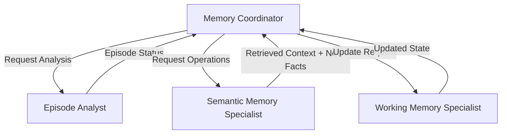
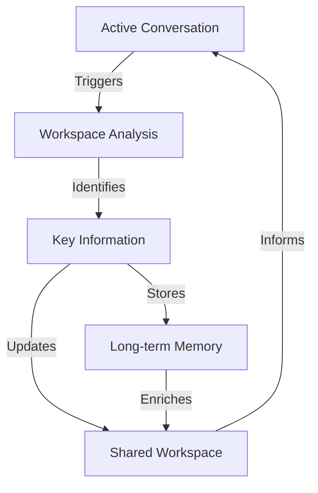
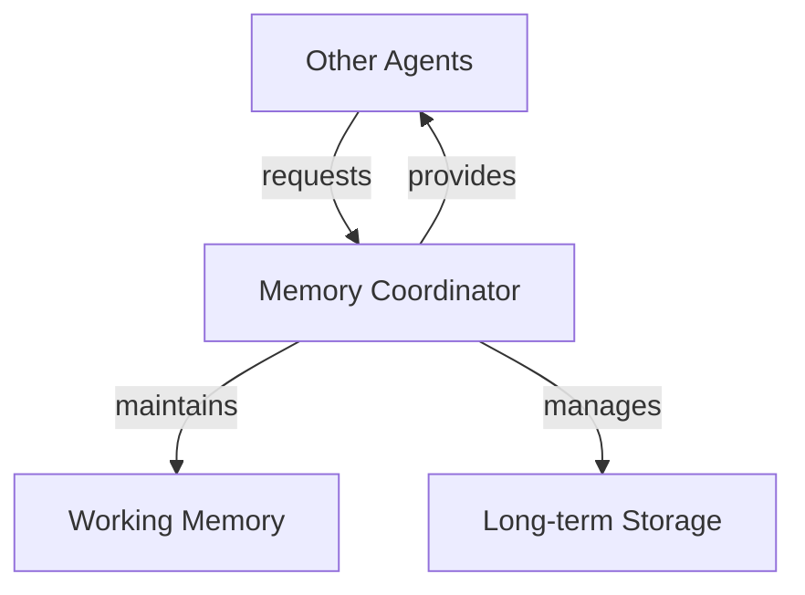

# Chapter 4: Enhanced Memory and Learning

Chapter 3 introduced basic workspace management - a simple utility for agents to maintain context. But genuine cognitive memory requires more. In this chapter, we evolve this foundation into a true memory system, with a dedicated memory agency coordinating both working and long-term memory operations.

A cognitive memory system must manage knowledge as connected pieces. Consider when Winston learns "I usually drink coffee in the morning, like my father used to." The memory coordinator must extract multiple connected ideas - the morning routine, the beverage preference, and the family connection. When knowledge changes (switching to tea), these connections help maintain context while updating facts.

These connected pieces of knowledge serve many purposes. When researching a technical problem, Winston needs to connect error messages with potential solutions and past attempts. During project planning, requirements link to constraints and available resources. Even simple scheduling connects people's preferences with time slots and locations. Just as the coffee preference connects to family history, all of Winston's knowledge forms a web of related information that must be maintained as facts change and understanding grows.

This connected knowledge structure is especially important because Winston is built on current-generation language models with frozen training weights. These models cannot update their core training to remember conversations or learn from experience. Without an external memory system to store and connect knowledge, every conversation would start fresh, every lesson would be forgotten, and every problem would need to be solved anew. When the user switches from coffee to tea, this change must be explicitly stored and connected to existing knowledge since the underlying language model cannot "learn" this update.

Winston must also learn from human feedback. When told "Actually, I've switched to tea," he needs to update stored knowledge. When corrected "That solution didn't work because..." he must revise his understanding of problem-solving approaches. When shown "Here's a better way to analyze this data..." he needs to adapt his research methods. While Winston can learn from his own observations, human feedback provides crucial corrections and improvements that he can't discover alone. The language model can engage with feedback in the moment, but without persistent memory, these lessons would be lost after each interaction.

These memory and learning requirements - storing knowledge and learning from feedback - must work within our Society of Mind architecture. Each cognitive function needs independent access to stored knowledge. When Winston updates his understanding of morning beverages, both conversation and planning agents need access to this change. The language model provides shared understanding through the workspace, but each agent needs to read and write to persistent memory while maintaining its independence.

While these requirements might suggest complex solutions, we'll see how straightforward implementations of core memory functions can support sophisticated cognitive capabilities. By focusing on essential operations - storing knowledge, finding relevant information, and incorporating feedback - we can build a memory system that serves Winston's cognitive needs while maintaining simplicity and clarity.

By the end of this chapter, you'll understand how Winston stores and updates knowledge over time, like changing beverage preferences and research findings. You'll see how he finds relevant knowledge when needed and learns from human feedback. These capabilities form the foundation for Chapter 5, where Winston will use this accumulated knowledge to reason about problems and plan solutions. Without reliable memory and learning, no meaningful reasoning or planning would be possible since each task would start from scratch.

## 4.1 Memory in cognitive architectures

In Chapter 3, agents directly managed their workspaces through the WorkspaceManager, treating working memory as a simple persistence mechanism for maintaining context. Chapter 4 introduces a fundamental architectural shift by establishing a true memory "agency" through the MemoryCoordinator. This coordinator becomes responsible for all memory operations - from immediate working memory (workspace maintenance) to long-term semantic storage.

This architectural evolution better reflects the Society of Mind model, where memory isn't just a collection of storage mechanisms but rather a coordinated agency that handles the full spectrum of memory operations. The MemoryCoordinator maintains working memory context, retrieves relevant long-term knowledge, evaluates new information for storage, and manages the relationships between different types of memory (semantic, episodic, procedural). This centralization of memory operations under a single agency enables more sophisticated cognitive capabilities while maintaining clear architectural boundaries - other agents interact with memory through the coordinator rather than managing memory operations themselves.

## Memory taxonomy

### Short-term memory

Also known as _working memory_.

Let's walk through the lifecycle of workspace maintenance:

1. **Initialization**

- Each agent gets a private workspace (already implemented)
- Shared workspaces can be created when needed
- Both use a template system (already implemented)

2. **During Interaction**

- Agent receives message with optional shared_workspace path
- Loads both private and shared workspaces
- Uses both contexts for processing
- Updates one or both based on interaction

3. **Persistence**

- Workspaces are markdown files
- Changes are saved immediately
- Content persists between interactions

Conversational memory (message history) is maintained slightly differently:

1. **During Runtime**

- Full conversation history maintained in Chainlit session
- Used for complete context in LLM interactions
- Lost when session ends

2. **Persistent Storage (Workspace)**

- Contains extracted/processed insights from interactions
- Organized into sections (preferences, context, etc.)
- Survives between sessions
- More semantic/compressed than raw history

And this cognitive parallel:

This is actually quite cognitively plausible:

- Like human working memory holding current conversation
- While simultaneously updating longer-term understanding
- Raw conversation details fade, but processed insights persist

### Long-term memory

**Semantic Memory** (focus of Ch 4)

- Facts, knowledge, and relationships
- Implemented through knowledge storage and embeddings
- Includes compressed experiences and lessons learned

**Procedural Memory** (future: Expert chapters)

- Skills and learned behaviors
- Tool usage patterns and strategies
- How to accomplish tasks

### Experience processing

- Not a separate memory system
- Process for converting experiences into long-term knowledge
- Involves:
  - Episode detection (topic/context shifts)
  - Information compression
  - Extraction of key facts and lessons
  - Storage in semantic memory

### Implementation focus for Chapter 4

1. Enhanced working memory (workspace management)
2. Semantic knowledge storage
3. Basic embedding-based retrieval
4. Simple experience compression (facts → semantic storage)

> This connected knowledge structure is especially important because Winston is built on current-generation language models with frozen training weights. These models cannot update their core training to remember conversations or learn from experience. Without an external memory system to store and connect knowledge, every conversation would start fresh, every lesson would be forgotten, and every problem would need to be solved anew.

---

Here's a summary of our key design insights:

1. **Memory Agency Hierarchy**

- Memory Coordinator (top-level)
  - Episode Analyst (specialist)
  - Working Memory Specialist
  - Semantic Memory Agency (sub-agency)
    - Semantic Memory Coordinator
    - Retrieval Specialist
    - Storage Specialist

2. **Observation Types** (driving memory system requirements)

- User dialog messages
- Commands/questions/answers
- Autonomous research findings
- Environmental observations (embodied)
- Internal process outputs

3. **Architectural Principles**

- Coordinators: Pure Python orchestration, no LLM
- Specialists: LLM reasoning with focused system prompts + tools
- Clear separation between:
  - Flow control (coordinators)
  - Cognitive decisions (LLM/specialists)
  - Concrete actions (tools)

4. **Memory Operations Flow**

- Episode analysis for context boundaries
- Semantic retrieval for context enrichment
- Storage analysis based on:
  - Nothing found (potential new knowledge)
  - Related found (context only)
  - Exact match (updates/conflicts)
- Working memory updates incorporating:
  - New observation
  - Retrieved context
  - Any knowledge updates

5. **Knowledge Management**

- Natural semantic relationships through embeddings
- Metadata for filtering/querying
- Version history for temporal changes
- Conflict resolution in storage specialist
- Focus on maintaining working memory context

6. **Key Design Decisions**

- Storage Specialist handles integration logic
- Retrieval drives storage decisions
- Simple metadata over complex relationships
- Working memory as primary goal
- Long-term storage serves working memory

This architecture supports the full range of cognitive operations while maintaining:

- Clean separation of concerns
- Clear specialist responsibilities
- Flexible observation handling
- Natural knowledge relationships
- Effective context management

---

## 4.2 Specialist agent and agencies

### Core design philosophy

- Cognitive logic lives in the prompt - the language model, guided by carefully crafted system prompts, performs all analysis and decision-making
- Tools represent concrete actions available based on that reasoning
- Clean separation between cognitive (prompt/LLM) and mechanical (tools) aspects

### Specialist agent requirements

1. Inherit from BaseAgent
2. Have clear, focused cognitive role
3. Provide configuration YAML
4. Maintain clean separation of concerns

#### Configuration example

```yaml
# required: config/agents/{agent_id}.yaml
id: agent_id
model: gpt-4
system_prompt: |
  You are a {SPECIALIST} agent in a Society of Mind system.

  Your ONLY role is to {SPECIFIC_COGNITIVE_FUNCTION}.

  Given input, analyze:
  1. {KEY_ANALYSIS_POINTS}
  2. {DECISION_CRITERIA}

  Based on your analysis, select the appropriate action:
  - Use tool_a when {CONDITION_A}
  - Use tool_b when {CONDITION_B}

  Always explain your reasoning before taking action.

temperature: 0.7
stream: true
```

#### Tool implementation

```python
from pydantic import BaseModel, Field
from winston.core.tools import Tool

class ActionRequest(BaseModel):
    content: str = Field(description="Content to analyze")
    context: dict[str, Any] = Field(
        default_factory=dict,
        description="Additional context"
    )

class ActionResponse(BaseModel):
    result: str = Field(description="Action results")
    metadata: dict = Field(description="Additional metadata")

async def handle_action(request: ActionRequest) -> ActionResponse:
    """Implement concrete action logic only."""
    return ActionResponse(
        result="Action completed",
        metadata={"status": "success"}
    )

action_tool = Tool(
    name="perform_action",
    description="Execute specific action based on LLM analysis",
    handler=handle_action,
    input_model=ActionRequest,
    output_model=ActionResponse
)
```

### Separation of concerns

1. **System Prompt**

   - Defines cognitive role and decision process
   - Specifies analysis criteria and decision logic
   - Establishes conditions for tool usage
   - Contains all reasoning patterns

2. **Language Model**

   - Performs analysis and reasoning
   - Makes decisions based on prompt guidance
   - Explains reasoning before taking action
   - Selects appropriate tools based on analysis

3. **Tools**

   - Execute concrete actions only
   - Process structured inputs/outputs
   - No decision logic
   - Format results for display (optional)

4. **Agent Class**
   - Registers available tools
   - Grants tool access
   - Inherits core functionality from BaseAgent
   - Provides no additional logic

#### Anti-patterns to avoid

❌ **Never use metadata for control flow:**

```python
# WRONG: Using metadata as RPC-like control
message = Message(
    content="Some content",
    metadata={
        "type": "do_analysis",  # NO!
        "operation": "store",   # NO!
        "mode": "quick"        # NO!
    }
)
```

### Agencies

- What is an agency in the Society of Mind
- Coordinator
  - Custom `process()` implementation
- Specialists (as above)

### Memory agency design

#### Core components

1. **Memory Coordinator**
   - Orchestrates all memory operations
   - Validates workspace requirements
   - Coordinates specialist sequence
   - Maintains system coherence

```python
async def process(self, message: Message) -> AsyncIterator[Response]:
    """Orchestrate memory operations."""
    # 1. Validate shared workspace exists
    if "shared_workspace" not in message.metadata:
        raise ValueError("Shared workspace required")

    # 2. Check for episode boundary
    # 3. Semantic memory operations
    # 4. Working memory update
```

2. **Episode Analyst**

   - Detects cognitive context shifts
   - Analyzes content against context
   - Signals working memory cleanup needs
   - No direct workspace manipulation

3. **Semantic Memory Coordinator**
   - Manages long-term knowledge
   - Coordinates three specialists:
     - Retrieval Specialist
     - Storage Specialist
     - Integration Specialist
   - Pure orchestration (not LLM-based)

The Semantic Memory agency (coordinated by the Semantic Memory Coordinator) has three specialists, each with a clear, focused role:

1. Retrieval Specialist

- Formulates and executes knowledge queries
- Finds semantically similar content
- Handles search parameters and filters

2. Storage Specialist

- Evaluates new information for storage
- Stores knowledge with appropriate metadata
- Handles direct updates to existing knowledge

3. Integration Specialist

- Maintains coherence between related knowledge pieces
- Resolves conflicts during updates
- Ensures semantic consistency

```yaml
# Retrieval Specialist Prompt
system_prompt: |
  You are a Knowledge Retrieval specialist.
  Your ONLY role is to formulate effective knowledge queries.

  Given any input:
  1. Identify key concepts to search for
  2. Consider related terms/ideas that might match
  3. Formulate search parameters including relevant filters

  Always explain your search strategy before executing.
```

4. **Working Memory Specialist**
   - Maintains workspace state
   - Incorporates retrieved context
   - Ensures workspace coherence
   - Handles directed cleanup

#### Information flow



#### Example: Preference Update Flow

```
Input: "Actually, I've switched to tea"

1. Episode Analyst
   - Analyzes against current coffee context
   - Determines: Not new episode, preference update

2. Semantic Memory Specialist
   - Generates query: "beverage preferences, morning routine"
   - Retrieves: Previous coffee preference, family context
   - Extracts fact: User now prefers tea

3. Working Memory Specialist
   - Updates preference while maintaining:
     - Morning routine context
     - Family relationship context
   - Ensures coherent integration
```

## 4.3 Semantic memory implementation

Winston's semantic memory system achieves connected knowledge through semantic association rather than explicit links. Using ChromaDB's vector embeddings, knowledge pieces naturally cluster by semantic similarity - "morning coffee" associates with both "afternoon tea" and "father's habits" through shared meaning. Metadata tags and context enrich these associations, allowing both fuzzy semantic connections and precise filtering.

### 4.3.1 Knowledge storage system

The foundation is a simple but effective file-based knowledge storage system:

```python
class Knowledge(BaseModel):
    """Single knowledge entry with metadata."""
    id: str
    content: str
    context: dict[str, Any]
    created_at: datetime
    updated_at: datetime
```

This model provides:

- Unique identification
- Core content storage
- Flexible context/metadata
- Temporal tracking

The `KnowledgeStorage` class implements basic CRUD operations:

```python
class KnowledgeStorage:
    """Simple file-based knowledge storage."""

    async def store(self, content: str, context: dict[str, Any]) -> str:
        """Store new knowledge entry."""

    async def load(self, knowledge_id: str) -> Knowledge:
        """Load knowledge by ID."""

    async def update(self, knowledge_id: str, ...) -> Knowledge:
        """Update existing knowledge."""
```

### 4.3.2 Embedding-Based Retrieval

The embedding system using ChromaDB enables semantic search and association:

```python
class SimilarityMatch(NamedTuple):
    """Result from similarity search."""
    id: str
    score: float
    metadata: dict[str, Any]

class EmbeddingStore:
    """Manages embeddings using ChromaDB."""

    async def add_embedding(self, knowledge: Knowledge) -> None:
        """Add knowledge embedding to store."""

    async def find_similar(self, query: str, limit: int = 5) -> list[SimilarityMatch]:
        """Find similar knowledge entries."""
```

### 4.3.3 Integration Example: Coffee Preference

A practical example showing the systems working together:

1. Initial Storage:

```python
# Store initial preference
knowledge_id = await storage.store(
    content="User drinks coffee in the morning, like father used to",
    context={"type": "preference", "category": "beverage"}
)

# Add embedding for retrieval
await embedding_store.add_embedding(
    await storage.load(knowledge_id)
)
```

2. Later Retrieval:

```python
# Find relevant knowledge
matches = await embedding_store.find_similar(
    "morning beverage preferences",
    limit=2
)

# Load full knowledge entries
for match in matches:
    knowledge = await storage.load(match.id)
    print(f"Found: {knowledge.content} (relevance: {match.score})")
```

3. Preference Update:

```python
# Update existing knowledge
updated = await storage.update(
    knowledge_id,
    content="User switched from coffee to tea in the morning",
    context={"type": "preference", "category": "beverage", "changed": True}
)

# Update embedding
await embedding_store.update_embedding(updated)
```

When Winston learns about a switch from coffee to tea, the embedding space maintains connections to morning routines and family patterns while the content updates. This approach provides cognitively plausible association without complex graph structures or explicit connection management, aligning with how humans flexibly recall related information.

## 4.4 Memory coordinator implementation

- Central coordinator design
  - Role and responsibilities
  - Interface patterns
  - Tool implementations
- Knowledge management operations
  - Storage requests
  - Retrieval patterns
  - Update cycles
- Implementation walkthrough
  - Coordinator agent
  - Tool registration
  - Operation handlers

## 4.5 Memory System Integration

### Architecture Evolution

1. **Current Architecture (Chapter 3)**

- `WorkspaceManager` handles persistence and content updates
- Maintains private and shared workspaces using templates
- Conversational memory:
  - Full history in Chainlit session (temporary)
  - Processed insights in workspace (persistent)

2. **Memory Evolution (Chapter 4)**

- Maintains backward compatibility
- `MemoryCoordinator` works alongside existing system
- Uses direct workspace management:
  - Leverages `WorkspaceManager` for persistence
  - Implements own content organization/updates
  - Enables sophisticated memory operations while preserving Chapter 3 functionality



### Working Memory Maintenance Lifecycle

#### 1. Initialization

- **Private Workspaces**
  - Agent-specific processing context
  - Contains analysis patterns, inference chains, etc.
- **Shared Workspaces**
  - Created for multi-agent coordination
  - Passed via message metadata
  - Contains shared context (preferences, requirements, etc.)

#### 2. Memory Retrieval

- Semantic associations
- Technical connections
- Historical context
- Duplicate checking
- Partial matching

#### 3. Working Memory Update

- **New Information Integration**
  - Add new data
  - Link to existing context
  - Note sources
- **Contradiction Resolution**
  - Mark historical information
  - Update current state
  - Track decision rationale
- **Extension/Refinement**
  - Add details to existing information
  - Maintain context relationships

#### 4. Semantic Memory Integration

- **Durable Facts Storage**
  - Store core information
  - Preserve context
  - Track timestamps
- **Knowledge Updates**
  - Update existing information
  - Maintain history
  - Document decisions

#### 5. Working Memory Cleanup

- **Relevance Management**
  - Keep active elements
  - Archive resolved items
  - Remove obsolete data
- **Context Compression**
  - Compress detailed histories
  - Maintain current state and key changes

### Implementation Example

```python
class MemoryCoordinator(BaseAgent):
    def __init__(self, system: System, config: AgentConfig, paths: AgentPaths) -> None:
        super().__init__(system, config, paths)
        self.workspace_manager = WorkspaceManager()

    async def update_workspace_content(self, workspace_path: Path, content: str) -> None:
        """Direct workspace content management."""
        self.workspace_manager.save_workspace(workspace_path, content)

    async def get_workspace_content(self, workspace_path: Path) -> str:
        """Load workspace content."""
        return self.workspace_manager.load_workspace(workspace_path)
```

### Multi-Agent Coordination



## Exercises

[TODO]

## Looking ahead

- Building on semantic memory
- Implementing episodic memory
- Developing procedural capabilities
- Experiential memory framework
