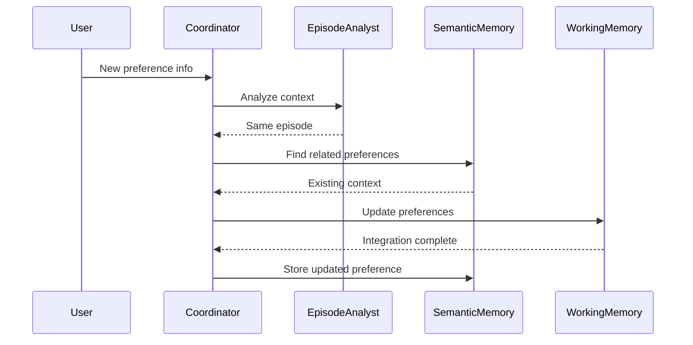

# Chapter 4: Enhanced Memory and Learning

Chapter 3 introduced basic workspace management - a simple utility for agents to maintain context. But genuine cognitive memory requires more. In this chapter, we evolve this foundation into a true memory system, with a dedicated memory agency coordinating both working and long-term memory operations.

A cognitive memory system must manage knowledge as connected pieces. Consider when Winston learns "I usually drink coffee in the morning, like my father used to." The memory coordinator must extract multiple connected ideas - the morning routine, the beverage preference, and the family connection. When knowledge changes (switching to tea), these connections help maintain context while updating facts.

These connected pieces of knowledge serve many purposes. When researching a technical problem, Winston needs to connect error messages with potential solutions and past attempts. During project planning, requirements link to constraints and available resources. Even simple scheduling connects people's preferences with time slots and locations. Just as the coffee preference connects to family history, all of Winston's knowledge forms a web of related information that must be maintained as facts change and understanding grows.

This connected knowledge structure is especially important because Winston is built on current-generation language models with frozen training weights. These models cannot update their core training to remember conversations or learn from experience. Without an external memory system to store and connect knowledge, every conversation would start fresh, every lesson would be forgotten, and every problem would need to be solved anew. When the user switches from coffee to tea, this change must be explicitly stored and connected to existing knowledge since the underlying language model cannot "learn" this update.

Winston must also learn from human feedback. When told "Actually, I've switched to tea," he needs to update stored knowledge. When corrected "That solution didn't work because..." he must revise his understanding of problem-solving approaches. When shown "Here's a better way to analyze this data..." he needs to adapt his research methods. While Winston can learn from his own observations, human feedback provides crucial corrections and improvements that he can't discover alone. The language model can engage with feedback in the moment, but without persistent memory, these lessons would be lost after each interaction.

These memory and learning requirements - storing knowledge and learning from feedback - must work within our Society of Mind architecture. Each cognitive function needs independent access to stored knowledge. When Winston updates his understanding of morning beverages, both conversation and planning agents need access to this change. The language model provides shared understanding through the workspace, but each agent needs to read and write to persistent memory while maintaining its independence.

While these requirements might suggest complex solutions, we'll see how straightforward implementations of core memory functions can support sophisticated cognitive capabilities. By focusing on essential operations - storing knowledge, finding relevant information, and incorporating feedback - we can build a memory system that serves Winston's cognitive needs while maintaining simplicity and clarity.

By the end of this chapter, you'll understand how Winston stores and updates knowledge over time, like changing beverage preferences and research findings. You'll see how he finds relevant knowledge when needed and learns from human feedback. These capabilities form the foundation for Chapter 5, where Winston will use this accumulated knowledge to reason about problems and plan solutions. Without reliable memory and learning, no meaningful reasoning or planning would be possible since each task would start from scratch.

---

Here's a summary of our key design insights:

1. **Memory Agency Hierarchy**

- Memory Coordinator (top-level)
  - Episode Analyst (specialist)
  - Working Memory Specialist
  - Semantic Memory Agency (sub-agency)
    - Semantic Memory Coordinator
    - Retrieval Specialist
    - Storage Specialist

2. **Observation Types** (driving memory system requirements)

- User dialog messages
- Commands/questions/answers
- Autonomous research findings
- Environmental observations (embodied)
- Internal process outputs

3. **Architectural Principles**

- Coordinators: Pure Python orchestration, no LLM
- Specialists: LLM reasoning with focused system prompts + tools
- Clear separation between:
  - Flow control (coordinators)
  - Cognitive decisions (LLM/specialists)
  - Concrete actions (tools)

4. **Memory Operations Flow**

- Episode analysis for context boundaries
- Semantic retrieval for context enrichment
- Storage analysis based on:
  - Nothing found (potential new knowledge)
  - Related found (context only)
  - Exact match (updates/conflicts)
- Working memory updates incorporating:
  - New observation
  - Retrieved context
  - Any knowledge updates

5. **Knowledge Management**

- Natural semantic relationships through embeddings
- Metadata for filtering/querying
- Version history for temporal changes
- Conflict resolution in storage specialist
- Focus on maintaining working memory context

6. **Key Design Decisions**

- Storage Specialist handles integration logic
- Retrieval drives storage decisions
- Simple metadata over complex relationships
- Working memory as primary goal
- Long-term storage serves working memory

This architecture supports the full range of cognitive operations while maintaining:

- Clean separation of concerns
- Clear specialist responsibilities
- Flexible observation handling
- Natural knowledge relationships
- Effective context management

---

## 4.1 Memory in cognitive architectures

The transition from simple workspace management to a true memory system represents a fundamental shift in Winston's cognitive architecture. While Chapter 3's `WorkspaceManager` treated memory as basic persistence, we now introduce a sophisticated memory agency through the `MemoryCoordinator`. This evolution reflects a deeper understanding of how cognitive systems must manage knowledge.

The `MemoryCoordinator` becomes the central authority for all memory operations, from immediate working memory to long-term semantic storage. This centralization brings several key advantages. First, it provides a single, coherent interface for all memory operations, simplifying how other agents interact with stored knowledge. Second, it enables sophisticated memory management strategies that would be impossible with disconnected storage systems. Third, it maintains clear architectural boundaries - other agents no longer need to understand memory implementation details, they simply request information or storage through the coordinator.

Consider how human memory works: we don't consciously manage different types of memory storage. Instead, our memory system seamlessly handles everything from maintaining current context to storing and retrieving long-term knowledge. Winston's `MemoryCoordinator` mirrors this pattern, providing a unified interface while managing the complexity of different memory types internally.

Working memory, or short-term memory, serves as the foundation of Winston's cognitive operations. Just as humans maintain immediate context during conversations or while solving problems, Winston uses working memory to track current interactions and maintain relevant context. This happens through two primary mechanisms: workspace management and conversational memory.

Workspaces provide persistent storage for context and intermediate processing. Each agent maintains a private workspace for its specific needs, while shared workspaces enable coordination between agents. These workspaces use a template system that structures information consistently while allowing flexible content updates. The content persists between interactions, ensuring continuity of context even as Winston processes new information.

Conversational memory operates differently, maintaining detailed interaction history during active sessions. While this full history exists temporarily in the Chainlit session, Winston extracts and processes key insights for long-term storage. This mirrors human cognition - we don't remember every word of every conversation, but we retain the important points and insights that emerge.

Long-term memory in Winston focuses primarily on semantic knowledge - facts, relationships, and learned information. This semantic memory system, which we'll explore in detail later in this chapter, uses sophisticated embedding techniques to maintain connections between related pieces of knowledge. While future chapters will address procedural memory (skills and learned behaviors), our current focus is on building robust semantic storage and retrieval capabilities.

The process of converting experiences into long-term knowledge requires careful attention. Winston must detect when topics or contexts shift, compress information to its essential elements, and extract key facts and lessons for semantic storage. This isn't a separate memory system, but rather a crucial process that bridges immediate experience and lasting knowledge.

## 4.2 Specialist agents and agencies

The complexity of memory management requires specialized cognitive functions working in concert. Rather than building a monolithic memory system, Winston implements memory through a coordinated agency of specialist agents. This design reflects a core principle of our cognitive architecture: complex capabilities emerge from the interaction of simpler, focused components.

Each specialist agent follows a consistent design philosophy. The cognitive logic - the actual analysis and decision-making - lives entirely within the language model, guided by carefully crafted system prompts. The agent's tools represent concrete actions available based on that reasoning. This creates a clean separation between cognitive aspects (handled by the prompt and language model) and mechanical operations (implemented through tools).

Consider the `EpisodeAnalyst`, one of our memory specialists. Its system prompt defines a specific cognitive role: detecting shifts in conversation context and determining when new episodes of interaction begin. The prompt guides the language model in analyzing message content, current context, and temporal patterns to identify these cognitive boundaries. However, the actual operations of updating workspaces or storing episode markers happen through clearly defined tools. This separation ensures that the agent's reasoning remains flexible while its actions stay predictable and testable.

The `MemoryCoordinator` serves as the central authority, orchestrating these specialists into a coherent memory system. When Winston receives new information, the coordinator first engages the `EpisodeAnalyst` to determine if this represents a new cognitive context. Based on this analysis, it then coordinates with semantic memory specialists for knowledge storage and retrieval, and finally ensures working memory remains coherent through the `WorkingMemorySpecialist`.

Each specialist's configuration defines its cognitive role through a carefully structured system prompt. These prompts establish clear analysis patterns and decision criteria, ensuring consistent behavior while allowing the language model's reasoning capabilities to handle complex scenarios. For example, the retrieval specialist's prompt focuses entirely on formulating effective knowledge queries, considering not just direct matches but semantically related concepts.

The implementation of specialist tools follows equally strict patterns. Each tool handles a specific, concrete operation with clearly defined inputs and outputs. Tools never make cognitive decisions - they simply execute the mechanical aspects of memory operations as directed by the language model's reasoning. This separation of concerns makes the system both more maintainable and more cognitively plausible.

The memory agency demonstrates how specialist agents work together to create sophisticated capabilities. The `MemoryCoordinator` doesn't just delegate tasks - it maintains the overall coherence of the memory system. When Winston learns that a user has switched from coffee to tea, this information flows through multiple specialists: episode analysis determines this represents a preference update rather than a new cognitive context, semantic specialists handle storing the new preference while maintaining connections to related knowledge about morning routines and past preferences, and working memory specialists ensure current context reflects this update.

This agency structure provides several key benefits. First, it allows each specialist to focus on a specific aspect of memory management, making the components easier to develop and maintain. Second, it creates natural points for future extension - new memory capabilities can be added by introducing new specialists rather than modifying existing ones. Finally, it reflects how cognitive systems actually work, with different components handling specialized aspects of memory while contributing to a unified memory experience.

## 4.3 Semantic memory implementation

Winston's semantic memory system achieves connected knowledge through semantic association rather than explicit links. This approach mirrors how humans naturally connect ideas - we don't maintain explicit indexes of related thoughts, but rather recognize connections through shared meaning and context. By using vector embeddings through ChromaDB, Winston's knowledge naturally clusters by semantic similarity, allowing flexible and intuitive knowledge retrieval.

Consider how Winston stores and connects information about morning routines. When learning "I usually drink coffee in the morning, like my father used to," the system doesn't create explicit links between "morning," "coffee," and "father." Instead, the embedding process automatically captures these semantic relationships. Later, when searching for information about family habits or morning preferences, these natural associations enable Winston to retrieve relevant knowledge without maintaining complex relationship graphs.

---

## NOTE

While the chapter discusses knowledge relationships and connections, explicit relationship management (graph structures, direct linking, connection tracking) is deferred to later chapters. In the current implementation, knowledge associations are handled implicitly through semantic similarity in the embedding space. The Integration Specialist focuses on maintaining knowledge coherence and resolving conflicts during updates, without managing explicit relationships between knowledge pieces.

---

The Semantic Memory agency (coordinated by the Semantic Memory Coordinator) has three specialists, each with a clear, focused role:

1. Retrieval Specialist

- Formulates and executes knowledge queries
- Finds semantically similar content
- Handles search parameters and filters

2. Storage Specialist

- Evaluates new information for storage
- Stores knowledge with appropriate metadata
- Handles direct updates to existing knowledge

3. Integration Specialist

- Maintains coherence between related knowledge pieces
- Resolves conflicts during updates
- Ensures semantic consistency

The foundation of this system is a straightforward but powerful knowledge storage model:

```python
class Knowledge(BaseModel):
    """Represents a single piece of knowledge with its context."""
    id: str
    content: str
    context: dict[str, Any]
    created_at: datetime
    updated_at: datetime
```

This structure captures not just the knowledge itself, but crucial metadata about when it was learned and its context. The `context` field allows flexible tagging of knowledge with additional information - whether it's a preference, a fact, an observation, or any other cognitive category. This metadata enriches the semantic connections while enabling precise filtering when needed.

The embedding system transforms each piece of knowledge into a high-dimensional vector that captures its semantic meaning. When Winston searches for related information, the system finds knowledge pieces whose vectors are closest in this semantic space. This creates an intuitive and flexible retrieval system that can find both exact matches and conceptually related information.

Here's how this works in practice. When Winston learns about a user's coffee preference, the system stores both the explicit knowledge and its embedding:

```python
# Store new knowledge about morning routine
knowledge_id = await storage.store(
    content="User drinks coffee in the morning, like father used to",
    context={
        "type": "preference",
        "category": "beverage",
        "temporal": "morning"
    }
)

# Create and store semantic embedding
await embedding_store.add_embedding(
    await storage.load(knowledge_id)
)
```

Later, when the user mentions switching to tea, Winston can find relevant knowledge through semantic similarity:

```python
# Find knowledge related to morning beverages
matches = await embedding_store.find_similar(
    "morning beverage preferences",
    limit=2
)
```

The system might return both the coffee preference and other morning routine information, allowing Winston to maintain context while updating the preference. This semantic approach means Winston can find relevant knowledge even when queries don't exactly match stored content. A question about "breakfast habits" might surface the coffee preference, just as a human would naturally make this association.

The power of this approach becomes clear when we consider how knowledge evolves. When Winston learns about the switch to tea, the update preserves semantic connections while changing the specific content:

```python
# Update the preference while maintaining context
updated = await storage.update(
    knowledge_id,
    content="User switched from coffee to tea in the morning",
    context={
        "type": "preference",
        "category": "beverage",
        "temporal": "morning",
        "changed": True
    }
)
```

The embedding system automatically maintains the semantic connections to morning routines and family patterns while reflecting the updated preference. This creates a flexible and robust knowledge system that can evolve over time while preserving important contextual relationships.

---

**Design Note: Filtering vs. Semantic Search**

While ChromaDB supports metadata filtering, we deliberately focus on pure semantic similarity search in our initial implementation. Metadata filters are binary operations - they completely exclude non-matching results. Having the LLM generate these filters introduces risk of accidentally blocking relevant knowledge due to inconsistent metadata classifications or overly restrictive filter combinations.

Instead, we rely on the embedding space to naturally capture semantic relationships. This allows for fuzzy matching and graceful degradation - less relevant results are still returned but with lower similarity scores. This approach is more robust and cognitively plausible, as human memory similarly operates through strength of association rather than strict categorical boundaries.

In later chapters, we'll explore more structured approaches to knowledge classification and filtering, including:

- Standardized metadata schemas
- Explicit relationship modeling
- Hierarchical categorization
- Controlled vocabulary for classifications

For now, keeping our retrieval system focused on semantic similarity provides a solid foundation while avoiding potential pitfalls of premature complexity.

---

## 4.4 Memory coordinator implementation

The `MemoryCoordinator` serves as the conductor of Winston's memory orchestra, ensuring each specialist agent performs its role while maintaining overall cognitive coherence. Rather than directly managing memory operations, the coordinator orchestrates the flow of information between specialists, making high-level decisions about how to process and store knowledge.

At its core, the coordinator implements a sophisticated version of the standard agent processing loop, but with additional responsibility for maintaining memory coherence:

```python
class MemoryCoordinator(BaseAgent):
    async def process(self, message: Message) -> AsyncIterator[Response]:
        """Orchestrate memory operations across the system."""
        # Validate workspace requirements
        workspace = self._ensure_workspace(message)

        # Analyze for episode boundaries
        episode_status = await self.episode_analyst.analyze(message)

        if episode_status.is_new_episode:
            await self._handle_episode_transition(workspace)

        # Retrieve relevant context
        context = await self.semantic_specialist.find_relevant(message.content)

        # Update working memory with new context
        await self.working_memory.integrate(
            workspace,
            context,
            message.content
        )

        # Extract and store new knowledge if needed
        if episode_status.contains_new_knowledge:
            await self._store_new_knowledge(message, context)
```

This processing loop demonstrates the coordinator's key responsibilities. First, it ensures proper workspace initialization - every memory operation needs appropriate context. Then it consults the episode analyst to determine if we're transitioning to a new cognitive context. Based on this analysis, it orchestrates a series of operations across the memory specialists.

Consider how this plays out when Winston learns new information about a user's project preferences:



The coordinator doesn't just pass messages between specialists - it makes crucial decisions about how information flows through the system. When the episode analyst indicates we're in the same cognitive context, the coordinator knows to update existing knowledge rather than creating new episodes. When retrieving context, it decides how much related information to pull in based on the current cognitive load and relevance.

This orchestration becomes particularly important when handling complex memory operations. For instance, when resolving contradictions between new information and existing knowledge, the coordinator must:

1. Identify the contradiction through semantic retrieval
2. Determine which information takes precedence
3. Update working memory to reflect current understanding
4. Store the update while preserving the history of changes

The coordinator implements these operations through a set of specialized tools that handle different aspects of memory management:

```python
class MemoryCoordinator(BaseAgent):
    def __init__(self, system: System, config: AgentConfig):
        super().__init__(system, config)
        self.tools = [
            Tool(
                name="integrate_knowledge",
                description="Integrate new knowledge with existing context",
                handler=self._handle_knowledge_integration
            ),
            Tool(
                name="resolve_contradiction",
                description="Resolve conflicts between new and existing knowledge",
                handler=self._handle_contradiction
            ),
            # Additional memory management tools...
        ]
```

These tools provide concrete implementations for the cognitive decisions made by the coordinator's language model. The model determines when and how to use these tools based on its analysis of the current situation, guided by its system prompt.

## 4.5 Memory system integration

The evolution from simple workspace management to a full memory system represents more than just added capability - it fundamentally changes how Winston processes and retains information. This integration touches every aspect of Winston's cognitive architecture, from immediate conversation handling to long-term knowledge accumulation.

Consider how Winston processes new information with this enhanced memory system. When a user mentions "I'm working on a new machine learning project using PyTorch," multiple memory processes engage simultaneously. The working memory system maintains the immediate conversation context, while the semantic memory system connects this new information with existing knowledge about the user's technical interests, past projects, and tool preferences. The memory coordinator orchestrates this complex dance of information processing and storage.

The integration with existing systems maintains backward compatibility while enabling new capabilities. The `WorkspaceManager` from Chapter 3 continues to handle basic persistence, but now operates under the guidance of the memory coordinator. This allows Winston to preserve the simplicity of direct workspace access while leveraging sophisticated memory operations when needed.

Here's how a typical interaction flows through the integrated memory system:

```python
async def handle_interaction(self, message: Message) -> AsyncIterator[Response]:
    """Process new information through the memory system."""
    # Initialize memory context
    memory_context = await self.memory_coordinator.prepare_context(message)

    # Process through cognitive pipeline
    async for response in self.cognitive_pipeline.process(
        message,
        memory_context
    ):
        # Update memory with new insights
        await self.memory_coordinator.integrate_response(
            response,
            memory_context
        )

        yield response
```

This integration pattern ensures that every cognitive operation has access to relevant memory while maintaining clean architectural boundaries. The memory system doesn't just store information - it actively participates in Winston's cognitive processes.

The memory coordinator's role in this integration becomes particularly clear when handling complex cognitive tasks. Consider how Winston processes a user's request to compare their current project approach with past solutions. The coordinator must:

1. Maintain the current conversation context in working memory
2. Retrieve relevant past project information from semantic memory
3. Enable comparison and analysis while preserving the original contexts
4. Store new insights gained from the comparison

This coordination happens seamlessly from the perspective of other cognitive agents, which simply request memory operations through a consistent interface. The complexity of memory management remains encapsulated within the memory system while providing sophisticated capabilities to the rest of Winston's architecture.

The integration also enables progressive learning and adaptation. As Winston interacts with users, the memory system accumulates not just facts but patterns of interaction, problem-solving approaches, and user preferences. This accumulated knowledge influences future interactions, allowing Winston to provide increasingly personalized and context-aware responses.

Looking ahead to future chapters, this memory system provides the foundation for more sophisticated cognitive capabilities. The ability to maintain and connect knowledge over time enables the planning and reasoning systems we'll explore in Chapter 5. Without reliable memory integration, no meaningful long-term learning or adaptation would be possible.

The memory system's integration demonstrates a key principle of cognitive architecture: sophisticated capabilities emerge from the careful coordination of simpler systems. By building on the basic workspace management from Chapter 3 and adding specialized memory agents coordinated through a central authority, we've created a memory system that enables genuine learning and adaptation while maintaining architectural clarity and reliability.
