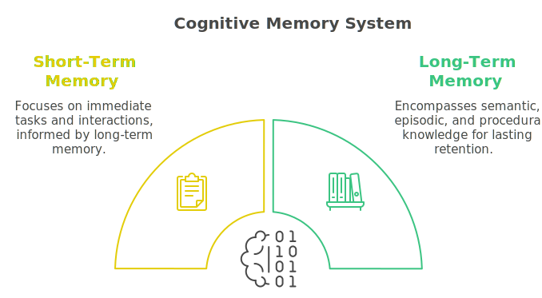

# Chapter 4: Enhanced Memory and Learning

Chapter 3 covered the basics of workspace management for maintaining context. However, true intelligence demands more advanced memory capabilities. An AI agent must do more than store facts; it must recognize relationships between pieces of knowledge and track how they change over time. Our **memory agency** approach addresses this complexity in a structured and effective way.

In this chapter, we’ll evolve Winston’s basic workspace system into a fully developed cognitive memory architecture. Building on the foundation from Chapter 3, we’ll design a coordinated memory system that balances advanced knowledge management with a clear and reliable structure.

We’ll start by examining Winston’s memory architecture, focusing on its central coordinator concept. From there, we’ll incrementally develop key memory functionalities: episode analysis to identify context boundaries, semantic storage to manage knowledge, retrieval systems to access relevant information, and working memory specialists to handle cognitive context. At each step, we’ll adhere to the _Society of Mind_ framework while enabling more advanced memory capabilities.

By the end of this chapter, Winston will have evolved into an agent with robust memory capabilities—storing knowledge, retrieving relevant information, learning from feedback, and maintaining cognitive context over time. More importantly, you’ll gain insight into how these capabilities emerge naturally from our coordinated agency approach. This understanding will lay the groundwork for developing advanced reasoning and planning in the next chapter.

In this chapter we're going to cover the following main topics:

- Implementing Winston's memory architecture and coordinator system
- Building semantic memory through embedding-based knowledge storage
- Developing retrieval capabilities through semantic search
- Creating episode analysis through cognitive boundary detection
- Managing temporal knowledge updates and conflict resolution
- Maintaining cognitive context through working memory refinement and knowledge integration

## Memory in cognitive architectures

In Chapter 3, agents interacted with their workspaces using the `WorkspaceManager`, leveraging working memory as a straightforward tool for maintaining context. In Chapter 4, we introduce a key architectural shift by creating a true memory "agency" via the `MemoryCoordinator`. This coordinator takes over all memory operations, encompassing everything from immediate working memory for workspace management to long-term semantic storage.

This evolution aligns more closely with the _Society of Mind_ model, where memory functions not as a set of isolated storage mechanisms but as a coordinated agency responsible for all memory operations. The `MemoryCoordinator` oversees working memory context, retrieves relevant long-term knowledge, evaluates new information for storage, and manages interactions between different memory types (semantic, episodic, procedural). By centralizing these operations within a single agency, we enable more advanced cognitive capabilities while preserving clear architectural boundaries—other agents interface with memory exclusively through the coordinator, rather than handling memory processes directly.

### Memory taxonomy

Before getting into the implementation details, let’s examine how Winston's memory system parallels human cognitive architecture. Like human memory, which relies on distinct but interconnected systems for managing immediate thoughts, recent experiences, and long-term knowledge, Winston employs specialized memory mechanisms that collaborate to support coherent cognitive behavior. This structure isn't just a theoretical model—it directly informs our design choices, from organizing workspaces for immediate processing to storing and retrieving long-term knowledge. Understanding these memory types and their interactions provides a clear rationale for the architectural decisions guiding our implementation.


_Figure 4.1: Memory taxonomy_

This memory architecture balances principles from cognitive science with practical implementation needs. Each component plays a distinct yet complementary role in Winston's cognitive operations. In the following sections, we’ll break down each type of memory, exploring its cognitive function and how it is implemented within the _Society of Mind_ framework.

### Short-term memory

Short-term memory, or _working memory_, forms the backbone of Winston's immediate cognitive operations, implemented through two distinct but complementary mechanisms: workspace management and conversational memory. These systems handle current information in different ways. Workspace management provides a structured "mental workspace" for organizing thoughts and maintaining focus on active tasks, ensuring Winston can process information within a coherent context. Conversational memory, on the other hand, retains recent interaction history and immediate conversational context, allowing for fluid and natural dialogue. Together, these mechanisms replicate how humans juggle immediate context while processing new information.

This dual approach addresses a critical limitation of language models: their lack of inherent memory. While these models can reason effectively within the boundaries of their context window, they cannot retain state between interactions. By bridging this gap, Winston's short-term memory enables the handling of immediate context that these models require and establishes a stepping stone for developing longer-term understanding.


_Figure 4.2: Short-term memory_

The workspace system is at the heart of Winston's immediate cognitive context. Each agent can maintain a private workspace—a dedicated "scratch pad" for processing information and forming its understanding. These private workspaces allow agents to operate independently, preserving their specific contexts without interference. When collaboration is required, agents can share context using shared workspaces, facilitating complex multi-agent operations while still preserving clear boundaries between their individual cognitive processes.

When Winston processes new information about a user's preferences, this system of workspaces ensures both specialization and consistency. The memory coordinator and its specialist agents might maintain private workspaces that focus on identifying patterns in how preferences evolve over time, enabling specialized analysis. Meanwhile, a shared workspace holds the current, consolidated understanding of the user’s preferences, making this information accessible to all agents. This separation allows for targeted processing in private workspaces while maintaining a unified and consistent context across the system.

Conversational memory functions by maintaining a detailed interaction history during active sessions, but it doesn't retain every detail indefinitely. Instead, Winston distills the interaction down to its essential insights and patterns, storing these in a compressed and semantically meaningful format. This approach is inspired by human cognition: we typically don’t remember every word of every conversation, but instead focus on retaining the important takeaways and overarching themes.

The interplay between these systems is a key strength of Winston's architecture. When new information is introduced, it is simultaneously captured in the detailed conversational history and the structured workspace context. The conversational history offers rich, nuanced detail for immediate processing, while the workspace system organizes this information into a coherent structure. This organized understanding can then be refined and, if relevant, transitioned into long-term memory, ensuring that transient details are preserved only as long as needed, while important insights are integrated into Winston's broader knowledge framework.

This design is intentionally structured to align with key principles of cognitive architecture. Rather than maintaining all context within a single system, separating conversational and workspace memory mirrors the way cognitive systems compartmentalize tasks for efficiency. This separation yields practical benefits: conversational memory can be optimized for quick recall and detailed context during interactions, while workspaces prioritize organizing information for structured understanding and long-term knowledge development. This dual-layered approach ensures both efficiency and adaptability in processing new information.

The implementation reflects this clear conceptual distinction. Workspaces rely on a templated system that enforces a quasi-consistent structure while accommodating flexible content. Meanwhile, conversational history uses Chainlit's session management to provide immediate context for interactions. The workspace system complements this by extracting and preserving key insights from conversations, enabling broader, organized understanding. By separating these concerns, the system remains practical, maintainable, and aligned with cognitive models.

This design stands out for its parallels to human cognitive processes. Much like humans retain immediate details in working memory while simultaneously consolidating deeper insights, Winston maintains both a detailed conversational history and processed understanding. Similarly, just as humans gradually forget the exact wording of conversations while preserving key takeaways, Winston’s conversation history exists temporarily within sessions, with extracted insights transitioning into more permanent storage. This isn’t merely an architectural choice—it reflects a fundamental pattern of cognitive systems, which must balance the demands of immediate processing with the need for enduring knowledge development.

Most importantly, this short-term memory system establishes the groundwork for more advanced cognitive capabilities. The structured context it maintains directly supports the semantic memory system discussed in the next section, while its coordination framework enables the collaborative reasoning and planning that will be explored in chapter 5. By reliably managing immediate context and paving the way for longer-term understanding, our short-term memory implementation acts as a vital bridge between transient interactions and permanent knowledge development.

### Long-term memory

While short-term memory addresses immediate cognitive needs, long-term memory allows Winston to accumulate and retain knowledge over time. This persistent storage is essential because language models, despite their advanced reasoning capabilities, cannot modify their training weights to integrate new information. To address this limitation, Winston’s long-term memory is built on two complementary systems: semantic memory for storing facts and relationships, and procedural memory for encoding skills and behaviors. This chapter focuses on semantic memory, laying the groundwork for effective knowledge storage and retrieval—foundations that will enable more advanced capabilities in later chapters.

#### Semantic memory

Semantic memory is responsible for storing facts, concepts, and general understanding—the "what" and "why" of knowledge rather than specific experiences or skills. Unlike humans, who develop this type of memory intuitively, Winston must explicitly construct and maintain it. For example, when Winston learns that "coffee helps me focus in the morning," this knowledge doesn't exist in isolation—it links concepts related to beverages, daily routines, and cognitive effects. These interconnections form the basis of Winston's understanding of how the world operates, enabling him to reason through unfamiliar situations and adapt as new information becomes available.

Our semantic memory implementation is designed to reflect how humans naturally connect ideas—through meaning rather than rigid, explicit relationships. For instance, when you think about your morning routine, you don’t create an explicit index linking "coffee," "breakfast," and "morning schedule." Instead, these concepts naturally group together in your mind through shared context and meaning. Winston achieves a similar form of association using vector embeddings, which enable knowledge to cluster by semantic similarity rather than relying on predefined categories or explicit links. This approach allows for flexible, context-rich organization of information.


_Figure 4.3: Semantic memory_

This approach offers several significant advantages. First, it enables flexible retrieval: Winston can surface relevant knowledge even when queries don’t precisely match the stored content. For example, a question about "breakfast habits" might retrieve information about morning coffee preferences, mimicking the way humans naturally associate related concepts. Second, it supports the natural evolution of knowledge. If Winston learns that someone has switched from coffee to tea, the semantic connections to morning routines or family patterns remain intact, while the specific details are seamlessly updated. This flexibility ensures that Winston’s understanding stays both relevant and adaptive over time.

Our implementation achieves this functionality through two complementary systems. The knowledge store handles the actual content and associated metadata, while the embedding system maps semantic relationships. For instance, when Winston learns about morning preferences, the details are stored in the knowledge store, and their semantic representation is captured as an embedding to enable retrieval based on meaning-driven similarity. This division of responsibilities creates a flexible architecture: the metadata schema can be refined, or the embedding model replaced, without disrupting the overall system. This modularity ensures adaptability and long-term scalability.

Most importantly, this design mirrors the way cognitive systems naturally operate. Just as humans intuitively group related concepts without relying on explicit categories, Winston’s semantic memory emerges from meaning rather than rigid structure. This approach not only enhances cognitive plausibility but also improves robustness. There’s no need to anticipate every potential relationship or manage intricate connection graphs — the semantic space inherently reflects how knowledge relates, allowing for adaptable and efficient reasoning.

This foundation unlocks increasingly sophisticated capabilities. For instance, when Winston needs to understand a user’s technical preferences, semantic memory can retrieve not only explicit statements about preferred tools but also related experiences and contextual nuances. Similarly, during project planning, it can surface relevant past approaches based on meaning rather than relying on exact matches. By forming associations through meaning instead of rigid structure, Winston is able to build and sustain the intricate web of knowledge essential for genuine cognitive functionality.

Looking forward, this semantic foundation will play a critical role in enabling reasoning and planning. By retrieving knowledge based on meaning rather than exact matches, Winston can apply past experiences to new situations, adapt solutions to varying contexts, and develop increasingly nuanced understanding over time. While future chapters will introduce more structured techniques tailored to specific challenges, this meaning-based foundation serves as the flexible and robust framework necessary for authentic cognitive behavior.

#### Procedural memory

While semantic memory focuses on facts and understanding, procedural memory is responsible for encoding skills, behaviors, and learned strategies—the "how" of knowledge. In humans, this encompasses everything from riding a bicycle to debugging complex code. For Winston, procedural memory involves developing effective patterns for using tools, conducting research, and solving problems.

Procedural memory poses unique challenges for language model-based systems. Unlike semantic knowledge, which can be directly stored and retrieved, procedures often consist of intricate sequences of actions, conditional logic, and ongoing refinements. For example, when Winston learns to solve technical problems more effectively, this process requires not just storing past search queries or steps, but understanding which strategies work best in varying contexts and adapting them dynamically based on outcomes.

While this chapter focuses primarily on semantic memory implementation, understanding procedural memory's role in cognitive architectures helps frame our broader goals. Future chapters will need to address how Winston can develop true procedural capabilities - learning not just what things are but how to accomplish tasks effectively. This will require new mechanisms for encoding and executing learned procedures, transforming Winston from a system that recalls facts into one that learns from experience.

In future chapters, Winston will develop procedural memory, moving from simply recalling facts to learning through experience. For example, he will refine sequences of tool operations to find the most effective combinations, much like a developer masters shortcuts through repeated use. His research strategies will adapt as he identifies patterns in successful outcomes, similar to how experienced engineers build intuition for debugging. Through trial and adjustment, Winston will improve his problem-solving methods, gradually forming sophisticated behavioral patterns that mirror human expertise.

This evolution from knowledge storage to learned procedures represents a pivotal step toward greater autonomy and adaptability. While this chapter focuses on semantic memory, understanding its place within Winston’s broader cognitive framework ensures that it contributes to a cohesive architecture—one capable of supporting advanced, dynamic learning in the future.

### Experience processing

Unlike short-term and long-term memory, which function as distinct storage systems, experience processing represents a cognitive workflow—the mechanism for converting immediate experiences into lasting knowledge. This process mirrors how humans extract meaningful insights from daily interactions, transforming raw experiences into structured understanding.

For Winston, "experience" extends beyond traditional conversational inputs, encompassing a diversity of observations from many sources. While text-based verbal input through a chat interface is common, advanced AI agents like Winston will soon be capable of processing multimodal experiences, such as visual, auditory, or behavioral observations. For example, Winston may observe user behavior in software applications, interpret environmental data from IoT sensors, or extract semantic meaning from visual inputs. Regardless of modality, the cognitive processing framework remains consistent: raw sensory or observational data is refined into actionable, interconnected knowledge.

Consider how Winston processes new information about a user's technical preferences. The immediate processing begins with episode analysis, where Winston evaluates whether this represents a continuation of the current context or signals a shift to a new cognitive episode. This boundary detection, combined with context evaluation, helps maintain coherent understanding while properly organizing new information.


_Figure 4.4: Experience processing workflow_

Simultaneous with boundary detection, Winston compresses the incoming information, identifying key elements and recognizing patterns. To manage memory efficiently, Winston extracts essential elements from interactions, identifying patterns and compressing details into a structured semantic memory format. When discussing technical preferences, for instance, specific implementation details might be less crucial to retain than the underlying patterns of tool selection or problem-solving approaches.

This extracted knowledge flows into semantic memory while simultaneously informing working memory updates. The process maintains cognitive coherence by ensuring that immediate context reflects new understanding while preserving important relationships for long-term storage. Later in this chapter, we'll explore how Winston implements this cognitive workflow through coordinated specialist agents, each handling specific aspects of experience processing while contributing to cohesive knowledge development.

### Engineering Winston's Memory System

This chapter focuses on four key capabilities: enhanced workspace management for working memory, semantic knowledge storage with embedding-based retrieval, experience processing via episode analysis, and coordinated memory operations through specialized agents. Instead of trying to replicate every aspect of human memory, we focus on these essential functions to ensure Winston can maintain cognitive context and learn from experience. This targeted approach addresses a core limitation of language models—their inability to update training weights—while preserving architectural clarity. By exploring the specialist agents and agencies behind these capabilities, we’ll see how this design enables increasingly advanced cognitive operations through clear separation of concerns and effective memory coordination.

## Specialist agents and agencies

Marvin Minsky's _Society of Mind_ theory suggests that intelligence arises from the interactions of simple, specialized processes—referred to as agents—each responsible for a specific cognitive function. As we implement more advanced capabilities, Winston’s architecture is now poised to fully adopt this model through the use of specialist agents and agencies—structured groups of agents coordinated by a lead agent. This architectural approach is central to Winston's memory system, but the same principles are broadly applicable to cognitive architectures as a whole.

A specialist agent performs a single, clearly defined cognitive task, such as identifying episode boundaries or assessing knowledge for storage. These agents are built on our `BaseAgent`, with carefully tailored prompts that define and constrain their specific roles. Specialists are then grouped into agencies, where a coordinator agent oversees their activities to accomplish a shared objective. For example, the Memory Coordinator directs a team of memory specialists, while the Semantic Memory Coordinator heads a sub-agency focused specifically on managing knowledge. This hierarchical structure allows sophisticated cognitive operations to emerge from the interaction of simpler, narrowly focused components.

Before we explore the specifics of Winston's memory system, we’ll outline the design patterns and principles behind creating effective specialists and agencies. These guidelines ensure that new cognitive capabilities can be added in a consistent, modular way, while preserving the clarity and structure fundamental to a _Society of Mind_ approach.

### Core design philosophy

The foundation of designing cognitive AI agents lies in the principle that _cognitive logic resides in the prompt_. In this architecture, the prompt serves as the primary mechanism for defining the agent’s reasoning, decision-making processes, and overall role. By carefully crafting the system prompt, we enable the language model (LLM) to perform all higher-order cognitive functions, such as analyzing inputs, making contextual decisions, and determining the appropriate course of action.

The prompt and LLM are also responsible for selecting the appropriate tools and constructing the arguments required to invoke them. Based on the reasoning articulated in the prompt, the LLM identifies the correct tool for a given situation and provides the parameters needed for its execution. Tools themselves are limited to performing specific, well-defined actions and do not include any decision-making logic. They act as mechanical extensions of the system, carrying out tasks based solely on the instructions passed to them by the LLM.

This approach ensures a clear separation of responsibilities—cognitive functions are centralized within the prompt and LLM, while tools handle discrete, operational tasks. By maintaining this division, the system preserves modularity and clarity, fully leveraging the reasoning power of the LLM while keeping tools simple and focused. This separation is critical to building robust, adaptable AI agents, ensuring that cognitive and mechanical aspects remain distinct and well-organized.

### Specialist agent requirements

Specialist agents are designed around a core set of requirements to ensure consistency, clarity, and modularity within a cognitive AI system. First and foremost, every specialist agent must inherit from the foundational `BaseAgent` class, which provides the core functionality necessary for interaction, tool management, and task execution. Each agent must also have a clear and focused cognitive role, defining a specific area of expertise or function, which is central to its reasoning and decision-making processes.

To ensure configurability and reusability, specialist agents are required to provide a YAML-based configuration file. This file specifies the agent’s unique identifier, model details, system prompt, and any optional parameters. Additionally, a strict separation of concerns must be maintained—cognitive logic resides exclusively in the prompt and is executed by the language model, while tools handle only the specific actions instructed by the LLM. This disciplined structure ensures that each agent is independently functional, aligns with the system’s design philosophy, and integrates seamlessly into the broader architecture.

Our approach to tool implementation adheres to the same principles of clarity and separation of concerns. Each tool is defined using Pydantic models, which specify both the input requirements (requests) and the output structure (responses). This ensures type safety and creates clear, well-defined interfaces. Tools are registered with the system and explicitly granted to specific agents, providing precise control over which agents have access to which mechanical capabilities.

The actual tool handlers—the functions responsible for executing requested actions—are implemented separately from the cognitive logic. Their sole focus is on performing specific tasks based on validated inputs. This separation ensures that tools remain operationally focused, leaving all reasoning and decision-making to the cognitive agents. By combining this structured approach to tools with the specialist agent design, we establish a cohesive framework where cognitive decisions and mechanical actions are clearly delineated but work together seamlessly to achieve broader system goals.

#### Configuration example

The following examples demonstrate our core design principles in practice. Let's examine a typical specialist agent configuration, paying particular attention to how the system prompt encapsulates all cognitive aspects of the agent's behavior:

```yaml
# config/agents/{agent_id}.yaml
id: agent_id
model: gpt-4o-mini
system_prompt: |
  You are a {SPECIALIST} agent in a Society of Mind system.

  Your ONLY role is to {SPECIFIC_COGNITIVE_FUNCTION}.

  Given input, analyze:
  1. {KEY_ANALYSIS_POINTS}
  2. {DECISION_CRITERIA}

  Based on your analysis, select the appropriate action:
  - Use tool_a when {CONDITION_A}
  - Use tool_b when {CONDITION_B}

  Always explain your reasoning before taking action.

temperature: 0.7
stream: true
```

The system prompt serves as the complete definition of the agent's cognitive behavior. It begins by establishing the agent's specific role within the broader system, then explicitly defines the decision-making process the agent should follow. The analysis criteria section guides how the agent should evaluate inputs, while the action selection rules establish clear conditions for tool usage. Most importantly, all reasoning patterns—from initial analysis to final action selection—are defined within the prompt, ensuring the language model has comprehensive guidance for its cognitive operations.

#### Tool implementation

Similarly, our tool implementations exemplify the separation between cognitive and mechanical aspects of the system. The Pydantic models provide strict typing and validation for both inputs and outputs, while the tool handler focuses solely on executing specific actions without any decision-making logic:

```python
from pydantic import BaseModel, Field
from winston.core.tools import Tool

class ActionRequest(BaseModel):
    content: str = Field(description="Content to analyze")
    context: dict[str, Any] = Field(
        default_factory=dict,
        description="Additional context"
    )

class ActionResponse(BaseModel):
    result: str = Field(description="Action results")
    metadata: dict = Field(description="Additional metadata")

async def handle_action(request: ActionRequest) -> ActionResponse:
    """Implement concrete action logic only."""
    return ActionResponse(
        result="Action completed",
        metadata={"status": "success"}
    )

action_tool = Tool(
    name="perform_action",
    description="Execute specific action based on LLM analysis",
    handler=handle_action,
    input_model=ActionRequest,
    output_model=ActionResponse
)
```

These examples serve as templates for implementing new specialist agents and their tools. The configuration-driven approach ensures consistency, but it's the language model's interaction with the system prompt that drives cognitive behavior. Following the prompt's guidance, the LLM performs all analysis and reasoning, explains its thought process, and makes decisions about which tools to employ. This structured interaction—where the LLM handles all cognitive tasks while remaining constrained by the prompt's parameters—ensures predictable yet flexible agent behavior. Meanwhile, the tools themselves remain focused purely on execution, maintaining our strict separation between cognitive and mechanical operations.

### Agencies

In the _Society of Mind_ model, an agency represents a coordinated group of specialist agents working together to accomplish complex cognitive tasks. The agency pattern introduces hierarchy into our architecture through a coordinator agent that orchestrates its specialists' activities. Unlike individual specialists that perform specific cognitive functions, a coordinator manages the sequencing and integration of multiple specialists' outputs to achieve higher-level goals.

A coordinator agent differs from specialists in its implementation. While it inherits from `BaseAgent`, its `process()` method focuses on orchestration rather than direct cognitive operations:

```python
class CoordinatorAgent(BaseAgent):
    """Coordinates specialist agents to accomplish complex tasks."""

    def __init__(self, system: System, config: AgentConfig, paths: AgentPaths) -> None:
        super().__init__(system, config, paths)

        # Initialize specialists
        self.specialist_a = SpecialistA(system, config_a, paths)
        self.specialist_b = SpecialistB(system, config_b, paths)

    async def process(self, message: Message) -> AsyncIterator[Response]:
        """Orchestrate specialist operations."""
        # 1. First specialist operation
        result_a = await self.specialist_a.process(message)

        # 2. Use results to inform next operation
        context_message = Message(
            content=message.content,
            metadata={"previous_result": result_a}
        )

        # 3. Second specialist operation
        result_b = await self.specialist_b.process(context_message)

        # 4. Integrate results
        yield Response(content=self._integrate_results(result_a, result_b))
```

This pattern enables hierarchical organization of cognitive functions. Agencies can contain other agencies (sub-agencies), each with their own coordinator and specialists. For example, a high-level coordinator might manage several sub-agencies, each focused on a specific cognitive domain. This hierarchical structure allows us to build increasingly sophisticated capabilities while maintaining clear boundaries and responsibilities at each level.

### Memory agency design

With the foundational principles and practical patterns for building specialist agents and agencies in place, we’re ready to apply them to Winston’s memory system. This implementation offers an excellent case study for how the _Society of Mind_ approach manifests as a functional cognitive capability—one that allows Winston to learn from experience, manage context effectively, and adapt his understanding over time.


_Figure 4.5: Memory agency design_

At the core of this design is the Memory Coordinator, which directs a team of specialists, each handling a specific layer of memory processing. The Episode Analyst identifies cognitive boundaries, enabling Winston to detect when shifts in context require adjusted processing strategies. The Semantic Memory Coordinator oversees long-term knowledge management through its own sub-agency, which includes retrieval and storage specialists. Meanwhile, the Working Memory Specialist maintains immediate cognitive coherence by ensuring that the current context integrates new information, as well as relevant retrieved knowledge.

This agency-based structure ensures that Winston can perform complex memory tasks while preserving architectural clarity. For example, when learning that someone has “switched from coffee to tea,” the system doesn’t simply replace one fact with another. The Episode Analyst interprets this change as part of a broader shift in preferences within a specific context. The Semantic Memory Coordinator retrieves related knowledge, such as information about morning routines or previous beverage preferences, and integrates the updated preference into long-term memory while preserving those connections. At the same time, the Working Memory Specialist updates the current conversational context to reflect this newly learned information, ensuring continued relevance and coherence in Winston’s interactions.

By distributing responsibilities among specialized components with clear roles, Winston’s memory system achieves both sophistication and maintainability. Let’s now explore how each of these key components collaborates to create a unified and flexible memory system...

Let's examine the key components of Winston's memory system:

#### Coordinators and Agencies

The **Memory Coordinator** orchestrates the entire memory system, ensuring each component performs its role at the right time. Like a conductor, it maintains system coherence without making cognitive decisions itself.

The **Semantic Memory Agency**, headed by its coordinator, manages all long-term knowledge operations. This sub-agency demonstrates how complex cognitive functions can be handled by a coordinated group of specialists while maintaining clear architectural boundaries.

#### Memory Specialists

The **Episode Analyst** detects cognitive boundaries in Winston's interactions. When conversation shifts from morning routines to work projects, this specialist determines whether we're entering a new cognitive episode and what context should be preserved.

The **Retrieval Specialist** formulates and executes knowledge queries, finding relevant information through semantic similarity. Rather than requiring exact matches, this specialist enables Winston to surface knowledge based on meaning and context.

The **Storage Specialist** evaluates new information and manages knowledge updates. When Winston learns about preference changes or new patterns, this specialist determines how to integrate this information and resolve any conflicts with existing knowledge.

The **Working Memory Specialist** maintains Winston's immediate cognitive context, ensuring new information and retrieved knowledge integrate coherently while preserving important relationships.

Consider how these components collaborate when Winston learns "I've switched from coffee to tea":

1. The **Memory Coordinator** sequences the operation through its specialists
2. The **Episode Analyst** recognizes this as a preference update within the current context
3. The **Retrieval Specialist** finds existing knowledge about morning routines and preferences
4. The **Storage Specialist** updates the knowledge while preserving connections to routines and patterns
5. The **Working Memory Specialist** updates the current context to reflect this new understanding

This organization embodies core principles of our _Society of Mind_ approach. Each specialist maintains clear cognitive boundaries, focusing on specific aspects of memory processing without overlapping responsibilities. The hierarchical structure, with coordinators managing both individual specialists and sub-agencies, enables increasingly sophisticated cognitive operations while maintaining architectural clarity. Most importantly, the coordinators focus purely on orchestration, leaving all cognitive decisions to their specialists—a pattern that ensures robust and maintainable memory operations while preserving the flexibility of specialist reasoning.

In the following sections, we'll explore the implementation details of each component, starting with semantic memory storage and retrieval, then examining how the memory coordinator orchestrates these specialists into a cohesive system.

## Semantic memory implementation

Winston's semantic memory system addresses a critical challenge in cognitive architectures: enabling knowledge storage and retrieval in ways that preserve meaning and support flexible recall. Instead of relying on rigid categorization or predefined relationship graphs, our implementation uses vector embeddings to naturally capture semantic connections. This approach allows Winston to retrieve relevant knowledge even when queries don’t exactly match stored content, while ensuring the system remains clean and maintainable.

The system is composed of two complementary components: a knowledge storage system and an embedding-based retrieval system. The storage system focuses on persisting knowledge and its associated metadata, while the embedding system enables semantic search by transforming knowledge into high-dimensional vector representations. Built on ChromaDB, the embedding system captures the semantic meaning of knowledge, allowing Winston to locate relevant information by measuring similarity in this semantic space.

This design adheres to the architectural principles of clarity and separation of concerns. The storage system is dedicated to persistence, while the embedding system is solely responsible for managing semantic relationships. Tools provide the concrete operations required for storing and retrieving data, while cognitive specialists determine when and how to invoke these tools based on higher-level reasoning. By maintaining clearly defined responsibilities for each component, this design supports flexibility and scalability while preserving simplicity.

Together, these components enable Winston to build and maintain an evolving body of knowledge. By separating storage from retrieval and embedding semantic meaning into the system, Winston can reason over stored knowledge in a way that supports both accurate recall and dynamic adaptability, all while maintaining a straightforward and modular architecture.


_Figure 4.6: Semantic memory system_

### Knowledge storage system

Winston's semantic memory system is intentionally straightforward: it uses a file-based storage system with JSON serialization. While more advanced databases could offer additional features, this implementation prioritizes clarity and maintainability, providing all the essential functionality needed for knowledge persistence.

The core of this system is the Knowledge model:

```python
class Knowledge(BaseModel):
    """Single knowledge entry with metadata."""
    id: str
    content: str
    context: dict[str, Any]
    created_at: datetime
    updated_at: datetime
```

This simple structure encompasses all the necessary elements for effective knowledge management: unique identification, the content itself, flexible contextual metadata, and temporal tracking. By leveraging Pydantic, the system ensures type safety and input validation, while also enabling clean and reliable serialization to and from JSON.

The `KnowledgeStorage` class provides a clean interface for the basic CRUD operations:

```python
class KnowledgeStorage:
    """Simple file-based knowledge storage."""

    async def store(self, content: str, context: dict[str, Any]) -> str:
        """Store new knowledge entry."""

    async def load(self, knowledge_id: str) -> Knowledge:
        """Load knowledge by ID."""

    async def update(
        self,
        knowledge_id: str,
        content: str | None = None,
        context: dict[str, Any] | None = None,
    ) -> Knowledge:
        """Update existing knowledge."""

    async def list_all(self) -> list[Knowledge]:
        """List all stored knowledge entries."""

    async def delete(self, knowledge_id: str) -> None:
        """Delete knowledge entry by ID."""
```

This simplicity in the storage layer is intentional - it provides a stable foundation that allows us to focus complexity where it matters most: in the semantic relationships managed by our embedding system. Let's examine how that embedding layer enables Winston to find and connect knowledge based on meaning rather than exact matches.

### Embedding-based retrieval (EBR)

Our embedding-based retrieval system, powered by ChromaDB, encodes knowledge as high-dimensional vector representations that capture semantic meaning. For those unfamiliar with vector embeddings, think of words or phrases as points in a multi-dimensional space, where similar concepts naturally cluster together. For example, when the language model processes text like "morning coffee," it generates a vector positioned near related concepts such as "breakfast routine" or "afternoon tea" in this semantic space. This technique enables Winston to retrieve relevant knowledge by measuring the proximity between these vector representations, offering far more flexibility and nuance than exact text matching.

The implementation is built on two essential components: a `SimilarityMatch` structure to represent search results and an `EmbeddingStore` class that manages integration with ChromaDB. While ChromaDB provides a wide array of advanced features, we’ve deliberately designed our interface to remain focused and minimal. The store supports three primary operations: adding new embeddings when knowledge is created, retrieving similar content through vector similarity search, and updating embeddings when knowledge is modified. This streamlined approach ensures the system remains reliable and easy to maintain, while delivering all the semantic search functionality Winston requires.

The `SimilarityMatch` class encapsulates the essential elements of a semantic search result:

```python
class SimilarityMatch(NamedTuple):
    """Result from similarity search."""
    id: str
    score: float
    metadata: dict[str, Any]
```

This simple structure captures everything needed to work with search results: the knowledge ID for retrieval, a similarity score for ranking, and any metadata that might help filter or contextualize the match. The similarity score represents cosine similarity between the query and stored embeddings, converted from ChromaDB's distance metric using `1.0 - distance`. This means scores range from 0 to 1, where 1 indicates perfect semantic similarity and 0 indicates completely unrelated content. This intuitive scoring helps agents make informed decisions about the relevance of retrieved knowledge.

The `EmbeddingStore` provides a clean interface to ChromaDB's vector operations:

```python
class EmbeddingStore:
    """Manages embeddings using ChromaDB."""

    async def add_embedding(self, knowledge: Knowledge) -> None:
        """Add knowledge embedding to store."""

    async def find_similar(
        self,
        query: str,
        limit: int = 5,
        filters: dict[str, Any] | None = None,
    ) -> list[SimilarityMatch]:
        """Find similar knowledge entries."""

    async def update_embedding(self, knowledge: Knowledge) -> None:
        """Update embedding for modified knowledge."""

    async def delete_embedding(self, knowledge_id: str) -> None:
        """Delete embedding for knowledge entry."""
```

This interface abstracts away the complexities of vector operations while providing all the functionality Winston needs for semantic search. The `find_similar` method is particularly important - it converts input text into a vector representation and returns the most semantically similar matches, optionally filtered by metadata.

The filtering system leverages ChromaDB's robust filtering capabilities, which include logical operators (AND, OR, NOT), range queries, and complex metadata conditions. For example, you could find all beverage preferences from the last month with a filter like:

```python
{
    "$and": [
        {"category": "beverage"},
        {"created_at": {"$gte": one_month_ago}}
    ]
}
```

While these powerful filtering options are available, our implementation generally favors semantic search over complex filtering rules, as explained in our design note. This keeps the system more flexible and cognitively plausible while maintaining the option for precise filtering when needed.

The `limit` parameter helps control computational costs and result relevance, while maintaining the option for metadata filtering gives us flexibility for future enhancements.

### Integration example: Coffee preference

Let's examine how the storage and embedding systems work together through a practical example. When Winston learns about a user's morning routine, the system coordinates both knowledge storage and semantic embedding:

```python
# Store initial preference
knowledge_id = await storage.store(
    content="User drinks coffee in the morning, like father used to",
    context={
        "type": "preference",
        "category": "beverage",
        "temporal": "morning"
    }
)

# Add embedding for retrieval
await embedding_store.add_embedding(
    await storage.load(knowledge_id)
)
```

Later, when Winston needs to recall information about morning routines, the semantic search capabilities come into play:

```python
# Find relevant knowledge
matches = await embedding_store.find_similar(
    "morning beverage preferences",
    limit=2
)

# Load full knowledge entries
for match in matches:
    knowledge = await storage.load(match.id)
    print(f"Found: {knowledge.content} (relevance: {match.score})")
```

When preferences change, both systems update to maintain consistency while preserving semantic connections:

```python
# Update existing knowledge
updated = await storage.update(
    knowledge_id,
    content="User switched from coffee to tea in the morning",
    context={
        "type": "preference",
        "category": "beverage",
        "temporal": "morning",
        "changed": True
    }
)

# Update embedding
await embedding_store.update_embedding(updated)
```

This example demonstrates how the storage and embedding systems complement each other. The storage system maintains the actual knowledge content and metadata, while the embedding system ensures that semantic relationships persist even as the content evolves. When the preference changes from coffee to tea, the embedding system maintains the semantic connections to morning routines and patterns, while the storage system preserves the historical context through metadata.

---

**Design Note: Filtering vs. Semantic Search**

While ChromaDB supports sophisticated filtering capabilities including logical operators, range queries, and complex metadata conditions, our implementation deliberately emphasizes semantic similarity search over explicit filtering. This architectural decision reflects several key considerations:

1. **Cognitive Plausibility**
   When searching for relevant knowledge, semantic similarity better mirrors how cognitive systems naturally surface related information. A query about "breakfast habits" should find morning coffee preferences through semantic association, not through explicit category matching.

2. **Graceful Degradation**
   Pure semantic search allows for fuzzy matching - less relevant results are still returned but with lower similarity scores. This provides more flexibility than binary filter conditions which completely exclude non-matching results. When an agent searches for knowledge, it's better to get somewhat relevant results than none at all.

3. **LLM Integration**
   Having the LLM generate complex filter conditions introduces risk. Inconsistent metadata classifications or overly restrictive filter combinations could accidentally block relevant knowledge. By focusing on semantic queries, we leverage the LLM's natural language capabilities while avoiding the complexity of filter generation.

Future enhancements might introduce more structured approaches to knowledge organization:

- Standardized metadata schemas
- Hierarchical categorization
- Controlled vocabulary for classifications

For now, keeping our retrieval system focused on semantic similarity provides a solid foundation while avoiding potential pitfalls of premature complexity. The powerful filtering capabilities remain available when needed, but they serve as optional refinements rather than primary search mechanisms.

---

## Memory agency implementation

Winston's memory system operates through a hierarchical agency structure, with the Memory Coordinator orchestrating specialized agents for episode analysis, semantic memory operations, and working memory management. The Semantic Memory Coordinator heads its own sub-agency of retrieval and storage specialists, demonstrating how complex cognitive functions can be decomposed into focused, manageable components. This organization enables Winston to process new information, maintain cognitive context, and evolve his understanding over time while preserving clear architectural boundaries.

Let's see how these components work together in practice. When Winston learns about a change in preferences, the interaction flows through multiple specialists, each contributing its specific cognitive function to the overall memory operation:


_Figure 4.7: Memory agency_

In the following sections, we’ll take a closer look at each component of Winston’s memory agency. We’ll start by examining the Memory Coordinator and how it orchestrates sophisticated memory operations while ensuring system-wide coherence. After that, we’ll break down the role of each specialist, from the Episode Analyst’s context boundary detection to the Semantic Memory Coordinator’s knowledge management. Finally, we’ll explore how the Working Memory Specialist ensures consistent cognitive context as new knowledge is integrated. Through illustrative examples, we’ll show how these components work together to give Winston robust and dynamic memory capabilities.

### Memory coordinator

The Memory Coordinator serves as the orchestrator of Winston's memory operations, implementing our _Society of Mind_ approach through clear separation between coordination logic and cognitive processing. Let's examine how this coordinator brings together our specialist agents to create sophisticated memory capabilities:

```python
class MemoryCoordinator(BaseAgent):
    """Orchestrates memory operations between specialist agents."""

    def __init__(self, system: AgentSystem, config: AgentConfig, paths: AgentPaths) -> None:
        super().__init__(system, config, paths)

        # Initialize specialist agents with their own configs
        self.episode_analyst = EpisodeAnalyst(
            system,
            AgentConfig.from_yaml(paths.system_agents_config / "memory" / "episode_analyst.yaml"),
            paths,
        )

        self.semantic_memory = SemanticMemoryCoordinator(
            system,
            AgentConfig.from_yaml(paths.system_agents_config / "memory" / "semantic" / "coordinator.yaml"),
            paths,
        )

        self.working_memory = WorkingMemorySpecialist(
            system,
            AgentConfig.from_yaml(paths.system_agents_config / "memory" / "working_memory.yaml"),
            paths,
        )
```

The coordinator's initialization demonstrates a key architectural principle: each specialist maintains its own configuration, ensuring clear cognitive boundaries while enabling flexible customization. The actual coordination happens in the `process` method, which orchestrates the flow of information through specialists:

```python
async def process(self, message: Message) -> AsyncIterator[Response]:
    """Orchestrate memory operations sequence."""

    # Let episode analyst evaluate context shift
    async for response in self.episode_analyst.process(message):
        yield response  # Pass through episode analysis

    # Let semantic memory handle knowledge operations
    async for response in self.semantic_memory.process(message):
        yield response  # Pass through retrieval/storage results

    # Finally, update working memory context
    async for response in self.working_memory.process(message):
        yield response
```

This implementation demonstrates deliberate architectural decisions aimed at balancing complexity with maintainability. The coordinator's role remains strictly operational—it sequences tasks and manages flow control while delegating all cognitive decisions to the specialist agents. As information moves through the system, metadata is passed between specialists to maintain context, yet this process avoids tight coupling, preserving modularity. The streaming design ensures that clients receive real-time updates during memory operations, rather than waiting for the full processing to complete. Most importantly, while each specialist functions as an independent cognitive agent, their collaborative operations—orchestrated by the coordinator—form a cohesive and effective memory system. This thoughtful balance between independence and integration highlights how _Society of Mind_ principles can be successfully applied to create practical cognitive architectures.

The full implementation (in `winston/core/memory/coordinator.py`) includes additional error handling and metadata management, but this core structure demonstrates how the coordinator enables sophisticated memory operations through clean architectural boundaries.

The Memory Coordinator exemplifies how clear architectural boundaries enable complex cognitive operations through straightforward orchestration. By separating coordination logic from cognitive processing, each specialist remains modular and can evolve independently, while the coordinator ensures seamless collaboration across the system. In the following sections, we’ll explore how each specialist fulfills its specific cognitive role within this coordinated framework.

### Episode Analyst

The Episode Analyst is responsible for determining when a context shift occurs in Winston's conversation flow and deciding what understanding to carry forward. Its functionality is structured into distinct cognitive and mechanical components, following the principle of separation of concerns.

The cognitive logic is implemented entirely in its system prompt, which guides the language model (LLM) in analyzing input messages against the current workspace context. Mechanical operations, such as reporting its decisions, are handled by a single, focused tool.

The Episode Analyst’s analysis and decision-making process can be depicted as follows:


The diagram highlights how the LLM analyzes the incoming message and current workspace context for topic shifts, context changes, or recurring temporal patterns. Following this analysis:

- It determines whether a new episode begins (`NE`).
- It identifies which elements of the current context should be preserved (`PC`).
- Based on the decision, it signals the appropriate system components, such as the Memory Coordinator or Working Memory.

#### System Prompt

The cognitive function of the Episode Analyst is driven entirely by its system prompt. The prompt defines the agent’s role and decision criteria for detecting context shifts and preserving relevant information across episode boundaries.

````yaml
id: episode_analyst
model: gpt-4o-mini
system_prompt: |
  You are an Episode Analysis agent in a Society of Mind system.

  
  Current Workspace Context:
  ```markdown
  {{ current_workspace }}
  ```
  

  Your ONLY role is to detect episode boundaries in the conversation flow.
  Given a message and current workspace content, analyze:

  1. Episode Boundaries

    - Is this a new topic/context?
    - How significantly does it shift from current context?
    - Should current context be preserved or cleared?

  2. Context Preservation
    - What elements of current context remain relevant?
    - What should be maintained across this boundary?
````

This configuration ensures that the LLM focuses solely on detecting episode boundaries and deciding what content from the workspace should persist.

#### Mechanical operations

The Episode Analyst uses a single tool to operationalize its cognitive decisions. This tool transforms the output from the prompt into a structured format defined by Pydantic models.

##### Response model

The structured response is modeled as follows:

```python
class EpisodeBoundaryResponse(BaseModel):
    """Response from episode boundary detection."""
    is_new_episode: bool
    context_elements: list[str]
```

This model represents whether a new conversational episode has begun (`is_new_episode`) and specifies which elements of the current context should be retained (`context_elements`).

##### Tool registration

The Episode Analyst registers its tool during initialization and is granted explicit access:

```python
self.system.register_tool(
    Tool(
        name="report_episode_boundary",
        description="Report episode boundary detection results",
        handler=self._handle_boundary_report,
        input_model=EpisodeBoundaryResponse,
        output_model=Response
    )
)
self.system.grant_tool_access(self.id, ["report_episode_boundary"])
```

The tool focuses solely on converting the LLM-generated decisions into structured form. The `handler` processes and stores these results but contains no cognitive logic of its own.

The Episode Analyst provides a structured approach to determining conversational context shifts and preserving relevant information, enabling Winston to maintain coherent and adaptive interactions across episodes. By isolating cognitive reasoning in the system prompt, the agent ensures clear and consistent decision-making about episode boundaries and context transitions. Its reliance on tools for mechanical operations, such as reporting decisions and structuring results, ensures modularity and flexibility. This separation of cognitive and operational concerns allows the Episode Analyst to evolve through prompt adjustments while maintaining reliable execution, ensuring seamless integration within the greater Winston architecture.

### Semantic Memory Coordinator

The Semantic Memory Coordinator implements a straightforward orchestration pattern, managing the sequence of retrieval and storage operations while maintaining clear separation of concerns. Let's examine its implementation, focusing on how it coordinates its specialist agents.

The coordinator's initialization establishes its specialist agents, each with their own configuration:

```python
def __init__(self, system: AgentSystem, config: AgentConfig, paths: AgentPaths) -> None:
    super().__init__(system, config, paths)

    # Initialize specialists with their own configs
    self.retrieval_specialist = RetrievalSpecialist(
        system,
        AgentConfig.from_yaml(paths.system_agents_config / "memory" / "semantic" / "retrieval.yaml"),
        paths,
    )

    self.storage_specialist = StorageSpecialist(
        system,
        AgentConfig.from_yaml(paths.system_agents_config / "memory" / "semantic" / "storage.yaml"),
        paths,
    )
```

The actual coordination happens in the `process` method, which manages a two-step workflow:

```python
async def process(self, message: Message) -> AsyncIterator[Response]:
    """Process semantic memory operations."""
    # 1. Find relevant knowledge
    retrieval_message = Message(
        content=message.content,
        metadata=message.metadata,
    )

    async for response in self.retrieval_specialist.process(retrieval_message):
        if not response.metadata.get("streaming"):
            # Pass retrieved context back to Memory Coordinator
            yield Response(
                content=response.content,
                metadata={"type": "retrieved_context"},
            )

    # 2. Let Storage Specialist analyze and handle storage needs
    storage_message = Message(
        content=message.content,
        metadata={"retrieved_content": response.content},
    )

    async for response in self.storage_specialist.process(storage_message):
        if not response.metadata.get("streaming"):
            yield Response(
                content=response.content,
                metadata={"type": "storage_result"},
            )
```

This implementation incorporates key design decisions to maintain clarity and efficiency. The coordinator enforces sequential processing by ensuring retrieval occurs before storage, allowing the Storage Specialist to account for existing knowledge during its operations. Context is preserved across specialists through the use of metadata, which enables informed decision-making without creating tight coupling between components. To support responsiveness, the coordinator streams responses from specialists in real-time, rather than waiting for all processing to complete. Each specialist operates independently with its own configuration, while the coordinator focuses exclusively on managing the sequence and flow of information, preserving clear boundaries between components.

The coordinator's role remains purely operational - it sequences tasks and manages information flow while delegating all cognitive decisions to its specialists. This clean separation ensures that knowledge management logic resides in the specialists while the coordinator focuses solely on orchestration.

This implementation provides a foundation for future enhancements through additional specialists or modified processing sequences, while maintaining the core pattern of coordinated but independent cognitive operations.

### Retrieval Specialist

The Retrieval Specialist is responsible for semantic knowledge retrieval within Winston's memory system. Its primary cognitive function is transforming queries into semantic representations to uncover relevant information through meaning-based similarity rather than exact text matches. This allows the system to retrieve pertinent knowledge even when the wording or phrasing of queries differs significantly from stored information.

The Retrieval Specialist's process can be represented as follows:


The diagram outlines the specialist's flow, starting with analysis of the input query to identify the key concepts and related terms. These are used to construct a semantic search query, which retrieves results from the Embedding Store. Results are drawn from the Knowledge Store in order of relevance scores, with the highest-ranked result identified as the primary match and the rest categorized as additional results with lower relevance.

The Retrieval Specialist processes queries both explicit and contextual, such as:

1. **Direct Query**: "What do I drink in the morning?"

   - Analyzes for key concepts like "morning" and "drink."
   - Retrieves patterns related to beverage preferences and routines.

2. **Contextual Query**: "Would that work with my schedule?"

   - Resolves references like "that" using prior conversational context.
   - Searches for temporal patterns and scheduling constraints.

3. **Implicit Query**: "I'm thinking of changing my routine."
   - Infers information needs around routines and habits.
   - Retrieves current patterns and past modifications.

#### System prompt

The Retrieval Specialist's cognitive reasoning is guided entirely by its system prompt, which instructs the LLM to analyze queries and form retrieval strategies. The prompt is deliberately designed to focus the agent on query transformation and semantic analysis.

```yaml
id: semantic_retrieval
model: gpt-4o-mini
system_prompt: |
  You are a Knowledge Retrieval specialist in a Society of Mind system.
  Your ONLY role is to formulate effective knowledge queries.

  For each retrieval request, analyze:
  1. Core Concepts
     - What key information is being sought?
     - What are the essential search terms?
     - Which concepts must be matched?

  2. Related Terms
     - What alternative phrasings might match?
     - What related concepts should be included?
     - How can the query be expanded for better recall?
```

This system prompt ensures that all cognitive efforts, such as analyzing the query and identifying core information needs, are handled at the language model level.

#### Response model

The Retrieval Specialist's output is structured using Pydantic models that define the components of retrieved knowledge. Each response reflects a combination of primary results and lower-relevance supplemental results.

```python
class KnowledgeItem(BaseModel):
    """Structured knowledge item."""
    content: str | None = Field(default=None)
    relevance: float | None = Field(default=None)
    metadata: dict[str, Any] = Field(default_factory=dict)

class RetrieveKnowledgeResponse(BaseModel):
    """Knowledge response with additional results."""
    primary_result: KnowledgeItem
    lower_relevance_results: list[KnowledgeItem] = Field(default_factory=list)
```

The `KnowledgeItem` represents an individual piece of retrieved knowledge, including its content, semantic relevance score, and associated metadata (e.g., timestamps or context). The `RetrieveKnowledgeResponse` groups these items into a primary result and an array of additional results, closely mirroring human memory's ability to recall both precise and supplementary related information.

#### Tool registration

The Retrieval Specialist uses a single tool to perform searches based on analyzed queries. Tool registration ensures the agent focuses only on task-specific behaviors and allows for structured, modular handling of semantic retrieval.

```python
self.system.register_tool(
    Tool(
        name="retrieve_knowledge",
        description="Retrieve semantically relevant knowledge based on input queries.",
        handler=self._handle_retrieve_knowledge,
        input_model=RetrieveKnowledgeRequest,
        output_model=RetrieveKnowledgeResponse,
    )
)
self.system.grant_tool_access(self.id, ["retrieve_knowledge"])
```

By separating the retrieval logic into a distinct tool, the system preserves modularity and isolates mechanical processes.

#### Tool handler

The core retrieval logic is implemented in the tool handler. It includes two sequential processes: semantic matching and knowledge assembly.

```python
async def _handle_retrieve_knowledge(
    self,
    request: RetrieveKnowledgeRequest,
) -> RetrieveKnowledgeResponse:
    """Handle knowledge retrieval requests."""
    # Perform semantic search
    matches = await self._embeddings.find_similar(
        query=request.query,
        limit=request.max_results,
    )

    if not matches:
        return RetrieveKnowledgeResponse(
            primary_result=None,
            lower_relevance_results=[]
        )

    # Process matches into structured results
    lower_relevance_results = []
    best_match = None

    for match in matches:
        knowledge = await self._storage.load(match.id)
        item = KnowledgeItem(
            content=knowledge.content,
            relevance=match.score,
            metadata={"id": match.id, **knowledge.context},
        )

        if best_match is None:
            best_match = item
        else:
            lower_relevance_results.append(item)

    return RetrieveKnowledgeResponse(
        primary_result=best_match,
        lower_relevance_results=lower_relevance_results,
    )
```

1. **Semantic Matching**: Queries are transformed into vector embeddings, and similar matches are identified in the embedding space. This step mirrors the activation of related concepts in human memory.
2. **Knowledge Assembly**: Matching entries are loaded from the Knowledge Store and organized into primary and supplemental results, with structured relevance scores.

For instance, if queried with "What do I drink in the morning?", the handler might return:

- Primary result: "I have coffee right after waking up" (0.92 relevance)
- Additional results:
  - "Like my father, I start the day with a hot drink" (0.78 relevance)
  - "I switched from coffee to green tea last month" (0.75 relevance)

#### Concluding remarks

The Retrieval Specialist combines semantic query analysis with structured matching and retrieval to provide relevant knowledge even when queries are indirect or context-dependent. By delegating reasoning to the system prompt and separating retrieval mechanics into tools, the specialist ensures modular, scalable, and precise performance within the Winston memory architecture.

### Storage Specialist

The Storage Specialist is responsible for managing Winston's knowledge base by integrating new information, reconciling conflicts, and preserving historical context. Unlike simple storage systems that merely save and retrieve data, the Storage Specialist evaluates and determines how new observations should interact with existing knowledge. It handles scenarios such as temporal changes, corrections, and contradictions, ensuring that the knowledge base remains coherent and semantically structured.

The Storage Specialist follows a structured analysis process that evaluates incoming information for its type, relationship to existing knowledge, and temporal or conflicting properties before determining the appropriate storage actions.


The flow diagram illustrates how incoming information is analyzed to determine its type, relationship to existing knowledge, and whether a temporal update, correction, or new entry is required. Based on this analysis, the Storage Specialist executes one of three storage actions: skip, store as new knowledge, or update existing knowledge. These actions ensure that Winston's knowledge remains accurate, organized, and properly indexed in the Embedding Store for semantic retrieval.

#### System prompt

The Storage Specialist's cognitive reasoning is driven by the system prompt, which defines its decision-making criteria for evaluating and classifying information:

```yaml
id: semantic_storage
model: gpt-4o-mini
system_prompt: |
  You are a Knowledge Storage specialist in a Society of Mind system.
  Your role is to analyze observations and existing knowledge to maintain the knowledge store.

  Given:
  1. Current Observation:
     {{ content }}

  2. Retrieved Knowledge:
     {{ retrieved_content }}

  Analyze and take appropriate actions:

  1. For no existing knowledge found:
     - Evaluate if this should be stored
     - Consider: Is this a command? A question? A fact?
     - Use store_knowledge if this represents storable information
     - Include appropriate metadata for future retrieval

  2. For relevant knowledge found:
     - Determine relationship to existing knowledge
     - Is this new complementary information? Use store_knowledge
     - Does this modify existing knowledge? Use update_knowledge
     - Include relationship metadata to maintain connections

  3. For exact matches found:
     - Is this a change over time? Use update_knowledge with temporal tracking
     - Is this a correction? Use update_knowledge with conflict resolution
     - Should old version be preserved? Set preserve_history flag

  Remember:
  - Commands rarely need storage
  - Questions inform context but aren't usually stored
  - Facts, preferences, and observations often need storage
  - Changes over time should preserve history
  - Corrections should resolve conflicts clearly
```

This prompt ensures that the agent evaluates each observation based on its type, relevance to existing knowledge, and temporal or structural impact, before determining appropriate storage actions.

#### Response model

The Storage Specialist uses structured response models to standardize its decisions and actions. These models capture the agent’s storage actions and the rationale behind them.

```python
class KnowledgeActionType(StrEnum):
    """Types of knowledge storage actions."""
    NO_STORAGE_NEEDED = auto()
    CREATED = auto()
    TEMPORAL_CHANGE = auto()
    CORRECTION = auto()
    CONFLICT_RESOLUTION = auto()

class StoreKnowledgeResponse(BaseModel):
    """Result of knowledge storage/update operation."""
    id: str | None = Field(default=None)
    content: str | None = Field(default=None)
    metadata: dict[str, str] | None = Field(default=None)
    action: KnowledgeActionType
    reason: str
```

The `KnowledgeActionType` enumeration reflects the different outcomes of the agent's analysis, while the `StoreKnowledgeResponse` contains additional context about what action was taken, the rationale, and any associated metadata.

#### Tool registration

The Storage Specialist utilizes a set of tools to carry out its decisions. Each tool corresponds to a specific storage action.

```python
storage_tools = [
    Tool(
        name="no_storage_needed",
        description="Use when information doesn't require storage",
        handler=self._handle_no_storage_needed,
        input_model=NoStorageNeededRequest,
        output_model=StoreKnowledgeResponse,
    ),
    Tool(
        name="store_knowledge",
        description="Store new knowledge with metadata",
        handler=self._handle_store_knowledge,
        input_model=StoreKnowledgeRequest,
        output_model=StoreKnowledgeResponse,
    ),
    Tool(
        name="update_knowledge",
        description="Update existing knowledge",
        handler=self._handle_update_knowledge,
        input_model=UpdateKnowledgeRequest,
        output_model=StoreKnowledgeResponse,
    )
]
```

By decoupling storage operations into dedicated tools, the Storage Specialist ensures a clean separation between decision-making (performed by the system prompt) and execution (handled by tools).

#### Example scenarios

The Storage Specialist handles a variety of nuanced scenarios, including temporal changes, conflict resolution, and data corrections:

1. **Temporal Changes**

   - Query: "I've switched from coffee to tea."
   - Action: Archives the original coffee preference as historical data, creates a new entry for tea, reindexes the Embedding Store, and updates the temporal context linking both preferences.

2. **Conflict Resolution**

   - Query: "Actually, I still drink coffee sometimes."
   - Action: Updates existing tea preference to reflect a more nuanced pattern while preserving historical data about the switch from coffee.

3. **Detail Corrections**
   - Query: "No, I meant green tea, not black tea."
   - Action: Modifies the tea preference entry to reflect the correction without archiving the incorrect entry, as it is a direct factual clarification.

#### Concluding remarks

The Storage Specialist ensures Winston's knowledge base remains coherent, up-to-date, and semantically structured by carefully analyzing incoming observations and resolving conflicts. It separates reasoning and decision-making (handled through the system prompt) from execution (conducted by tools), enabling it to evolve independently in its cognitive logic while maintaining mechanical reliability. By preserving temporal history, managing data corrections, and updating relationships in the semantic embedding space, the Storage Specialist maintains a knowledge base that reflects both current understanding and historical context, ensuring consistency and adaptability in Winston's memory architecture.

### Working Memory Specialist

The Working Memory Specialist is responsible for managing Winston's cognitive workspace, which functions as an active, structured repository of immediate context and understanding. Unlike memory components focused on storage or retrieval, this agent processes new information in real time, organizes it into meaningful structures, and evolves the workspace to reflect current situations, user preferences, and broader cognitive patterns. This specialist contextualizes observations and integrates retrieved knowledge into actionable understanding to support ongoing reasoning and decision-making.

The Working Memory Specialist operates in three major stages: input analysis, workspace organization, and integration. These stages ensure that information is processed, organized, and integrated into a cohesive workspace.


New information (e.g., observations, retrieved data) is processed along with existing context and relationships to determine its relevance. From there, the workspace is updated across structured sections, such as the Current Episode, User Model, Temporal Patterns, Context Web (relationships and concepts), and Working Analysis. Finally, these updates are compiled into an integrated, coherent workspace that serves as Winston’s immediate cognitive environment.

#### System prompt

The Working Memory Specialist's cognitive behavior is fully guided by its system prompt, which defines the analysis and organization of the workspace. The prompt ensures that new updates are integrated into a structured format while preserving conceptual relationships and enabling future operations.

````yaml
id: working_memory
model: gpt-4o-mini
system_prompt: |
  You are a Working Memory Specialist in a Society of Mind system. Your role is to analyze and manage cognitive workspace updates with careful attention to context preservation and knowledge integration.

  WORKSPACE CONTEXT:
  
  Current Workspace:
  ```markdown
  {{ current_workspace }}
  ```
  

  
  Retrieved Context:
  ```markdown
  {{ retrieved_context }}
  ```
  

  Your task is to maintain a structured cognitive workspace that:

  1. Current Episode Management
     - Track active topics and themes
     - Maintain recent interaction context
     - Note emerging patterns
     - Identify immediate concerns

  2. User Model Development
     - Update preferences and patterns
     - Record behavioral observations
     - Track relationship dynamics
     - Note key characteristics

  3. Temporal Pattern Analysis
     - Identify time-based preferences
     - Track pattern evolution
     - Note recent changes
     - Maintain historical context

  4. Context Web Maintenance
     - Map concept relationships
     - Track context shifts
     - Preserve important connections
     - Link related elements

  5. Working Analysis
     - Develop current understanding
     - Note ongoing evaluations
     - Track emerging hypotheses
     - Identify clarity needs

  CRITICAL REQUIREMENTS:
  - Organize for cognitive utility
  - Track knowledge evolution
  - Preserve relationships
  - Support future operations
````

This structured prompt defines five key areas of workspace maintenance: episode management, user modeling, temporal pattern analysis, concept mapping, and ongoing evaluation. The specialist prioritizes preserving meaningful relationships between information while organizing the workspace to support cognitive utility.

#### Response Model

The Working Memory Specialist uses a flexible request model for workspace updates. Although simplified, the model supports structured integration of new information into the workspace’s markdown-based format.

```python
class WorkspaceUpdateRequest(BaseModel):
    """Parameters for workspace update."""
    content: str = Field(description="New content to integrate")
    current_workspace: str = Field(description="Current workspace content")
```

This model facilitates workspace updates by passing new content and existing workspace data to the agent for structured processing.

#### Tool registration

The specialist relies on a single tool to execute workspace updates. This tool handles the transformation of cognitive decisions (made in the system prompt) into structured updates for the workspace.

```python
Tool(
    name="update_workspace",
    description="Update workspace content while maintaining context",
    handler=self._handle_workspace_update,
    input_model=WorkspaceUpdateRequest,
    output_model=Response,
)
```

The separation of workspace update execution from cognitive decision-making ensures that reasoning resides entirely in the prompt, maintaining clean modularity.

#### Technical implementation

The workspace update process emphasizes structured organization and context preservation. The update handler manages this process by rendering markdown-based prompts for the LLM, ensuring coherence in new information integration.

```python
async def _handle_workspace_update(self, request: WorkspaceUpdateRequest) -> Response:
    update_prompt = self._render_update_template(request)
    return await self.generate_response(
        Message(content=update_prompt, metadata={"type": "Workspace Update"})
    )
```

While technically simple, this handler orchestrates the transformation of structured markdown prompts into workspace updates. The workspace format supports relationships, temporal awareness, and context utility. For example:

**Before Update:**

```markdown
## Current Episode

- User drinks coffee in the morning
- Following family tradition
- Established routine
```

**After Update (Switch to Tea):**

```markdown
## Current Episode

- Recent switch to tea
- Maintains morning ritual timing
- Shows flexibility in preferences

## Temporal Patterns

- Previous: Morning coffee ritual
- New: Morning tea adaptation
- Consistent: Early morning timing

## Context Web

- Morning routine → Time consistency
- Beverage change → Adaptability
- Previous habit → Family connection
```

The handler preserves relationships and temporal progression while integrating new information.

#### Key considerations

1. **Cognitive Sections**: The workspace is organized into distinct sections like Current Episode, User Model, and Temporal Patterns, supporting reasoning and contextual understanding.
2. **Temporal Awareness**: The specialist tracks the evolution of routines and concepts over time, enabling recognition of patterns and adaptability to changes.
3. **Error Handling**: Updates maintain functional coherence even under failure conditions, ensuring critical relationships and context are not lost.
4. **Markdown Utility**: The workspace's markdown-based organization provides semantic clarity and extensibility, supporting both machine processing and inspection.

#### Conclusion

The Working Memory Specialist provides structured, real-time management of Winston's cognitive workspace. By maintaining temporal coherence, preserving relationships, and organizing information into actionable structures, it supports ongoing reasoning and decision-making. Through its separation of cognitive reasoning and mechanical updates, the specialist ensures modularity and maintainability, enabling Winston to adapt dynamically to interactions while preserving long-term context and understanding.

### Looking ahead

This implementation provides the foundation for more advanced memory capabilities:

- Episodic memory development
- Procedural knowledge acquisition
- Enhanced conflict resolution
- Sophisticated context management

The coordinator's design allows these capabilities to be added through new specialists while maintaining the core orchestration patterns established here.

## Exercises

- Implement "forgetting"
- [TBD]

## Conclusion

- [TBD]
